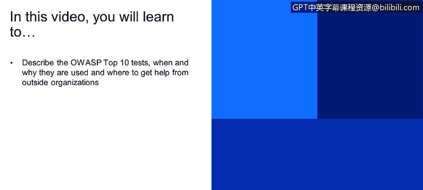
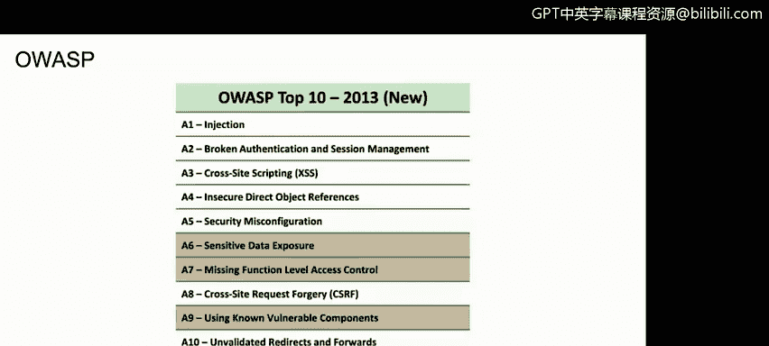
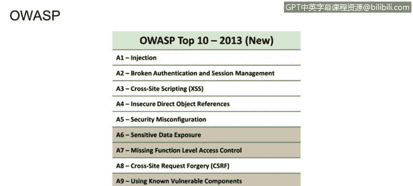
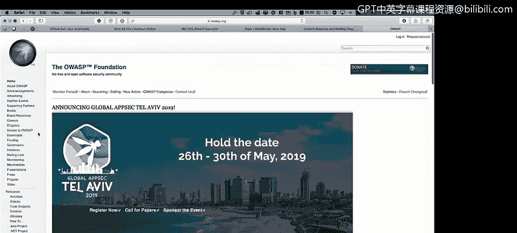
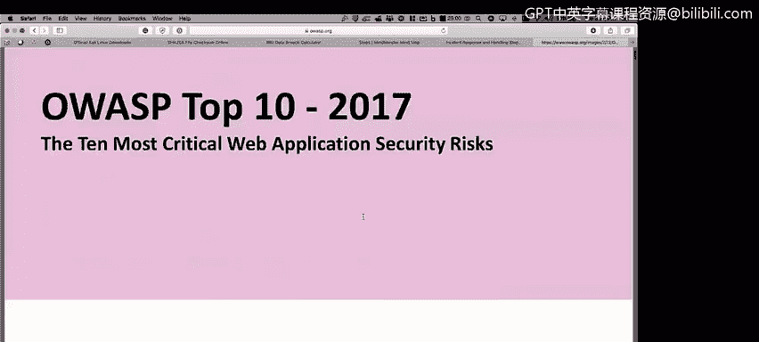
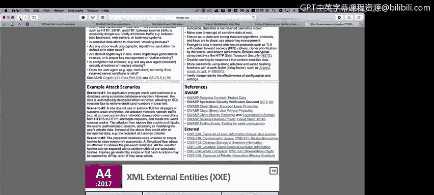

# 课程1：《网络安全工具与网络攻击简介》：131：OWASP框架简介 🛡️

在本节课程中，我们将学习OWASP Top 10框架。我们将了解其定义、使用场景与原因，以及如何从外部组织获取相关帮助。

上一节我们介绍了其他安全测试方法，本节中我们来看看另一个最佳实践框架——OWASP Top 10。大多数Web应用程序都需要遵循这一框架。

## 什么是OWASP Top 10？ 🔍

OWASP Top 10是一个由开放式Web应用程序安全项目发布的、关于Web应用程序最严重安全风险的共识列表。如果你正在处理网页、Web应用程序，或者任何类型的应用程序，都可以参考OWASP Top 10，并开始对其列出的每个风险类别进行测试。

## 如何获取OWASP资源 📚

OWASP组织提供了丰富的资源来帮助你进行应用程序安全测试。以下是获取这些资源的步骤：

1.  访问官方网站：在搜索引擎中输入“OWASP”，即可找到其官方网站链接 `owasp.org`。
2.  浏览项目与文档：网站上提供了大量信息，不仅针对Web应用程序，也包含移动应用程序的安全指南。
3.  下载核心报告：例如，你可以找到并下载《OWASP Top 10 - 2017》报告，其中详细列出了当前最主要的十大Web应用安全风险。

## OWASP Top 10 2017 核心风险示例 💉

以2017年报告为例，排名第一的风险是**注入**（Injection）。报告会详细解释：

*   **风险定义**：什么是注入攻击（例如SQL注入）。
*   **攻击场景**：攻击者如何利用此漏洞获取系统信息。
*   **检测方法**：你需要执行哪些查询来测试系统是否存在注入漏洞。

报告还涵盖了其他关键风险，例如失效的身份认证、敏感数据泄露等，为每个风险提供了测试与验证方法。

## 使用安全清单（Checklist） ✅

除了Top 10报告，OWASP还提供了一种名为**检查清单**的文档。以下是该清单的作用：

*   **提供控制措施**：清单中列出了大量需要在Web应用程序中实施的安全控制措施。
*   **确保系统安全**：遵循这份清单有助于确保你的Web应用程序达到充分的安全状态。

## 总结 📝

本节课中我们一起学习了OWASP框架。我们了解了OWASP Top 10是一个用于识别和应对Web应用程序关键安全风险的重要指南，掌握了如何从其官方网站获取详细的报告和检查清单等资源。利用这些资源，你可以系统地测试和加固应用程序，防范常见的安全威胁。