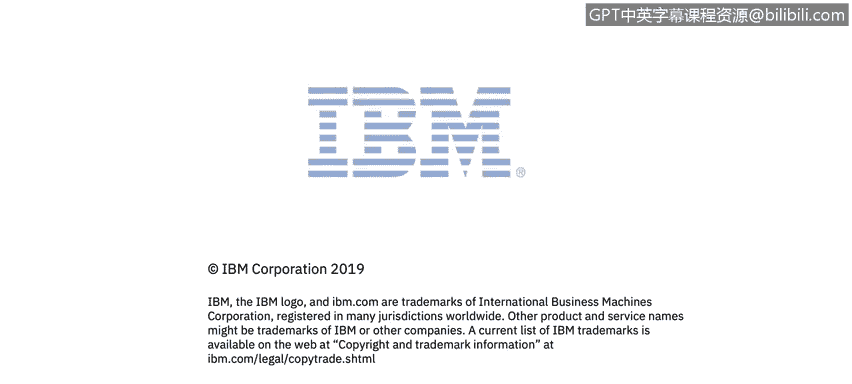

# 课程1：《网络安全工具与网络攻击简介》：4：关键安全工具概述 🛡️

在本模块中，我们将概述网络安全领域使用的多种关键安全工具。哥斯达黎加IBM托管安全服务组织的SIEM管理员Warren Perez将为我们讲解这些工具。随后，Warren和John将解释这些工具的用途并举例说明。

完成本模块的学习后，你将能够描述防火墙、防病毒与反恶意软件、密码学、渗透测试和数字取证的目的。你还将了解到两个关键资源：SecurityIntelligence.com网站和Warren的文章《事件响应与数字取证》。

让我们开始吧。

---

上一节我们介绍了本模块的学习目标，本节中我们来看看防火墙。


防火墙是一种网络安全系统，它根据预设的安全规则监控并控制进出网络的流量。其核心作用是建立一个屏障，在受信任的内部网络与不受信任的外部网络（如互联网）之间进行隔离。

防火墙的工作原理主要基于规则匹配。以下是其工作流程的简化表示：

```python
# 伪代码示例：防火墙规则检查
def check_firewall_rule(packet, rules):
    for rule in rules:
        if (packet.source_ip in rule.allowed_sources and
            packet.destination_port in rule.allowed_ports and
            packet.protocol == rule.protocol):
            return "ALLOW"
    return "DENY"
```

---

了解了防火墙的基础后，我们接下来探讨防病毒与反恶意软件。

防病毒与反恶意软件是用于预防、检测和移除恶意软件的程序。恶意软件包括病毒、蠕虫、特洛伊木马、勒索软件等。

以下是其主要功能的简要列表：

*   **实时扫描**：持续监控系统活动，检查文件与进程。
*   **特征码检测**：通过比对已知恶意软件的签名数据库来识别威胁。
*   **启发式分析**：通过分析程序行为来检测未知或新型恶意软件。
*   **隔离与清除**：将检测到的恶意文件隔离或删除，防止其造成损害。

---

在防护系统免受恶意软件侵害之后，保护数据本身的机密性与完整性也至关重要。这就引出了密码学的概念。

密码学是保护信息通信安全的技术，确保只有预期接收者能够读取和处理信息。它主要涉及加密（将明文转换为密文）和解密（将密文恢复为明文）过程。

一个基本的加密公式可以表示为：

**C = E(K, P)**

其中：
*   **C** 代表密文
*   **E** 代表加密算法
*   **K** 代表密钥
*   **P** 代表明文

---

除了防御性工具，主动评估系统安全性同样重要。下面我们介绍渗透测试。

渗透测试，也称为道德黑客攻击，是经授权模拟网络攻击，以发现计算机系统、网络或应用程序中安全弱点的过程。其目的是在恶意攻击者利用这些漏洞之前将其识别并修复。

一次典型的渗透测试流程包含以下几个阶段：

1.  **规划与侦察**：定义测试范围、目标，并收集目标系统信息。
2.  **扫描**：使用工具分析目标，了解其如何响应各种入侵尝试。
3.  **获取访问权限**：利用发现的漏洞（如SQL注入、跨站脚本）进入系统。
4.  **维持访问权限**：模拟高级持续性威胁，测试在系统内长期驻留的可能性。
5.  **分析与报告**：记录所利用的漏洞、访问的数据，并提供修复建议。

---

当安全事件发生时，我们需要一套方法来调查和响应。这就是数字取证。

数字取证涉及在调查过程中，以法律上可接受的方式收集、保存、分析和呈现来自计算机设备、网络系统的电子证据。它对于事件响应、法律诉讼和了解攻击影响至关重要。

数字取证调查通常遵循以下核心原则：

*   **证据保全**：确保原始数据不被修改。
*   **记录完整链条**：详细记录证据从发现到呈堂的每一个处理步骤。
*   **分析验证**：使用可靠的工具和方法进行分析，确保结果可重复、可验证。
*   **符合法律规范**：确保整个调查过程符合相关法律法规的要求。

---

最后，为了帮助你持续学习和获取最新安全资讯，我们推荐两个有价值的资源。


以下是本模块介绍的两个关键外部资源：

*   **SecurityIntelligence.com**：这是一个由IBM运营的网络安全新闻、分析和见解平台，提供丰富的行业动态和深度文章。
*   **《事件响应与数字取证》**：这是由Warren Perez撰写的文章，更深入地探讨了事件响应流程与数字取证技术的结合与实践。



---

本节课中我们一起学习了网络安全中的几类关键工具：防御性的**防火墙**和**防病毒软件**，保障数据安全的**密码学**，主动发现弱点的**渗透测试**，以及用于事件调查的**数字取证**。理解这些工具的基本目的和原理，是构建网络安全知识体系的重要基础。通过利用像SecurityIntelligence.com这样的资源，你可以不断扩展和更新你的专业知识。