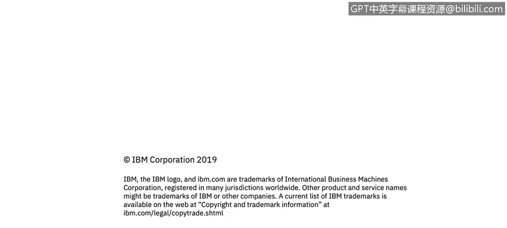

# 课程1：《网络安全工具与网络攻击简介》：133：防火墙简介 🔥

在本节课程中，我们将学习防火墙的基本概念。防火墙是网络安全的核心工具之一，它通过隔离内部网络与外部互联网，并基于特定规则控制数据包的进出，来保护组织免受多种网络攻击。

---

上一节我们介绍了网络安全的重要性，本节中我们来看看防火墙的具体作用。

防火墙是一种保护机制，它将组织的内部网络与更广阔的互联网隔离开来。它允许某些数据包通过，同时阻止其他数据包。

防火墙通常成对使用，外部防火墙用于隔离DMZ（非军事区）。它将应用了安全策略的内部企业网络与公共互联网分隔开。公共互联网常被比喻为“狂野西部”，几乎没有任何安全措施。

---

那么，我们为什么需要使用防火墙呢？以下是其主要防护目标：

*   **防止拒绝服务攻击**：防火墙可以抵御两种特定的DoS攻击——SYN洪泛攻击和TCP连接耗尽攻击。这些攻击会使系统资源耗尽，无法处理真实的连接请求。
*   **防止非法数据修改或访问**：这与拒绝服务攻击不同。此类攻击违反了安全策略，可能导致内容被窃取（即数据外泄），或者组织的网站主页被篡改和替换。
*   **仅允许授权访问**：防火墙与访问控制模块协同工作，确保只有经过身份验证的用户和主机能够访问内部网络。我们稍后会详细讨论这一点。

---

上一部分我们了解了防火墙的防护目标，接下来我们看看防火墙的主要类型。

实际上，防火墙主要有两种类型：

1.  **应用级防火墙**
2.  **包过滤防火墙**

此外，还有第三种称为**XML防火墙**的设备，但它实质上是一个XML网关。我们也会简要提及它。

---

在本节课中，我们一起学习了防火墙的基础知识。我们明确了防火墙作为网络隔离和流量控制核心设备的功能，了解了它能防护的三种主要攻击类型（拒绝服务攻击、非法数据访问与篡改、以及未授权访问），并初步认识了防火墙的几种主要类型。理解这些概念是构建有效网络安全防御体系的第一步。