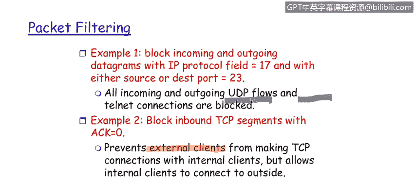

# 课程1：《网络安全工具与网络攻击简介》：134：防火墙-数据包过滤

在本节课程中，我们将学习什么是数据包过滤，以及数据包过滤防火墙的工作原理。

数据包过滤是应用级和企业级防火墙的一项基础技术。其核心原理是，防火墙对每一个数据包进行独立判断，决定是转发还是丢弃该数据包。

这个决策基于几个关键参数。以下是数据包过滤所依据的主要参数：

*   **源IP地址与目的IP地址**：这是最基础的参数。防火墙会检查数据包来自哪里（源IP）以及要发往哪里（目的IP），并据此做出决策。
*   **传输层协议**：防火墙可以识别数据包使用的是哪种传输协议，例如**TCP**或**UDP**。TCP是面向连接的可靠协议，而UDP是无连接的广播式协议。
*   **目的端口号**：端口号对应特定的网络服务。防火墙可以根据目的端口号来过滤流量。
*   **消息类型**：某些协议有特定的消息类型，防火墙可以据此过滤。
*   **TCP标志位**：对于TCP协议，防火墙可以检查如**SYN**（同步）和**ACK**（确认）等标志位的状态。

现在，我们来看几个数据包过滤的具体应用示例。

以下是两个常见的过滤规则示例：

*   **示例一：阻止特定协议和端口的流量**
    *   **规则**：阻止所有传入和传出的、IP协议字段为17（即UDP协议）或源/目的端口号为23（即Telnet服务）的数据报。
    *   **效果**：这条规则有效地阻止了所有UDP流量以及所有Telnet连接。在企业网络边界实施此类规则，是执行安全策略的良好实践。

*   **示例二：基于TCP标志位控制连接发起方**
    *   **规则**：阻止所有传入的、ACK标志位设置为0的TCP报文段。
    *   **原理**：在TCP三次握手过程中，发起连接的第一个SYN包的ACK位为0。阻止这类数据包可以防止外部主机主动与内部客户端建立TCP连接。
    *   **效果**：这实现了一种常见的安全策略——允许内部主机主动向外发起连接，但阻止外部主机主动连接内部主机。这体现了“内部比外部更可信”的安全模型。

在本节课中，我们一起学习了数据包过滤防火墙的核心概念。我们了解到，防火墙通过检查数据包的**源IP地址**、**目的IP地址**、**传输协议**、**端口号**以及**TCP标志位**等参数，依据预设的规则对每个数据包做出**转发**或**丢弃**的决策。通过两个示例，我们看到了如何利用这些规则来执行具体的安全策略，例如阻止不安全的服务或控制连接的发起方向。数据包过滤是构建网络安全防线的第一道重要关卡。