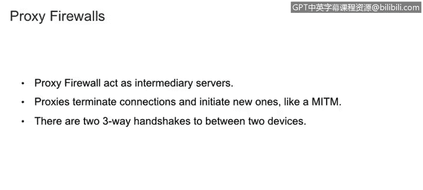

# 课程1：《网络安全工具与网络攻击简介》：137：防火墙：有状态与无状态

在本节课程中，我们将学习描述有状态防火墙与无状态防火墙之间的区别，并了解从无状态防火墙过渡到有状态防火墙时所涉及的权衡取舍。

接下来，我们将深入探讨防火墙的相关知识。

正如你可能已经知道的，防火墙可以在网络之间过滤流量。根据防火墙类型的不同，它们处理数据包的方式也有所区别。防火墙也可以是**多宿主**的，这意味着它们拥有多个网络接口卡，连接到不同的网络。换句话说，我们可以用一个网络接口连接到互联网，另一个网络接口连接到我们的本地网络。

防火墙有多种类型，本节我们将介绍其中最常见、最基础的两种：**无状态防火墙**和**有状态防火墙**。我们将看到，其中一种比另一种更为安全。

**无状态防火墙**，顾名思义，它没有“状态”的概念。它们也可以被称为**包过滤防火墙**，其决策基于**第3层（网络层）**和**第4层（传输层）**的信息，例如IP地址和端口号。它们缺乏对连接状态的感知能力，因此安全性相对较低。

从左侧上方的图片中可以看到，一个ICMP Echo请求及其对应的ICMP Echo回复被防火墙接受了。但在下方，攻击者只是发送了Echo回复，而这个回复前面并没有对应的Echo请求，包过滤或无状态防火墙却允许这个数据包通过。在我们接下来要讲的有状态防火墙上，如果一个Echo回复没有对应的Echo请求，它将被防火墙拒绝。

**有状态防火墙**则拥有**状态表**，这允许防火墙将当前的数据包与之前的数据包进行比较。这使得防火墙的处理速度稍慢一些，但比无状态防火墙安全得多。它们有时也被称为**应用层防火墙**，因为它们可以根据**第7层（应用层）**的信息做出决策，例如根据用户访问的网站类型来过滤信息。

从左侧的图片中可以看到，ICMP Echo请求和对应的Echo回复被接受了。但当攻击者试图发送一个ICMP Echo回复时，有状态防火墙会检查状态表，发现这个Echo回复没有对应的先前Echo请求，从而阻止该流量。

我们还将讨论另一种类型的防火墙，称为**代理防火墙**。它们本质上充当一个中间服务器。如下方图片所示，它位于两台设备（例如计算机和服务器）之间。当计算机与服务器发起连接时，代理防火墙实际上会终止这个连接。

如图所示，它在两个设备之间进行了**两次“三次握手”**。这意味着计算机1会向服务器发起连接，但防火墙会先与计算机1建立连接，然后防火墙再发起另一个连接到服务器本身。因此，它就像中间人一样位于两个设备之间。这种机制允许代理防火墙过滤大量流量，并进行更深入的分析。

---

## 课程总结

在本节课中，我们一起学习了防火墙的三种主要类型：无状态（包过滤）防火墙、有状态防火墙和代理防火墙。我们了解了无状态防火墙基于IP和端口进行简单过滤，而有状态防火墙通过维护状态表来跟踪连接状态，从而提供更强的安全性。我们还探讨了代理防火墙作为中间人，通过两次独立的连接来深度分析和控制流量。理解这些防火墙的工作原理和区别，是构建有效网络安全防御的基础。