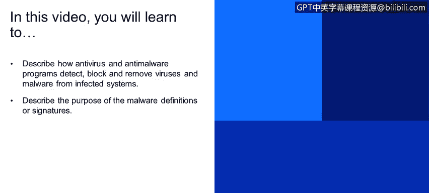
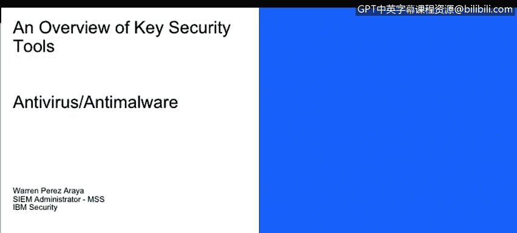

# 课程1：《网络安全工具与网络攻击简介》：138：64_01_反病毒与反恶意软件

在本节课程中，我们将学习反病毒与反恶意软件程序如何检测、阻止并清除受感染系统中的病毒和恶意软件。同时，我们也将了解恶意软件定义或特征库的目的。

## 反病毒与反恶意软件简介

上一节我们讨论了网络攻击的类型，本节中我们来看看如何防御其中一种常见威胁——恶意软件。反病毒软件是一种专用软件，能够检测、预防甚至清除计算机病毒或恶意软件。

## 恶意软件定义（特征库）的工作原理

这种专用软件使用恶意软件定义。这些定义本质上就像是用于识别恶意软件的特征签名。

以下是恶意软件定义工作的关键点：

*   供应商会不断更新这些恶意软件定义。
*   供应商将这些更新或恶意软件定义推送到反病毒服务器。
*   反病毒软件扫描系统，并搜索与这些恶意软件定义匹配的项目。

例如，如果一个文件被感染，其哈希值（例如一个MD5哈希值）可能会与已知的恶意软件特征匹配。此时，反病毒软件将采取行动。

## 反病毒软件的响应措施

当检测到威胁时，反病毒软件通常会执行以下操作之一：

*   **删除**该文件。
*   将其放入**隔离区**。
*   向最终用户**发出警报**，提示该系统已感染或可能感染病毒。

## 反病毒软件的部署方式

反病毒软件可以本地安装在计算机上，即基于主机的反病毒系统。它也可以是网络反病毒系统。最常见的是基于主机的反病毒系统，该系统通常会连接到一个中央服务器以获取更新和集中管理。

## 总结

本节课中，我们一起学习了反病毒软件如何利用不断更新的恶意软件定义来检测和应对威胁。我们了解了其工作原理、响应措施以及常见的部署方式。掌握这些知识是构建有效防御体系的基础。