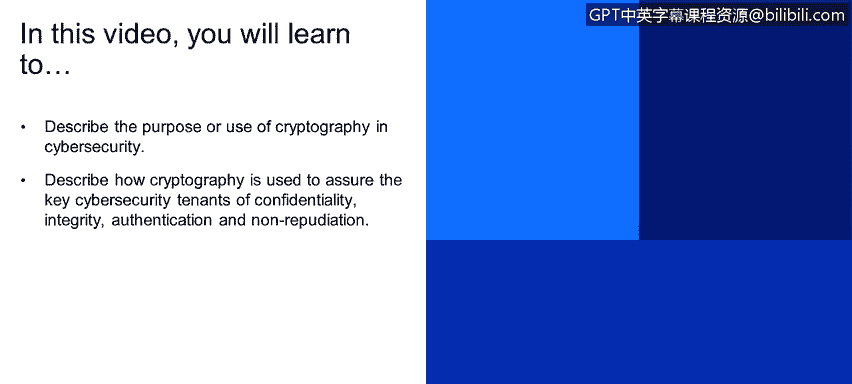
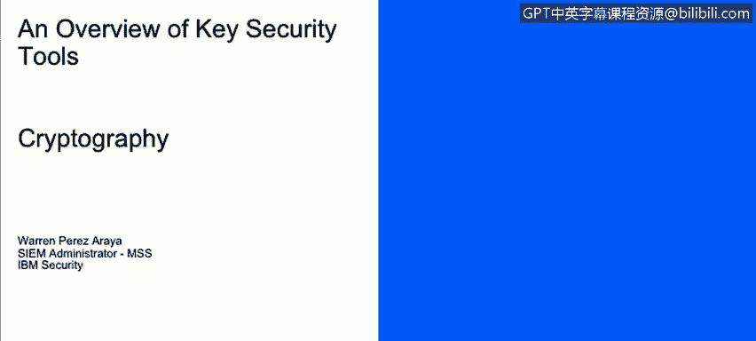
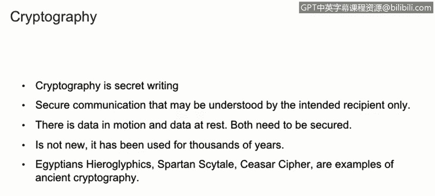
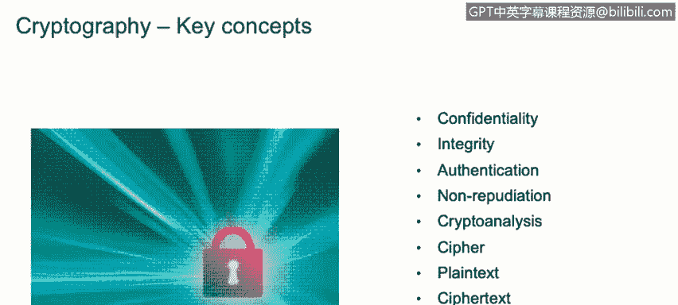
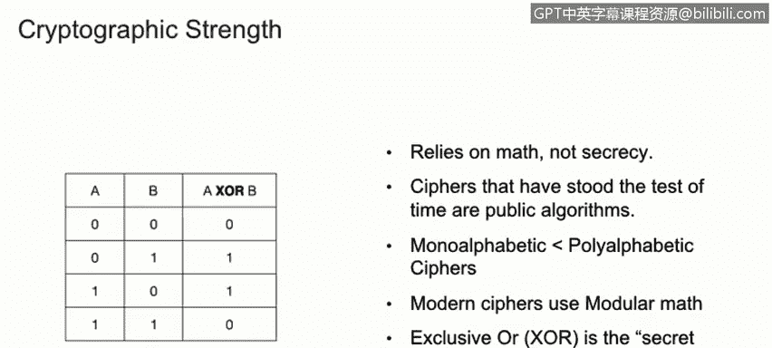

# 课程1：《网络安全工具与网络攻击简介》：139：密码学入门 🔐

在本节课程中，我们将学习密码学的基本概念、目的及其在网络安全核心原则中的应用。

密码学是一门关于秘密书写的科学，旨在确保通信双方能够安全地交换信息，且只有预期的接收者能够理解其内容。它的核心任务是保护传输中的数据（动态数据）和存储中的数据（静态数据）。密码学并非新生事物，它已有数千年的历史，从古埃及的象形文字到凯撒密码都是其早期形式。如今，随着计算机的出现，密码学已演变为更复杂的数据加密方式。

为了更好地理解密码学及其重要性，我们需要探讨几个关键概念。

## 核心安全原则

以下是密码学旨在保障的四个关键网络安全原则：

*   **保密性**：确保只有预期的接收方能够读取和理解信息。
*   **完整性**：检测信息在传输过程中是否被篡改或更改。
*   **身份验证**：确认某人或某物的身份，以判断其是否被授权执行某项操作或信息是否真实可信。
*   **不可否认性**：确保行为或信息的发送方在事后无法否认其行为或发送过该信息。

## 密码学基础术语

上一节我们介绍了安全目标，本节我们来了解实现这些目标所涉及的基本术语。

*   **密码分析**：分析密码和加密算法的过程。这是密码学的关键环节，科学家和数学家通过它来评估加密算法的安全性。
*   **密码**：用于加密信息的实际算法。例如，凯撒密码就是一个通过将字母表向左或向右移动特定次数来加密的算法。
*   **明文**：指人类可读的原始文本。
*   **密文**：指明文经过密码算法处理后的结果，通常是人类不可读的形式。
*   **加密**：将明文转换为密文的过程。
*   **解密**：使用相应的密码算法将密文恢复为明文的过程。

## 密码强度与类型

了解了基本术语后，我们来看看是什么决定了密码的强度，以及密码有哪些主要类型。

密码的强度依赖于数学的复杂性，而非算法的保密性。仅仅将算法保密并不能使其更安全。事实上，最安全的算法都是公开的，并且经受住了时间的考验。现代密码通常使用模运算。

例如，在异或（XOR）运算中：
*   设列A为明文。
*   设列B为加密所用的密钥。
*   那么，运算 `A XOR B` 的结果列C就是密文。
*   反之，用密文C与密钥B进行 `XOR` 运算，就能得到原始的明文A。

现代密码主要分为两种类型：

*   **流密码**：以比特为单位，逐位地加密或解密信息。公式可以表示为：`C_i = P_i XOR K_i`，其中 `C` 是密文，`P` 是明文，`K` 是密钥流，`i` 代表第i个比特。
*   **分组密码**：以数据块为单位进行加密或解密。例如，某些算法会一次性加密64位（8字节）的数据块。

## 总结

本节课中，我们一起学习了密码学的基础知识。我们了解到密码学通过加密技术来保障信息的**保密性**、**完整性**、**身份验证**和**不可否认性**。我们明确了**明文**、**密文**、**加密**、**解密**以及**密码**和**密码分析**等核心概念。最后，我们探讨了密码强度依赖于数学原理，并介绍了**流密码**和**分组密码**这两种主要的加密类型。掌握这些基础是理解更复杂网络安全机制的第一步。