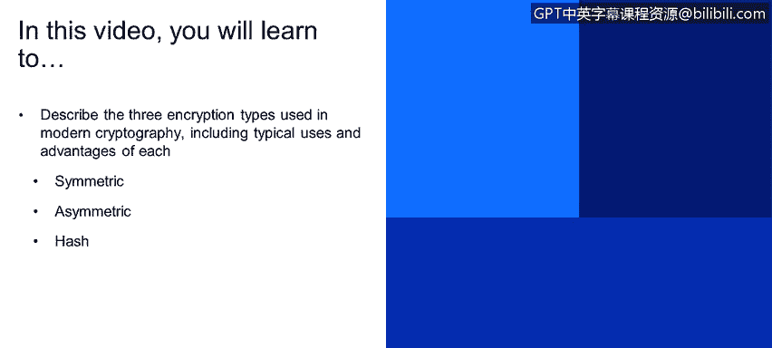
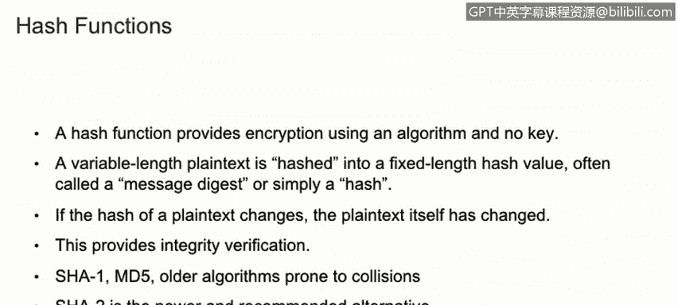

# 课程1：《网络安全工具与网络攻击简介》：140：现代加密类型

## 概述
在本节课程中，我们将学习现代密码学中使用的三种主要加密类型：对称加密、非对称加密和哈希函数。我们将探讨每种类型的工作原理、典型用途及其各自的优缺点。

---

## 对称加密 🔑

上一节我们介绍了密码学的基本概念，本节中我们首先来看看对称加密。

对称加密使用**单个密钥**进行数据的加密和解密。这意味着加密方和解密方必须共享同一个秘密密钥。

以下是其主要特点：
*   **速度快**：由于其算法相对简单，对称加密在处理大量数据时速度很快。
*   **安全性随密钥长度增加**：加密强度与密钥长度直接相关，密钥越长，通常越安全。
*   **密钥分发是挑战**：最大的问题在于如何安全地将密钥分享给通信的另一方。不能通过不安全的信道（如明文）发送密钥，因为整个加密体系的安全性都依赖于这个单一密钥的保密性。

目前常用的对称加密算法包括DES、3DES和AES。其中，AES是当今最常用的现代对称加密算法之一。

---

## 非对称加密 🔐

了解了使用单一密钥的对称加密后，我们来看看使用密钥对的非对称加密。

非对称加密使用**两个密钥**：一个公钥和一个私钥。Whitfield Diffie和Martin Hellman创建的Diffie-Hellman算法被认为是现代非对称加密的先驱。

以下是其核心机制与特点：
*   **密钥对**：公钥可以公开给任何人，私钥则必须始终保密。
*   **加密与解密关系**：用公钥加密的数据只能由对应的私钥解密；反之，用私钥加密的数据（即签名）只能由对应的公钥解密（即验证）。
*   **基于数学难题**：其算法基于大质数分解、离散对数等数学难题，是一种单向函数，用于生成密钥对。
*   **速度较慢**：相比对称加密，非对称加密的计算过程更复杂，因此速度慢得多。
*   **主要用途**：常用于数字证书和公钥基础设施（PKI）。在实际应用中（如访问HTTPS网站），通常先使用非对称加密安全地交换一个**会话密钥**，然后转而使用更快的对称加密来进行后续的通信。

---

## 哈希函数 🔗

最后，我们来看一种不用于加密，而是用于确保数据完整性的技术：哈希函数。

哈希函数提供了一种**无需密钥**的单向加密。它将任意长度的输入（明文）通过哈希算法，转换成一个固定长度的哈希值，也称为消息摘要或散列值。

以下是其关键特性与注意事项：
*   **确保完整性**：哈希函数的主要用途是验证数据完整性。发送方生成明文及其哈希值一并发送；接收方重新计算收到明文的哈希值，并与发送来的哈希值比对。如果两者不同，则说明数据在传输中被篡改。
*   **存在碰撞风险**：哈希函数可能发生“碰撞”，即两个不同的输入值产生了相同的哈希输出。这是由于输出长度固定导致的。
*   **算法演进**：MD5和SHA-1是较旧的算法，已被证明容易发生碰撞。SHA-2是当前更新、更受推荐的替代方案。

---

## 总结
本节课中，我们一起学习了现代密码学的三种核心类型：
1.  **对称加密**：使用单一密钥，速度快，但密钥分发需通过安全渠道。
2.  **非对称加密**：使用公钥和私钥组成的密钥对，解决了密钥分发问题，但速度较慢，常与对称加密结合使用。
3.  **哈希函数**：使用单向算法生成固定长度的摘要，主要用于验证数据完整性，需注意选择抗碰撞的强哈希算法。

理解这些加密类型的基本原理及其应用场景，是构建网络安全知识和实践技能的重要基础。