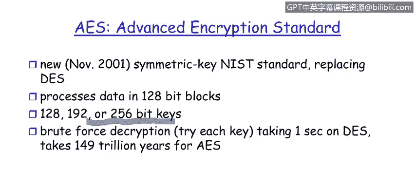

# 课程1：《网络安全工具与网络攻击简介》：142：从安全架构师视角看密码学

## 概述

在本节课程中，我们将学习密码学的基础概念。我们将了解密码学中的关键术语、两种主要的密码学架构（对称密钥与非对称密钥），并探讨一些经典的加密算法，如替换密码、数据加密标准（DES）和高级加密标准（AES）。通过本节学习，你将能够描述这些核心概念并理解它们的基本工作原理。

---

## 密码学基础术语

在开始深入学习之前，我们首先需要建立关于密码学的词汇表。理解这些术语是掌握后续内容的基础。

以下是密码学中的几个关键概念：

*   **明文**：这是发送者希望发送的原始、人类可读的消息。它可以是电子邮件、Word文档或网页链接等任何形式的内容。在未加密状态下，任何人都可以阅读它。
*   **密文**：明文经过加密算法处理后生成的不可读文本。这是通过通信信道实际传输的内容。
*   **加密密钥**：用于将明文转换为密文的一串数据。在示意图中，发送者爱丽丝的密钥被标记为 **KA**。
*   **解密密钥**：用于将密文恢复为明文的一串数据。接收者鲍勃的密钥被标记为 **KB**。
*   **窃听者**：在通信信道中试图拦截并读取消息的第三方。

---

## 对称与非对称密码学架构

上一节我们介绍了基本术语，本节中我们来看看密码学的两种核心架构。它们的主要区别在于加密和解密密钥的关系。

密码学有两种基本的架构类型：

*   **对称密钥密码学**：在这种架构中，发送者和接收者使用**相同的密钥**进行加密和解密。这意味着 **KA = KB**。
*   **公钥密码学（非对称密码学）**：在这种架构中，加密和解密使用**不同的密钥**。通常，公钥用于加密，私钥用于解密。这意味着 **KA ≠ KB**。

---

## 对称密码学原理

现在，让我们花些时间深入研究对称密码学背后的原理。我们将探讨几种对称密钥加密的风格。

以下是两种对称密钥加密方法的介绍：

### 替换密码

这是一种最简单的加密形式，相当于一个“魔法解码器环”。它使用**单表替换**，即用一个字母替换另一个字母，并且这种替换在整个消息中保持不变。

例如，我们可以将字母表平移13位（即凯撒密码的一种，ROT13）。如果明文是 “Bob, I love you, Alice”，那么经过ROT13加密后的密文将是 “Obo, V ybir lbh, Nypvr”。然而，由于英文字母的使用频率分布不均（例如字母‘E’出现最频繁），通过分析密文中字母的频率分布，可以很容易地破解这种简单的密码。因此，它并不是一种安全的加密方法。

### 对称密钥加密流程

从架构上看，对称密钥加密的流程如下：
1.  爱丽丝使用她与鲍勃共享的密钥 **KAB** 加密明文消息 **M**。
2.  加密算法生成密文 **C**，可以表示为：`C = Encrypt(K_AB, M)`。
3.  密文通过信道发送给鲍勃。
4.  鲍勃使用相同的共享密钥 **KAB** 对密文进行解密。
5.  解密算法恢复出原始明文 **M**，可以表示为：`M = Decrypt(K_AB, C)`。

这个流程的核心问题是**密钥分发**：爱丽丝和鲍勃如何安全地商定并共享同一个密钥 **KAB**？如果通过不安全的渠道（如电子邮件）发送密钥，窃听者伊夫就可以截获密钥，从而解密所有后续消息。因此，密钥分发是对称密码学的一个根本性挑战。

---

## 数据加密标准（DES）

上一节我们看到了简单替换密码的弱点，本节中我们来看一个更强大的对称加密标准。DES是历史上第一个重要的商业化电子加密算法。

DES由IBM开发，并于1977年被美国国家标准与技术研究院（NIST）采纳为标准。

以下是DES的关键特性：

*   **密钥长度**：它使用**56位**的对称密钥。
*   **分组大小**：它以**64位**为一个数据块对明文进行加密。如果消息更长，会被分割成多个64位的块分别处理。
*   **安全性**：DES的设计在当时是坚固的，没有已知的“后门”。然而，随着计算能力的增长，56位的密钥长度变得脆弱。一次著名的尝试表明，通过暴力破解（尝试所有可能的密钥），可能在几个月内攻破DES。
*   **增强方式**：为了提高安全性，可以采用**三重DES**，即使用两个或三个不同的密钥对每个数据块进行多次加密。另一种技术是**密码块链接**模式，它将前一个密文块与当前明文块混合，从而增加加密的复杂性。

---

## 高级加密标准（AES）

由于DES的密钥长度已不足以应对现代计算能力，NIST在2001年发布了新的加密标准——AES，以取代DES。

AES在多个方面对DES进行了显著增强：

*   **分组大小**：AES将处理的数据块大小从64位增加到了**128位**。
*   **密钥长度**：AES支持更长的密钥长度，用户可以选择**128位、192位或256位**。密钥越长，加密强度越高，但计算开销也越大。因此，可以根据数据的敏感程度选择合适的密钥长度。
*   **安全性**：AES的安全性得到了极大提升。以暴力破解为例，攻破一个128位的AES密钥，即使用当今最强大的计算机，也需要难以想象的时间（理论计算达数万亿年）。这使得暴力破解在实践中变得不可行。

因此，AES有效地解决了DES在暴力破解面前脆弱的问题，成为当前广泛使用的对称加密标准。

---

## 总结

本节课中我们一起学习了密码学的基础知识。我们首先定义了明文、密文、密钥等核心术语。然后，我们探讨了对称密钥和非对称密钥两种主要的密码学架构，并指出了对称密钥系统中密钥分发这一根本挑战。接着，我们分析了从简单的替换密码到复杂的数据加密标准（DES）的演变，并了解了DES在密钥长度上的局限性。最后，我们学习了其继任者——高级加密标准（AES），它通过更长的密钥和更大的数据块显著提升了安全性，使暴力破解变得不切实际。掌握这些概念是理解现代网络安全中数据保护机制的重要一步。