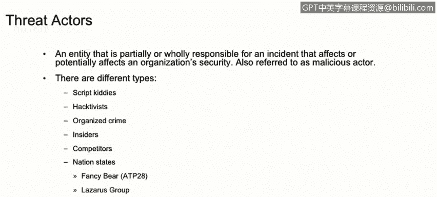

# 课程1：《网络安全工具与网络攻击简介》：143：渗透测试简介

在本节课程中，我们将学习渗透测试的基本概念、其目的以及相关的伦理考量。我们还将区分不同类型的黑客和威胁行为者，并了解他们的特征。

## 什么是渗透测试？🔍

渗透测试，也常被称为“渗透测试”或“道德黑客”。它是指对计算机系统、网络或应用程序（如Web应用或软件应用）进行测试的实践，目的是发现安全漏洞。攻击者可能利用这些漏洞来获取对系统或应用程序的未授权访问。

渗透测试的主要目标是**在攻击者发现并利用这些漏洞之前，识别出安全弱点**。

渗透测试的实践需要在执行前完成多项合同约定，例如服务级别协议、参与规则以及各类文档，以确保渗透测试是双方之间的合法协议。

## 黑客的类型：白帽、灰帽与黑帽 🎩

执行渗透测试的技术人员被称为渗透测试员，他们也常被称为“白帽黑客”。黑客可以根据其行为和动机分为三类：白帽黑客、灰帽黑客和黑帽黑客。

以下是不同类型黑客的简要介绍：

*   **白帽黑客**：即道德黑客。他们通常在合同授权下，出于安全目的为公司执行渗透测试，其行为是为了公司的利益。
*   **灰帽黑客**：他们介于白帽和黑帽之间。通常，他们在未经授权的情况下进行渗透测试，但事后会向潜在受害公司报告发现的漏洞。他们并未事先获得公司的安全评估授权。
*   **黑帽黑客**：即所谓的“坏人”。他们进行攻击通常是为了个人声誉、金钱、政治目的或社会变革。他们未经授权，也不会在合同约束下进行任何渗透测试活动。

## 威胁行为者概述 🎭

威胁行为者是指对安全事件或攻击负有部分责任的实体。他们通常会影响组织的安全，也被称为恶意行为者。

威胁行为者有多种类型，且各自具备不同的技能水平。

以下是几种主要的威胁行为者类型：

*   **脚本小子**：经验不足的黑客，技术知识有限。他们依赖自动化工具进行攻击，不开发自己的工具，基本只使用公开可用的工具，技术含量很低。
*   **黑客行动主义者**：这类黑客通常受政治议程或推动某种社会变革的动机驱使。
*   **有组织的犯罪集团**：这类威胁通常来自公司外部，技术高度复杂，意味着他们拥有极高的技术知识。从经济角度看，他们资金雄厚，通常通过高度开发的恶意软件（如勒索软件）进行攻击。
*   **内部人员**：指现任或前任员工、承包商、合作伙伴或任何有权访问公司资产或机密信息的实体。内部人员可能有意或无意地构成安全风险。例如，一名被解雇的员工可能有动机对公司进行破坏活动；也可能是一名员工无意中错误删除了不该删除的信息。
*   **竞争对手**：竞争对手可能是其他组织的潜在安全风险，因为他们可能受抢先发布产品等动机驱使。
*   **国家支持的黑客**：这类威胁来自公司外部，技术高度复杂，资金非常充足。其动机可能与政治、军事、技术或经济议程相关。例如，Fancy Bear（也称APT28）、Lazarus Group（也称Hidden Cobra或APT29）都是国家资助的黑客组织实例。

## 总结 📝

在本节课中，我们一起学习了渗透测试的核心概念及其在主动安全防御中的重要性。我们明确了白帽、灰帽和黑帽黑客之间的关键区别。最后，我们详细探讨了从技术能力有限的脚本小子到高度复杂的国家支持黑客等各种类型的威胁行为者及其特征。理解这些基础知识是迈向成为一名网络安全分析师的重要一步。