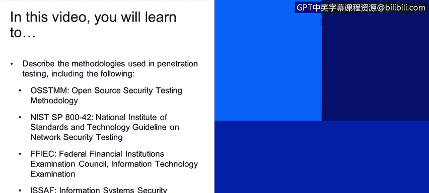
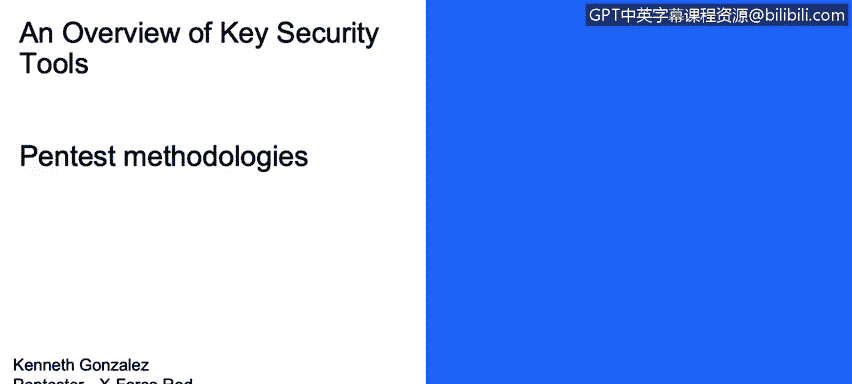
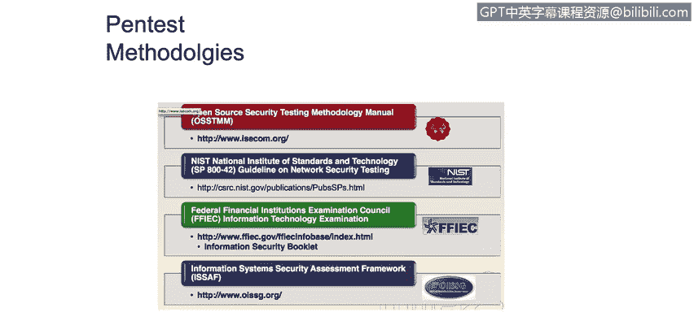
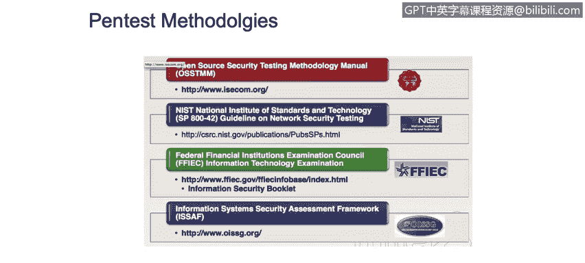
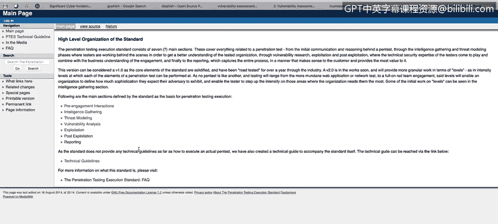
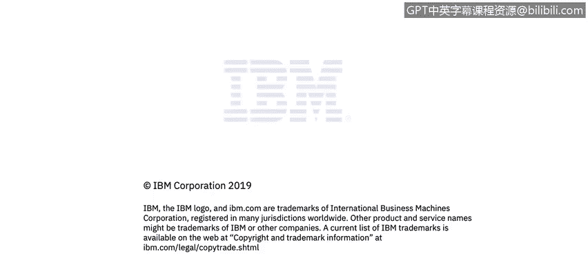

# 课程1：《网络安全工具与网络攻击简介》：144：渗透测试方法论 🔍

## 概述
在本节课程中，我们将学习渗透测试中使用的几种核心方法论。理解这些方法论对于系统性地评估和提升网络安全防御至关重要。

---

## 渗透测试方法论介绍
上一节我们介绍了渗透测试的基本概念，本节中我们来看看执行渗透测试所遵循的几种结构化方法论。这些方法论为网络安全顾问提供了一套清晰的行动流程，旨在尝试利用系统漏洞。更重要的是，这个过程能让你清晰地了解目标公司或客户如何应对网络安全挑战，以及他们如何处理网络安全防御和监控流程。

首先，我们来了解几种公开的、可供理解和遵循的方法论。

以下是几种主要的渗透测试方法论：
*   **OSSTMM方法论**：即开源安全测试方法论手册。
*   **NIST指南**：美国国家标准与技术研究院发布的网络安全测试指南。
*   **FFIEC IT手册**：联邦金融机构检查委员会的信息技术检查手册。
*   **ISSAF框架**：信息系统安全评估框架。

此外，还有一种名为“渗透测试执行标准”的方法论。如果你在谷歌搜索“PTES technical Guidelines”，其实际网址是 `www.pentest-standard.org`。访问该网站，你会看到大量从渗透测试方法论角度提供的信息。

为了让你能够阅读和理解，这套方法论实际上是现有方法论中较为简洁的一种。它的核心在于分阶段执行。网站上的每个链接代表一个你需要在你渗透测试项目中探索和执行的阶段。

---

## 渗透测试执行标准详解
上一节我们列举了多种方法论，本节我们将以“渗透测试执行标准”为例，深入探讨其各个阶段的具体内容。

### 情报搜集阶段
以下是情报搜集阶段需要执行的关键任务：
*   这是渗透测试的第一步，也是最重要的一步。
*   你需要进行信息搜集和枚举，以全面了解客户的攻击面。
*   目标是理解所有可能被利用的系统或漏洞。

现实中存在一个误解，有人认为渗透测试员只是打开一个叫Metasploit的工具，开始使用命令和漏洞利用模块。事实并非如此。在真实世界中，你需要从目标获取大量信息，进行充分的枚举和信息搜集，才能进入后续阶段。

### 威胁建模阶段
当你掌握了足够的信息后，就可以开始威胁建模过程。此时你已经拥有了目标的所有信息，接下来需要制定攻击或利用目标的路线图。

以下是威胁建模阶段可以着手进行的一些示例或检查项：
*   基于之前信息搜集阶段对网络和组织的理解，确定从哪个部分开始进行更深入的漏洞利用。

### 漏洞分析阶段
下一步是漏洞分析。在某些情况下，作为渗透测试员，我们会使用漏洞扫描器或漏洞评估工具，以便更好地理解系统中哪些漏洞更可能被利用。

例如，如果我们发现80端口上运行着一个Apache服务器，版本是2.6，那么我们可以尝试利用影响该版本Apache服务器的漏洞。我们可以使用漏洞评估工具，例如OpenVAS、Nessus或Nexpose等。市面上有很多此类工具。

同时，理解你也可以通过手动过程来探索漏洞，这一点很重要。你可以做的一件事是，如果你知道系统版本，只需在谷歌搜索“exploit Apache 2.2.4”，就能找到大量影响该特定版本Apache服务器的漏洞信息，然后你可以在下一步尝试利用这些漏洞。

### 漏洞利用阶段
接下来是漏洞利用阶段。在进行漏洞利用时，首先必须理解，作为一名渗透测试员或道德黑客，你**绝不能**在没有获得许可的情况下利用任何系统。

你需要与你的客户或目标协调，确定执行系统漏洞利用的时间窗口。因为，如果你在我们几分钟前提到的Apache网页服务器销售高峰期进行漏洞利用，不仅可能获取系统访问权限，还可能因为发起拒绝服务攻击而导致系统瘫痪，这很可能会影响客户的正常运营，从而给你带来麻烦。因此，协调、与客户沟通、安排好漏洞利用阶段的所有操作，是渗透测试员需要理解的关键部分。

再次强调，在这个PTES渗透测试标准方法论中，有很多事情需要牢记。例如，如果你想向你的系统发送带有反向连接的有效载荷，你可能需要处理“规避”或“混淆”技术，以尝试避免反病毒软件的检测。或者，如果你想加密你的有效载荷或攻击，你可以开始做一些事情来加密你的连接，例如使用带加密的Netcat，或使用其他不一定加密但会利用系统上开放端口进行加密通信的工具。

### 后渗透与报告阶段
最后是后渗透和报告阶段。后渗透是指在你已经获得系统访问权限后发生的事情：你如何维持访问权限？如何开始进行“横向移动”？换句话说，如何开始从一台计算机跳转到另一台计算机？或者如何开始执行我们称之为“权限提升”的操作？而这里最重要的部分是**报告**：你如何向客户展示你是如何执行项目的每个步骤并成功访问系统的？

---

## 总结
本节课中，我们一起学习了渗透测试的几种核心方法论，特别是以“渗透测试执行标准”为例，详细剖析了从情报搜集、威胁建模、漏洞分析、漏洞利用到后渗透与报告的完整流程。理解并遵循这些结构化方法论，是成为一名专业、高效的网络安全分析师或道德黑客的基础。