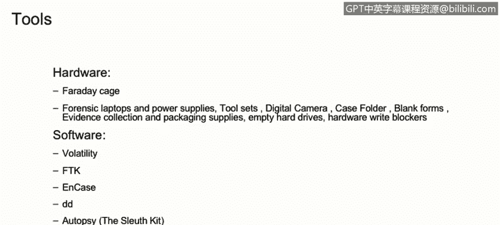

# 课程1：《网络安全工具与网络攻击简介》：146：数字取证简介 🔍

在本节课程中，我们将学习数字取证的基本概念，了解其作为法证科学分支的核心内容，并探讨有效进行数字取证所需的技术技能与法律知识。

---

## 什么是数字取证？

数字取证是法证科学的一个分支。它主要涵盖与识别、恢复、调查、验证和呈现数字证据相关事实的所有活动。数字证据通常存在于计算机或类似的数字存储设备上，例如硬盘、手机和服务器。

## 洛卡德交换原理

在讨论法证科学时，我们必须提及**洛卡德交换原理**。该原理由法证科学先驱埃德蒙·洛卡德博士提出，他被称为“法国的福尔摩斯”。这一原理在物理世界和技术（或计算机）世界中同样适用。

该原理指出：**犯罪者总会从犯罪现场带走一些东西，也会在现场留下一些东西。这两者都可以作为法证证据使用。** 这意味着，任何人实施犯罪时，都会从犯罪现场带走某些物品，同时也会在现场留下某些痕迹，这两方面的事实均可用于法证分析。

## 证据链

在数字取证中，如同在法证科学中一样，我们需要讨论**证据链**。证据链本质上是指记录物理或电子证据的保管、控制、转移、分析和处置顺序的文档或书面记录。

证据链是一份书面文件，它使我们能够重建对证据所做的处理：谁曾保管过它、谁复制了信息、信息是如何被获取的、谁分析了信息等。任何要在法庭上合法呈堂的证据，都必须具备完整的证据链过程。

## 数字取证工具

数字取证工具主要可分为两大类：硬件工具和软件工具。

### 硬件工具

以下是几种硬件工具示例：

*   **法拉第袋**：一种能够屏蔽任何电子或磁场的设备。它用于隔离手机等设备，使其无法接入蜂窝数据或Wi-Fi网络，从而切断所有电子通信。
*   **取证工具箱**：包含多种工具的专用工具箱，内部可能装有取证笔记本电脑、电源、工具套装、数码相机、案件文件夹和空白表格等。这些空白表格将构成调查期间收集的任何证据的证据链。
*   **空白硬盘**：用于复制信息。
*   **写保护器**：确保我们能够从硬盘读取数据，但不会向硬盘写入任何数据。

### 软件工具

市面上有许多软件工具，以下仅列举一小部分：

*   **开源应用**：例如 **Volatility**（用于内存取证分析）。
*   **商业软件**：例如 **FTK** 和 **EnCase**。
*   **其他工具**：**DD**（大多数Linux操作系统中都有的逐位复制工具）、**Autopsy**、**Bulk Extractor** 等，都是取证调查中可以使用的工具。

---

在本节课中，我们一起学习了数字取证的定义及其在法证科学中的地位。我们了解了洛卡德交换原理如何将物理世界的法则应用于数字领域，并认识了确保证据法律效力的关键——证据链。最后，我们简要介绍了进行数字取证所需的硬件与软件工具。掌握这些基础知识，是成为一名有效的网络安全分析师的重要一步。