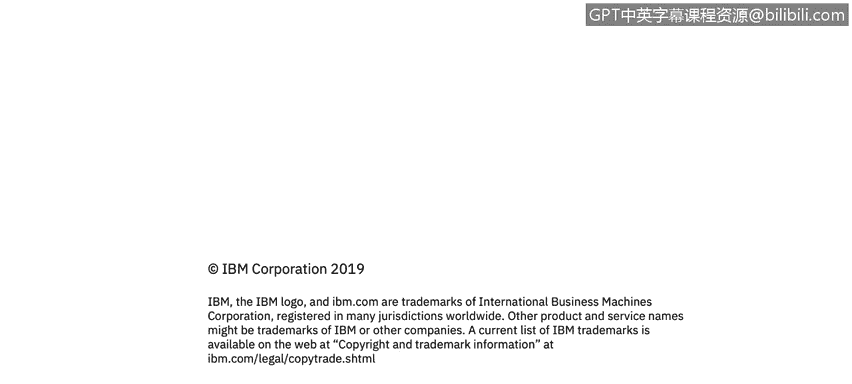

# 课程1：《网络安全工具与网络攻击简介》：147：73_01_课程总结 🎯

在本节课中，我们将对《网络安全工具与网络攻击简介》这门课程进行总结，回顾所学内容，并展望未来的学习路径。

---

## 课程总结

上一节我们探讨了网络安全领域的各种工具与攻击手段。本节中，我们来对整个课程进行回顾与总结。

在本课程中，我们一起学习了网络安全的基础概念、常见的网络攻击类型以及用于防御这些攻击的关键工具。我们了解了威胁行为者的动机、攻击链模型，并实践了使用基础安全工具进行分析。

以下是本课程涵盖的核心知识要点：

*   **网络安全基础**：定义了网络安全的核心目标——保护信息系统的**机密性、完整性与可用性**。
*   **威胁与攻击**：识别了包括恶意软件、网络钓鱼、拒绝服务攻击在内的多种常见网络威胁。
*   **防御工具**：介绍了防火墙、入侵检测系统、加密技术等基础安全工具的原理与应用。
*   **安全实践**：强调了安全策略、事件响应与安全意识培训在整体防御中的重要性。

---

## 后续学习路径展望

掌握了网络安全的基础知识后，你可能会思考如何进一步深入这个领域。

为了帮助你继续在网络安全职业道路上前行，更多进阶课程、专业细分方向以及初级网络安全分析师专业证书项目即将推出。

我们期待在不久的将来再次与你相见。

---

## 最终总结

本节课中，我们一起回顾了《网络安全工具与网络攻击简介》的核心内容。我们从基础概念出发，逐步学习了网络威胁的形态与防御策略。网络安全是一个持续演进的领域，希望本课程为你奠定了坚实的第一步。祝你在此后的学习与职业旅程中一切顺利。