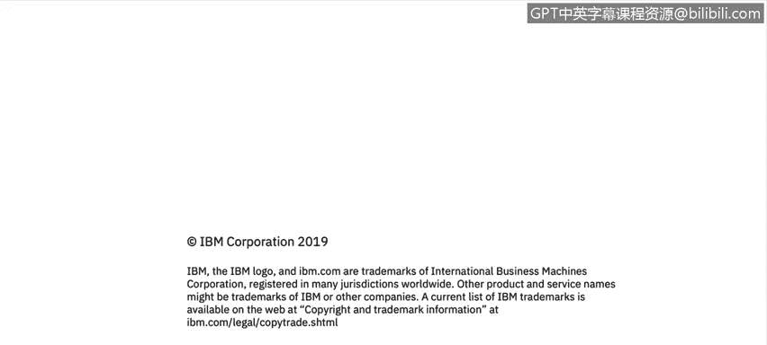

# 课程2：《网络安全角色、流程与操作系统安全》：1：欢迎来到网络安全人员、流程和操作系统基础

## 🎯 概述
在本节课中，我们将初步了解网络安全分析师的角色、所需的核心技能以及本课程的学习目标。我们将听到来自IBM安全专家的分享，了解实际工作中对技术能力和软技能的要求。

---

我的名字是亚历克斯，是哥斯达黎加地区MCCN管理员团队的经理。

我的团队负责为IBM及其客户监控网络安全威胁，并针对这些威胁采取行动，以最小化客户数据丢失或泄露的风险。

当我要招聘新的网络安全分析师和管理员时，我会寻找一些技术技能。

我关注操作系统知识，例如对Linux、Mac和Windows的掌握。

数据库知识也是必需的。

此外，还需要了解跨站脚本攻击、恶意软件、分布式拒绝服务攻击以及一般的网络安全知识。

特别是关于防火墙和防病毒软件的知识。

同样重要的还有有效的沟通技巧。

因为这是与正确人员协作所必需的。

批判性思维也很关键，因为每天的事件都各不相同。

还需要有主动性，因为分析师必须拥有追求问题解决方案的动力。

在本课程中，您将听到来自IBM全球的几位主题专家的讲解。

他们将帮助您开始构建关于重要网络安全流程的技能。

这些资源与术语将为您打下基础。

谢谢。

---

## 📝 总结
本节课中，我们一起学习了网络安全分析师的核心职责，即监控并应对威胁以保护数据安全。我们明确了成为一名合格分析师所需的技术技能，如操作系统、数据库和特定攻击手段的知识，以及沟通、批判性思维和主动性等软技能。本课程将由IBM专家带领，逐步构建您在网络安全流程和术语方面的基础。