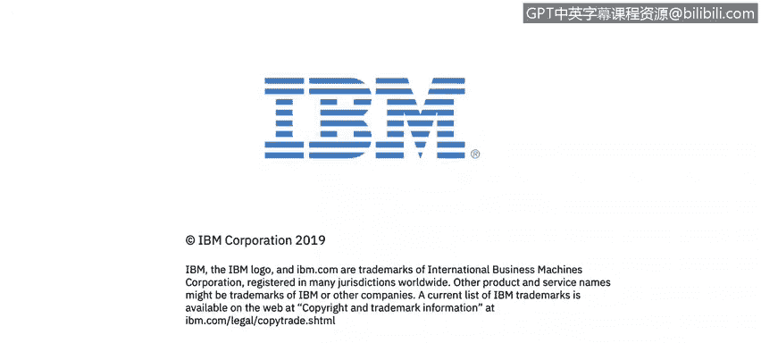

# 课程2：《网络安全角色、流程与操作系统安全》：2：1_人员、流程和技术概述

在本节课中，我们将要学习网络安全的基础支柱：人员、流程和技术。理解这三者如何相互作用，对于评估和提升组织的整体安全态势至关重要。

正如你在Alex的课程欢迎辞中所了解到的，理解安全基础对于网络安全分析师的日常工作至关重要。

我是Lou Fua，IBM数据安全产品组合的课程开发人员。在整个课程二中，我将陪伴你学习，帮助你掌握成为一名成功的初级网络安全分析师所需的知识。

IBM的网络安全专家将为你授课，带你学习系统基础知识的模块。我们将展示人员、流程和技术如何影响公司的整体网络安全态势。

你将学习服务管理框架如何影响企业应对网络安全威胁的能力。

你准备好了吗？

---

## 核心概念：人员、流程与技术

上一节我们介绍了本课程的目标，本节中我们来看看构成网络安全基础的三个核心要素。这三者共同构成了一个动态的防御体系。

以下是构成网络安全基础的三个关键组成部分：

1.  **人员**：指组织内的所有个体，包括员工、管理人员、安全专家和最终用户。人员是安全链中最关键也最脆弱的一环，因为社会工程学攻击（如网络钓鱼）往往以人为目标。安全意识培训至关重要。
2.  **流程**：指为管理、检测和响应安全事件而制定的正式策略、程序和操作指南。一个清晰的流程可以确保安全措施的一致性和有效性。例如，事件响应计划就是一个关键流程。
3.  **技术**：指用于保护信息资产的工具和解决方案，例如防火墙、入侵检测系统（IDS）、防病毒软件和加密技术。技术是实施安全策略的物理或逻辑手段。

这三者之间的关系可以用一个简单的公式表示：**有效网络安全 = 安全意识强的人员 + 定义明确的流程 + 恰当部署的技术**。任何一方的薄弱都会导致整个安全体系的失效。

---

## 服务管理框架的作用

理解了基础要素后，我们来看看如何将它们系统化地组织起来。服务管理框架提供了一个结构化方法，将人员、流程和技术整合到日常运营中。

服务管理框架（如ITIL）为企业提供了一套最佳实践，用于设计、交付和管理IT服务，包括安全服务。它通过定义清晰的流程和角色，帮助组织更高效地应对安全威胁。

例如，一个遵循服务管理框架的变更管理流程可以确保对系统的任何修改都经过评估、批准和记录，从而减少因配置错误引入安全漏洞的风险。

---

## 总结

本节课中，我们一起学习了网络安全的三位一体模型：人员、流程和技术。我们探讨了每个组成部分的重要性以及它们之间的相互依赖关系。此外，我们还介绍了服务管理框架如何作为粘合剂，将这些要素系统化地整合，以提升企业整体的安全防御和响应能力。记住，强大的网络安全不是单靠先进技术就能实现的，它需要警惕的人员、稳健的流程和合适的技术协同工作。