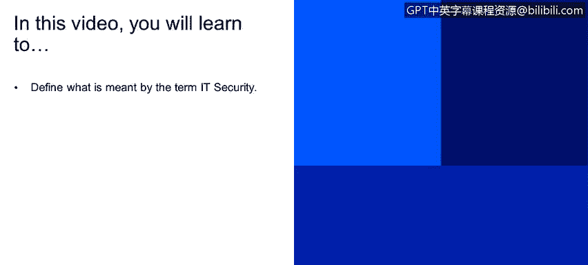
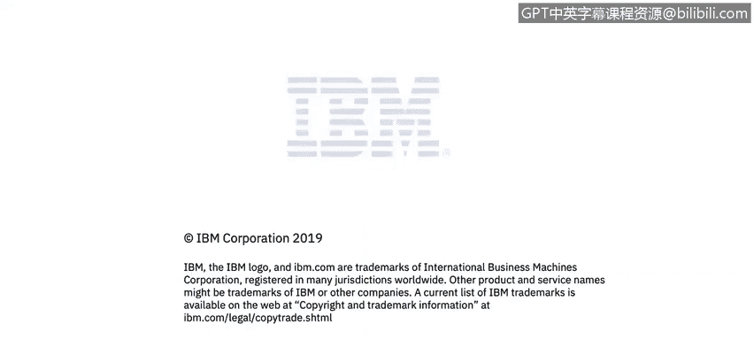

# 课程2：《网络安全角色、流程与操作系统安全》：3：什么是IT安全 🔒

在本节课程中，我们将学习“IT安全”这一核心概念的定义。我们将了解IT安全的基本范畴、其重要性以及它如何保护我们的数字资产。

---

上一节我们介绍了课程的整体框架，本节中我们来看看IT安全的具体含义。

IT安全可以定义为：保护计算机、服务器、移动设备、电子系统、网络及其数据免受恶意攻击的实践。这个术语在行业内也可被称为“信息安全”或“网络安全”。

---

为了更清晰地理解IT安全的保护对象，以下是其主要涵盖的领域：

*   **计算机与服务器**：保护承载关键应用和数据的硬件与操作系统。
*   **移动设备**：保护智能手机、平板电脑等便携设备及其上的信息。
*   **电子系统**：泛指所有基于电子的信息系统和设备。
*   **网络**：保护数据传输的通道和网络基础设施。
*   **数据**：保护所有形式的数字信息，这是最核心的资产。

---

总而言之，本节课中我们一起学习了IT安全的定义。我们了解到，IT安全的核心目标是采取各种措施，防御针对各类数字设备和数据的恶意攻击，确保信息的**机密性、完整性和可用性**。这是构建所有网络安全实践的基石。