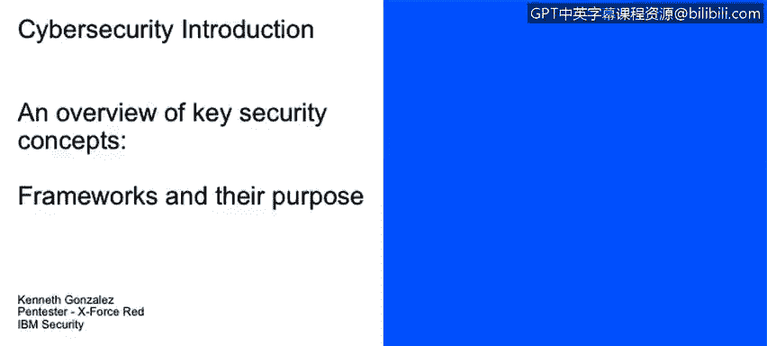

# 课程2：《网络安全角色、流程与操作系统安全》：4：框架及其目的

在本节课中，我们将学习框架、基线和最佳实践在有效网络安全策略中的目的。我们将区分这些概念，并理解它们在组织中的不同作用。

上一节我们讨论了网络安全策略的组成部分，本节中我们来看看框架、基线和最佳实践。

在组织中，我们会接触到许多概念，例如最佳实践、基线和框架。框架的一个好例子是COBIT，而最佳实践的例子则因业务领域而异，例如ITIL或ISO系列标准。这些框架、基线和最佳实践旨在改进和增强你的IT治理、流程、政策和程序。例如，遵循微软关于其数据库服务器加固的最佳实践，你将获得一个性能更优的Microsoft SQL服务器。

然而，这些最佳实践和框架并非强制要求。它们是“锦上添花”的部分。你会有许多好的实践和控制措施，但如果没有它们，你的业务也不一定会受到损害。如果你没有遵循微软的服务器实施指南、思科设备的最佳实践，或者没有采用COBIT来改善公司IT治理，你可能不会因此失去业务或与监管机构产生问题。

在另一层面，我们拥有规范性和合规性要求。这里的区别在于，规范性要求你必须遵守，合规性是你的业务所必需的。例如，HIPAA是美国任何医疗保健公司都必须遵守的规范性法案。你的医疗保健公司可以拥有COBIT、许多ITIL流程以及所有供应商的最佳实践，但如果你不遵守HIPAA，哪怕只是遗漏了两个流程点，你可能就无法在美国运营，并会面临美国政府的处罚，因为你未能合规。

这就是基线、框架、最佳实践与规范性、合规性之间的主要区别。

正如我们所提到的，我们拥有许多可以改善业务技术处理方式的最佳实践和框架方法。

以下是一些具体的例子：

*   **COBIT**：一个用于IT治理和管理的框架。
*   **ITIL**：一套IT服务管理的最佳实践。
*   **ISO 27000系列**：信息安全管理体系标准。
*   **CAL**：可能指特定领域的合规性要求。
*   **PMI（项目管理协会）**：提供多种项目管理方法论。
*   **开发者推荐**：当你开始使用编程语言时，会有大量关于如何在系统和软件中遵循最佳实践的文档，以避免可能损害或破坏软件的安全事件或其他事故。

本节课中我们一起学习了框架、基线和最佳实践在网络安全策略中的目的，并重点区分了自愿采用的最佳实践与强制遵守的规范性合规要求。理解这些概念有助于你构建更有效、更符合业务需求的网络安全体系。