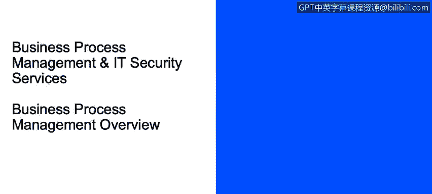
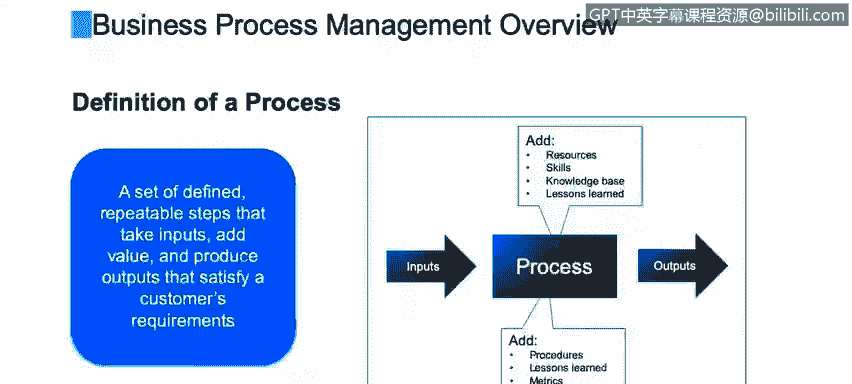

# 课程2：《网络安全角色、流程与操作系统安全》：7：业务流程管理概述 🧭




在本节课程中，我们将学习业务流程管理的基础知识。我们将定义什么是流程及其关键属性，描述标准的流程角色，探讨流程成功的要素，并介绍衡量流程表现的指标。

---



## 定义流程

流程的定义因作者或来源而异。在您的公司，它可能被称为业务流程管理、质量流程、六西格玛、敏捷或持续改进流程。尽管名称不同，但其核心目标是一致的。

一个流程本质上是一系列**定义明确、可重复的步骤**。它接收输入，通过应用知识、技能和资源进行处理并增加价值，最终产出一个满足客户（无论是内部还是外部客户）要求的输出。


**流程模型**可以表示为：
```
输入 -> [处理过程] -> 输出
```

---

## 流程的属性

上一节我们定义了流程，本节中我们来看看构成流程的具体属性。每个流程都应具备以下关键属性：

*   **输入**：进入流程的信息、数据或原材料，用于启动或支持流程。例如，将借记卡插入ATM机就是一个输入。
*   **起点与终点**：流程必须有明确的开始和结束。
*   **输出**：流程产生的成果，可以是服务、支持或实体产品。它必须满足最初的客户需求。
*   **边界**：流程必须有范围限制，不能无限进行。
*   **任务/步骤**：流程中执行的具体操作或行动，是导致产出的“执行”部分。

---

## 流程文档与角色

除了基本属性，流程的成功执行还依赖于清晰的文档和明确的角色分工。文档对于培训、统一理解、审计和合规都至关重要。

以下是建议的三层文档方法：
1.  **高层级**：一页纸的概要，展示流程的起点、终点和中间的主要环节。
2.  **中层级**：通常采用“泳道图”的形式，横向展示流程，每个角色占据一条“泳道”，清晰描述任务和交接。
3.  **低层级**：详细的“如何做”程序，说明完成每个具体任务的步骤。

在流程执行中，通常涉及以下角色：
*   **供应商**：为流程团队提供输入。
*   **请求者**：向流程团队提出需求，通常由此启动流程。
*   **团队领导/主题专家**：监督流程执行，提供支持并解决问题。
*   **处理者**：执行流程中的一个或多个步骤。
*   **审批者/评审者**：在流程继续前，对某些任务进行批准或质量检查。

一个关键原则是**职责分离**。例如，请求者不应同时是审批者，以确保良好的商业实践。

---

## 流程成功的要素

明确了流程的构成部分后，我们来探讨是什么让一个流程走向成功。虽然因素很多，但以下六点至关重要：

以下是确保流程成功的六个关键要素：
1.  **章程**：描述流程的目的、存在原因、目标及利益相关者，相当于流程的“菜单”。
2.  **明确的目标**：清晰、可衡量的目标，达成这些目标意味着实现整体目的。
3.  **治理与所有权**：应指定一位**流程负责人**，对流程的成功负责，并作为向上级管理层汇报的对接人。
4.  **可重复性**：确保每次执行的输出结果一致，减少因人员操作偏好带来的变异，这对于质量至关重要。
5.  **自动化**：减少容易出错的人工操作，节省时间和成本。
6.  **绩效指标**：收集可量化的指标，定期评估流程表现。

---

## 流程绩效指标

为了理解和改进流程，我们必须对其进行测量。绩效指标为我们提供了客观的评估依据。

以下是一些常见的流程绩效指标类别：
*   **周期时间**：衡量完成一个事件、一系列步骤或端到端流程所需的时间。例如，从流程启动到产出耗时48小时。也包括测量流程内的延迟和瓶颈。
*   **质量**：测量输入质量（确保接收的信息正确）、过程质量（执行任务的质量）和输出质量（最终成果是否符合标准）。许多公司采用抽样检查。
*   **成本**：计算与流程相关的各项成本，如缺陷成本、延误成本、员工加班成本等。
*   **返工**：测量需要“重做”的情况。返工会浪费时间、系统资源和材料，成本高昂，应追根溯源并消除根本原因。

---

## 持续流程改进

测量之后，改进随之而来。持续流程改进是一个永无止境的循环，对于保持流程的效率和有效性至关重要。

持续流程改进活动包括：
*   **定期审查绩效指标**。
*   **收集客户反馈**。
*   **进行成熟度评估**：使用预设的检查清单进行自我评估，量化流程的成熟度水平（例如，在5分制中获得3.5分），并设定改进目标。
*   **分析财务表现**。
*   **组建小型改进团队**：召集流程负责人、主题专家和执行人员定期评审流程。一线执行者往往能提出宝贵的改进意见。

---


本节课中我们一起学习了业务流程管理的核心概念。我们定义了流程及其属性，介绍了流程中的关键角色和文档方法，探讨了流程成功的要素，并学习了如何通过绩效指标来衡量和推动流程的持续改进。理解这些基础对于在网络安全或任何其他领域内建立高效、可靠的操作流程都至关重要。