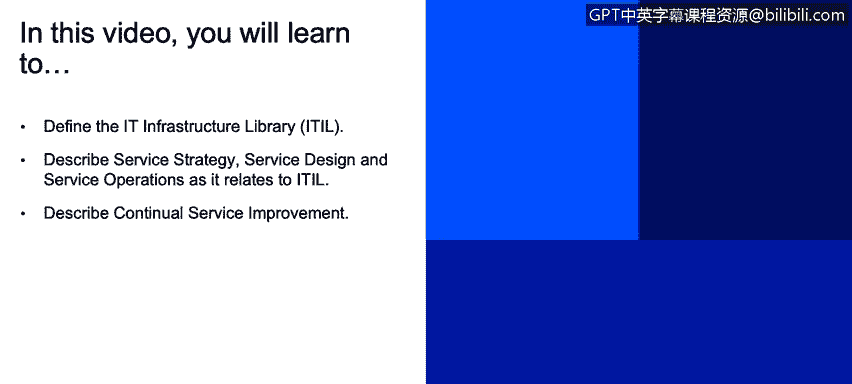
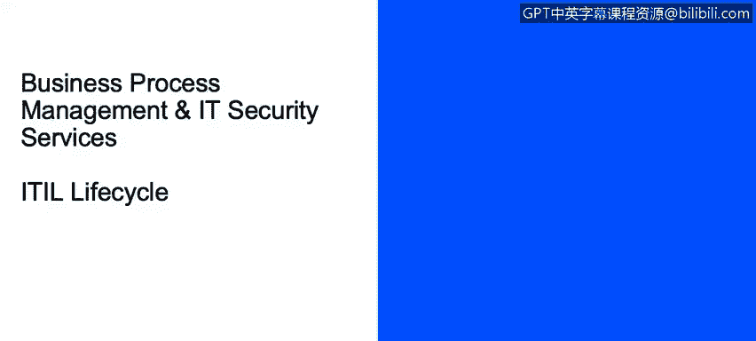
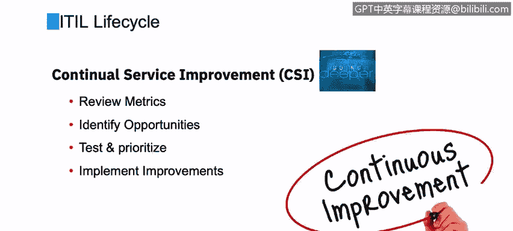

# 课程2：《网络安全角色、流程与操作系统安全》：8：信息技术基础架构库(ITIL)概述 🛠️

在本节课中，我们将要学习信息技术基础架构库（ITIL）的基本概念。ITIL是一套用于IT服务管理的全球公认最佳实践框架，旨在帮助组织通过标准化的流程来交付高质量的IT服务，从而创造业务价值。我们将了解ITIL生命周期中的几个核心阶段。

## 概述

ITIL并非由IBM发明，而是由行业专业人士和顾问经过多年发展形成的。它是一个优秀的方法论和框架，被广泛应用于各类公司，包括公共和私营部门。ITIL提供了一个指导性的框架，帮助IT组织更好地组织其流程，并通过这些流程提供业务价值。

## ITIL生命周期阶段

ITIL开发者提出了一个非常符合逻辑的生命周期流程，包括战略、设计、转换、运营和改进五个阶段。接下来，我们将逐一探讨这些阶段。

### 服务策略

上一节我们介绍了ITIL的整体框架，本节中我们来看看第一个阶段：服务策略。服务策略关注的是IT组织如何规划其服务，以支持公司内部的业务部门（如财务、市场、销售团队）。其核心在于理解IT组织能向客户提供哪些服务、具备哪些能力。

以下是服务策略阶段包含的一些关键子流程：

*   **服务组合管理**：管理IT组织所提供的服务组合。例如，为内部组织提供帮助台支持，并定义其服务参数（如是否为7x24小时服务）。
*   **财务管理**：为实现IT组织的战略目标进行预算、会计核算等工作。
*   **需求管理**：理解和预测客户（无论是内部业务部门还是外部客户）可能提出的需求。
*   **业务关系管理**：建立并维护与客户（内部或外部）的积极关系，确保倾听他们的声音并采取行动。

### 服务设计

在明确了服务策略之后，下一个阶段是服务设计。这个阶段涉及设计新的IT安全服务，以及对现有服务进行变更。

以下是服务设计阶段包含的一些关键子流程：

*   **服务目录管理**：创建并维护一个包含所有服务准确信息的目录。例如，帮助台服务应被记录在服务目录中。
*   **服务级别管理**：有时也称为SLA（服务级别协议）管理。这是在您与客户之间就服务性能水平达成的书面或共识条款，例如设定“在X小时内完成帮助台工单”的目标，并据此衡量绩效。
*   **信息安全管理**：确保组织信息和IT服务的**机密性、完整性和可用性**。
*   **供应商管理**：确保与必要的供应商签订合同，以获取IT安全团队开展工作所需的资源。

### 服务转换

设计完成后，我们进入服务转换阶段。此阶段的目标是构建和部署IT服务，无论是新的还是变更的，并将其从当前状态过渡到稳定状态。

以下是服务转换阶段包含的一些关键子流程：

*   **变更管理**：控制所有变更的生命周期，确保变更以高质量的方式进行。
*   **项目管理**：协调资源以部署项目，例如在环境中发布新版本。
*   **发布与部署管理**：规划、调度和控制版本向测试及生产环境的移动。
*   **服务验证与测试**：确保部署的版本及其产生的服务满足客户（内部或外部）的期望。
*   **知识管理**：收集、分析、存储在整个组织（无论是IT安全部门还是整个公司）内可以共享的知识和信息。

### 服务运营

从转换阶段进入稳定状态后，便是服务运营阶段。这个阶段是服务的执行和监控阶段，目标是确保向业务部门或外部客户提供的IT服务能够有效且高效地交付。

以下是服务运营阶段包含的一些关键子流程：

*   **事件管理**：确保对配置项和服务进行持续监控，对事件进行分类并采取适当行动。
*   **事故管理**：管理所有事故的生命周期。
*   **问题管理**：管理所有问题的生命周期。

### 持续服务改进

ITIL生命周期的最后一个阶段是持续服务改进，这也是一个持续循环的过程。它涉及持续审查指标，识别当前服务流程中的差距，寻找改进方向，测试并确定优先改进项，然后实施改进。

## 总结

本节课中我们一起学习了信息技术基础架构库（ITIL）的核心概念及其生命周期。我们了解到ITIL是一个旨在通过标准化、可重复的流程来提升IT服务管理质量的框架。其生命周期包括**服务策略、服务设计、服务转换、服务运营和持续服务改进**五个逻辑阶段。通过实施ITIL，组织可以减少流程中的差异，更有效地交付IT服务，从而为业务创造更大价值。