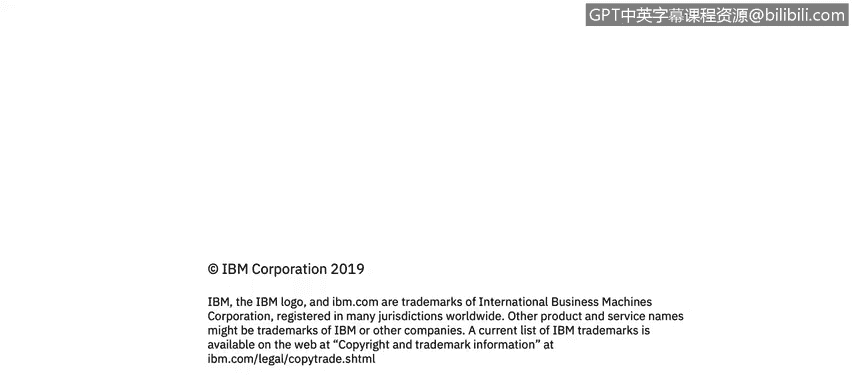

# 课程2：《网络安全角色、流程与操作系统安全》：10：CIA三角简介模块 🔐

在本模块中，我们将学习信息安全的核心基础概念——CIA三角。我们将了解其三个组成部分：保密性、完整性和可用性。此外，我们还将聆听来自哥斯达黎加IBM安全运营中心的Priscilla Mariel Guzman Angello分享她作为安全分析师的日常工作。最后，我们会介绍一个致力于信息安全与风险管理的关键组织——信息安全论坛。

---

## 什么是CIA三角？ 🛡️

CIA三角是信息安全领域的基石模型，它代表了三个核心安全目标。理解这些目标对于保护信息和系统至关重要。

上一节我们介绍了本模块的学习内容，本节中我们来看看CIA三角的具体定义。

CIA三角由以下三个原则组成：
*   **保密性**：确保信息不被未授权的人访问或泄露。
*   **完整性**：确保信息的准确性和完整性，防止被未授权地篡改。
*   **可用性**：确保授权用户在需要时可以可靠地访问信息和相关资产。

---

## 来自安全运营中心的视角 👩💻

理论需要与实践结合。接下来，我们将通过一位一线安全分析师的经验，了解CIA三角在实际工作中的应用。

来自哥斯达黎加IBM安全运营中心的Priscilla Mariel Guzman Angello将描述她作为安全分析师的典型一天，并分享她如何运用自身技能来维护上述安全原则。

---

## 信息安全论坛（ISF）简介 🌐

除了企业内部的安全实践，行业内的协作与标准制定也极为重要。本节我们将认识一个在此领域发挥关键作用的组织。

您还将了解到信息安全论坛。这是一个非营利性组织，致力于调查、阐明和解决信息安全及风险管理中的关键问题。

以下是ISF的主要工作：
*   开发满足其成员业务需求的最佳实践方法论。
*   制定标准化的安全流程。
*   提供针对性的安全解决方案。

---

## 总结 📝

本节课中我们一起学习了信息安全的核心框架CIA三角，包括其**保密性**、**完整性**和**可用性**三大原则。我们通过安全分析师的实际工作，看到了这些原则如何被应用于日常防护。最后，我们介绍了推动行业最佳实践的信息安全论坛。掌握这些基础知识，是迈向成为一名合格网络安全分析师的重要一步。