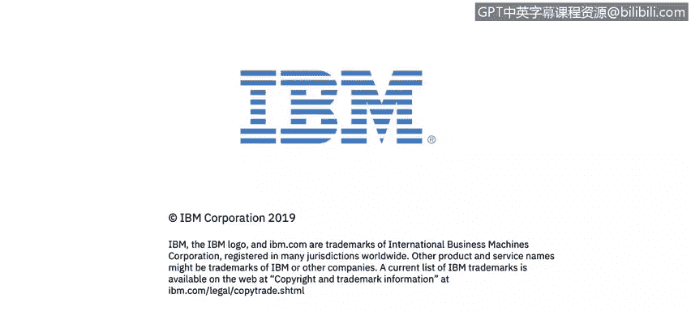

# 课程2：《网络安全角色、流程与操作系统安全》：11：谁是爱丽丝、鲍勃和特鲁迪 🔐

在本节课程中，我们将学习密码学与安全通信中常用的三个角色模型：爱丽丝、鲍勃和特鲁迪。我们将了解每个角色所代表的含义及其在安全通信场景中的作用。

## 角色定义与起源

在密码学文献中，我们经常看到三个核心角色：爱丽丝、鲍勃和特鲁迪。这些名字起源于20世纪60年代的几篇学术论文，并沿用至今。它们分别用字母A、B和T表示，是安全通信模型中的标准角色。

## 角色详解

以下是每个角色的具体描述：

*   **爱丽丝**：爱丽丝通常是通信的发起方。她希望将信息安全地发送给接收者。
*   **鲍勃**：鲍勃是通信的预期接收方。他的目标是接收并解密来自爱丽丝的信息。
*   **特鲁迪**：特鲁迪是通信中的拦截者或攻击者。她试图在通信信道上拦截、窃听、篡改或删除爱丽丝与鲍勃之间的消息。

## 通信流程分析

上一节我们定义了三个核心角色，现在我们来分析一个典型的安全通信流程，看看这些角色是如何互动的。

爱丽丝拥有一些数据，这些数据可能是一封电子邮件、一条笔记或一个网页。她的目标是将这些**明文**数据转化为安全的**密文**。这个过程可以表示为：

`密文 = 加密算法(明文， 密钥)`

随后，爱丽丝通过一个**信道**将密文传输出去。这个信道可以是任何传输媒介，例如电子邮件、文件传输协议、短信，甚至在历史上可以是信使传递的实体信件。信道中传输的“载荷”就是加密后的数据，同时还会包含控制信息，如收件人地址（在现代是IP地址，在历史上是姓名和物理地址）。

鲍勃作为接收方，从信道获取密文，并使用相应的密钥进行解密，恢复出爱丽丝发送的原始明文：

`明文 = 解密算法(密文， 密钥)`

## 攻击者视角

在上述流程中，特鲁迪有能力在信道上拦截这些消息。然而，由于爱丽丝对消息进行了加密保护，特鲁迪无法读取、篡改或有效删除这些密文消息，除非她能够破解加密算法或获取密钥。这凸显了加密技术在保护通信机密性和完整性方面的重要性。

## 课程总结

本节课中，我们一起学习了密码学中的三个标准角色：爱丽丝、鲍勃和特鲁迪。我们明确了爱丽丝是发送方，鲍勃是接收方，而特鲁迪是潜在的恶意攻击者。通过分析一个基本的安全通信模型，我们了解了加密如何将明文转化为密文，并通过信道传输，最终由接收方解密还原。这个模型是理解更复杂网络安全概念的基础。