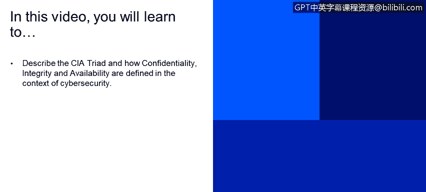
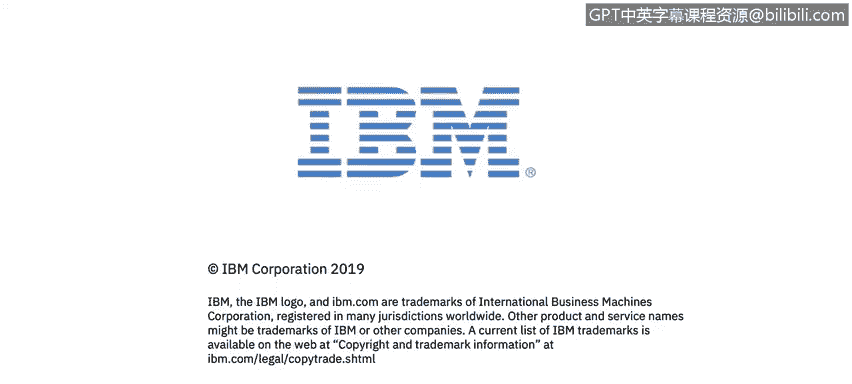

# *程2：《网络安全角色、流程与操作系统安全》：12：11_机密性、完整性与可用性 🔐

在本节课中，我们将学习信息安全的核心基石——CIA三要素，即机密性、完整性与可用性。我们将详细探讨这三个概念在网络安全背景下的定义及其重要性。

---

### **概述：CIA三要素**

CIA三要素是信息安全架构的三个主要组成部分，它们共同构成了保护数据和服务的基石。除了这三个要素，安全架构还涉及认证和访问控制等方面，我们将在后续课程中详细讨论。

---

### **机密性**

上一节我们介绍了CIA三要素的整体概念，本节中我们首先来深入探讨“机密性”。

根据美国国家标准与技术研究院的定义，**机密性**是指“对信息访问和披露施加授权限制，包括保护个人隐私和专有信息的手段”。

我们可以将这个定义分解为几个关键部分来理解：

*   **“施加授权限制”**：这意味着存在受控的协议和机制，明确规定谁可以、以及如何访问特定信息。这些限制源于治理流程，旨在防止未经授权的访问。
*   **“信息访问和披露”**：这不仅涉及读取信息，还包括在访问控制范围内分发信息，以维护信息的机密性。
*   **“保护个人隐私和专有信息”**：这是机密性保护的两个主要领域。

**机密性失效**的定义是：信息的**未经授权披露**。

---

### **完整性**

理解了如何保护信息不被泄露后，我们接下来看看如何确保信息在传输和存储过程中不被篡改或破坏，这就是“完整性”。

**完整性**是指“防止信息被不当修改或破坏”。

某些政府机构甚至将完整性置于机密性之上。其核心在于，即使攻击者截获了信息，也无法篡改其内容。例如，如果一条“今天共进午餐”的消息被篡改为“明天共进午餐”，就会导致误解和混乱，这体现了完整性对任务执行的影响。

完整性还包含两个重要概念：

*   **不可否认性**：确保通信或交易的双方（发送方和接收方）事后都无法否认该行为的发生。例如，在银行转账中，系统必须有记录证明Alice确实发起了向Bob转账100美元的交易，且Bob收到了款项。
*   **真实性**：确保交易是合法的、经过授权的。例如，上述100美元的转账是由其银行处理的，而非某个第三方，这保证了交易的权威性和合规性。

**完整性失效**的定义是：信息的**未经授权修改或破坏**。这包括篡改信息内容，也包括完全销毁信息阻止其送达。

---

### **可用性**

最后，在确保了信息的保密性和真实性之后，我们需要确保授权用户能够在需要时访问到这些信息和服务，这就是“可用性”。

**可用性**是指“及时且可靠地访问信息和使用服务”。

这个定义包含两个核心组成部分：

1.  **及时访问**：通常是一个系统级要求，指从发起请求到获得响应必须在规定时间内完成。例如，一个网页请求可能在5秒内得到响应；而对于空中交通管制雷达系统，这个时间要求可能是微秒级的。
2.  **可靠访问**：指系统或服务能够持续正常运行的时间比例，通常用可用性百分比表示，例如“99.99%的可用性”。安全专业人员会将这种整体要求分解，并分配到架构的各个组件中。

**可用性失效**的定义是：对信息系统的**访问中断**。这意味着系统无法在要求的时间限制内，或根本无法处理事务。

---

### **总结**

本节课中，我们一起学习了信息安全的基础——CIA三要素。
*   **机密性** 关注的是防止信息被未经授权地访问或泄露。
*   **完整性** 确保信息在传输和存储过程中不被篡改或破坏，并涉及不可否认性和真实性。
*   **可用性** 保证授权用户能够及时、可靠地访问信息和使用服务。

理解这三个核心原则是构建任何有效网络安全策略的第一步。在后续课程中，我们将学习如何在实际的系统和操作中应用这些原则。