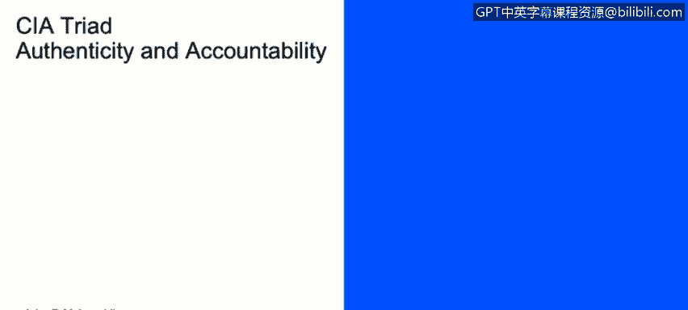
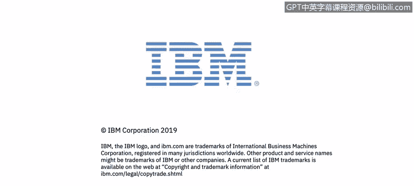

# 课程2：《网络安全角色、流程与操作系统安全》：13：真实性与责任

在本节课中，我们将学习网络安全背景下的“真实性”与“责任”这两个核心概念。理解这些概念对于确保数字交互的可信度和可追溯性至关重要。

上一节我们讨论了其他安全属性，本节中我们来看看本模块要探讨的最后两个定义：真实性与责任。

## 真实性

真实性是指信息或实体是真实、可信且可验证的属性。它确保接收方能够确认信息来源的正当性以及信息本身的完整性。

例如，当爱丽丝向鲍勃发送一条消息时，鲍勃必须能够证明这条消息确实来自爱丽丝本人，符合预期的通信协议，并且内容未被篡改。这个过程可以通过数字签名、证书等密码学技术来实现。

**核心公式**：`验证(消息) == 真实(来源) && 完整(内容)`

## 责任

责任是指能够将某个动作或事件明确无误地追踪到特定实体的属性。它确保了行为的不可否认性和可审计性。

继续上面的例子，从责任的角度看，鲍勃在收到来自爱丽丝的消息后，必须能够证明这条消息确实源自爱丽丝。这在金融等环境中应用广泛。

例如，银行系统在处理账户存款、转账等操作时，必须将每笔交易准确映射到一个已知的、经过验证的个人身份上。这通常通过强身份认证和详尽的日志记录来实现。

**核心概念**：`动作 -> 可追溯 -> 唯一实体`

## 总结

本节课中，我们一起学习了网络安全中的两个基础概念：真实性与责任。真实性关注于验证信息来源和内容的真伪，而责任则强调将行为追溯到具体的、可识别的个体。理解并实施这两点，是构建可信、安全数字环境的关键。

---
*课程资源：IBM Cybersecurity Analyst Professional Certificate - Course 2: Cybersecurity Roles, Processes & Operating System Security*