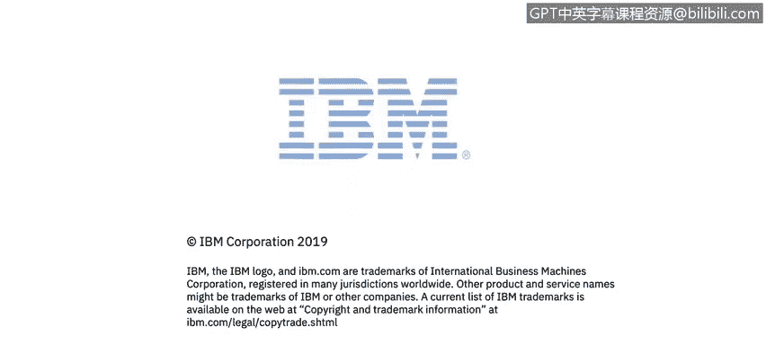

# 课程2：《网络安全角色、流程与操作系统安全》：14：我的工作重要的是什么 👩💻

## 概述
在本节课程中，我们将跟随IBM哥斯达黎加公司的网络安全专家普丽西拉·古斯曼，了解她作为MCN管理员（MCn admin）的日常工作内容、面临的挑战以及她认为这份工作最重要的价值所在。

## 日常工作与挑战
普丽西拉·古斯曼在IBM哥斯达黎加公司的网络安全部门工作。她的职位是MCN管理员（MCn admin），需要持续处理IBM安全信息与事件管理（SIEM）软件可能遇到的各种技术问题。

对她而言，**每一天都是新的挑战，因此没有“典型”的工作日**。这种动态性要求她必须保持高度的适应性和解决问题的能力。

## 持续学习与技能提升
为了应对不断变化的挑战，她和团队需要持续学习。这包括使用各种工具，例如：
*   **Explores**
*   **Know Center**

此外，考取相关领域的认证也是提升专业知识的重要途径。普丽西拉认为，这种持续学习的过程能帮助她紧跟新技术的发展，并了解新出现的网络攻击与威胁。

## 工作的价值与意义
对普丽西拉来说，在网络安全领域工作最有价值的部分，在于**帮助客户保护他们的敏感数据与环境，使其免受日常可能发生的攻击**。

她特别指出，在她个人看来，这是当前最好的技术类工作之一。这份工作不仅技术性强，更承载着保护他人数字资产安全的重要责任。

## 总结
本节课中，我们一起了解了网络安全管理员角色的日常：这是一个充满挑战、需要不断学习新工具（如Explores、Know Center）和获取认证的动态岗位。其核心价值在于通过技术手段，切实地帮助客户防御网络威胁，保护关键数据与环境安全。普丽西拉的经历展示了网络安全工作兼具技术深度与社会责任感的双重魅力。