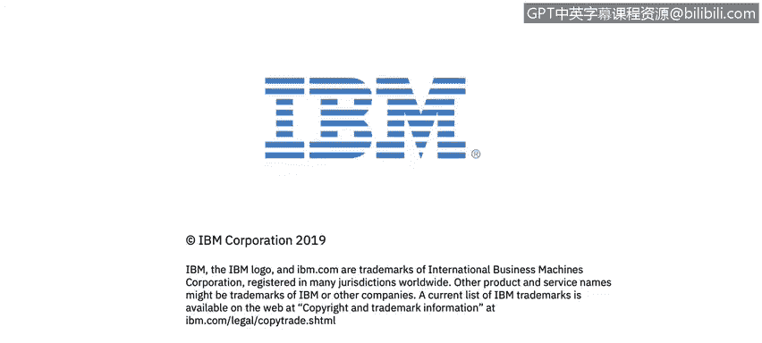

# 课程2：《网络安全角色、流程与操作系统安全》：15：认证和访问控制简介 🔐

在本节课中，我们将学习访问控制与授权的基本概念，并了解开放网络应用安全项目（OWASP）及其在提升软件安全可见性方面的作用。

在模块3中，Elio和John将继续围绕访问控制和授权展开网络安全讨论。

## 认识OWASP项目

上一节我们介绍了课程背景，本节中我们来看看一个重要的安全项目。你将探索开放网络应用安全项目，即**OWASP**。该组织的使命是让软件安全变得可见。这种可见性使得组织内的所有成员都能识别潜在的安全威胁。

## 访问控制参考手册

了解了OWASP的使命后，我们来看一个实用的工具。访问控制参考手册是一个大型参考手册系列的一部分，该系列旨在提供关于访问控制和授权威胁的数据及简明、可操作的指导。

## 研究练习

为了巩固所学知识，接下来需要进行一个实践练习。你将使用**OWASP基金会Top 10项目**进行研究练习，以磨练你的网络安全研究技能。

以下是进行研究的核心步骤：
1.  访问OWASP官方网站。
2.  查找并下载最新的“OWASP Top 10”报告。
3.  针对报告中列出的每一项风险，研究其原理和潜在影响。
4.  思考这些风险如何与你所在或所知的组织环境相关联。

让我们开始吧。

本节课中，我们一起学习了访问控制与授权的基础，认识了OWASP项目及其提升安全可见性的目标，并介绍了通过OWASP Top 10进行安全研究的方法。