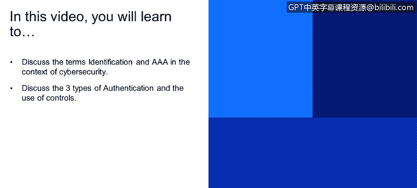
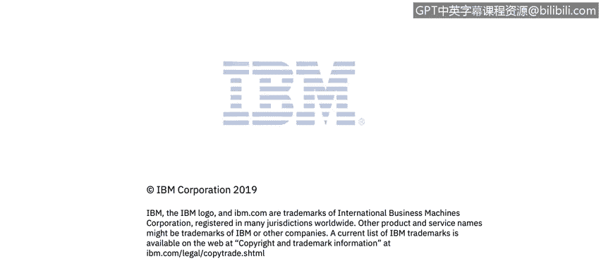

# 课程2：《网络安全角色、流程与操作系统安全》：16：识别与AAA 🛡️

在本节课程中，我们将学习网络安全中的两个核心概念：**识别**与**AAA**。我们将探讨识别过程如何作为访问控制的第一步，并详细解析AAA（认证、授权与审计）框架。此外，我们还将了解三种主要的身份验证方法以及不同类型的安全控制措施。

## 识别与AAA

**识别**是我们向某个资源表明自己身份的第一步。这可以通过用户名和密码、令牌等方式实现。以登录社交网络为例，当我们提交用户名和密码后，应用程序或资源会据此对我们进行身份验证，确保我们在其系统中确实存在。验证成功后，系统会授予我们相应的访问权限。在社交网络的例子中，我们通常会获得一个“用户”类型的角色，而不会拥有管理员权限。此后，我们使用该身份进行的操作都将具有**可审计性**，这意味着我们的所有行为都会被记录和追踪。

简单来说，要使用一个资源，我们首先需要进行**识别**，以获得相应的**授权**。在使用资源的过程中，我们的行为会产生**审计**记录。

## 身份验证方法

身份验证方法多种多样，但可以概括为以下三种主要类型：

*   **你知道的东西**：例如用户名和密码。
*   **你拥有的东西**：通常用于提升安全性，例如银行提供的令牌或智能卡。在日常生活中，带有芯片的信用卡就是“你拥有的东西”。在美国使用信用卡时，你需要输入PIN码（你知道的东西）并验证芯片（你拥有的东西）。RSA令牌在登录银行网站时也会生成随机数字进行验证。
*   **你固有的特征**：这通常指生物特征识别控制。例如指纹、视网膜扫描和生物特征签名。

以下是生物特征验证的基本流程：
1.  **生物特征采集**：例如扫描指纹。
2.  **数据转换**：将采集到的样本图像转换为计算机可以理解的字节数据。
3.  **模式匹配**：系统通过算法创建独特的模式，并与数据库中的记录进行比对。
4.  **结果判定**：系统给出匹配结果。需要注意的是，生物识别存在一定的误差范围，例如指纹识别可能有约5%的误差率。

## 安全控制措施

接下来，我们讨论日常使用的安全控制措施。这些控制主要分为三类：**管理控制**、**技术控制**和**物理控制**。

*   **管理控制**：指企业内部的任何政策或程序。例如，垃圾邮件报告政策。在许多企业中，如果收到垃圾邮件，员工需要报告，这有助于防止恶意邮件进入系统。
*   **技术控制**：在用户行为管理之外增加的技术安全层。例如，防火墙。即使有人打开了恶意邮件，防火墙也能提供保护。
*   **物理控制**：任何物理上限制我们接触资源的措施。例如，需要生物识别才能进入的独立房间、门禁等。

## 控制措施子类别

除了上述主要类别，控制措施还有以下子类别：

*   **纠正性控制**：在发现问题后纠正问题的控制。例如，针对违反公司程序的行为进行政策培训或处罚。
*   **预防性控制**：旨在防止或发现内部控制违规行为的措施。例如，随机内部审计。
*   **威慑性控制**：旨在阻止违规行为的措施。例如，在服务器机房安装摄像头，记录人员活动，使人们因行为被记录而三思而后行。
*   **恢复性控制**：在灾难发生后用于恢复的措施。例如，数据备份。
*   **检测性控制**：帮助识别潜在违规行为的措施。例如，防火墙。
*   **补偿性控制**：当现有控制（如政策）不足以覆盖风险缺口时，采取的额外控制措施。例如，在防火墙上添加模块以阻止恶意软件，作为用户可能点击垃圾邮件链接的补偿措施。

下图更深入地展示了控制措施的类型及其子类别：

---

**总结**：本节课我们一起学习了网络安全中的**识别**与**AAA**框架，了解了身份验证的三种主要类型（你知道的、你拥有的、你固有的），并探讨了管理、技术和物理三大类安全控制及其子类别（纠正性、预防性、威慑性、恢复性、检测性、补偿性）。理解这些概念是构建有效访问控制和系统安全的基础。