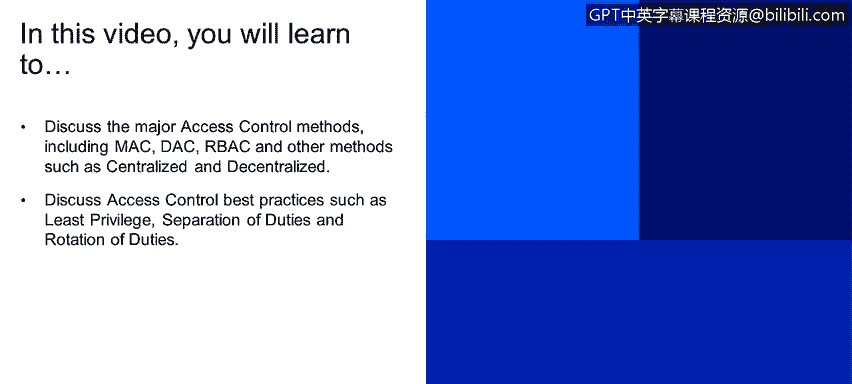
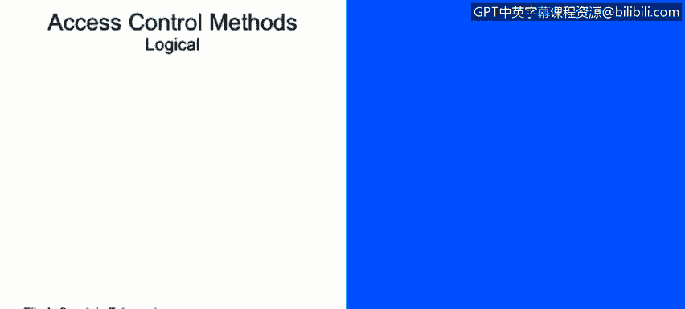
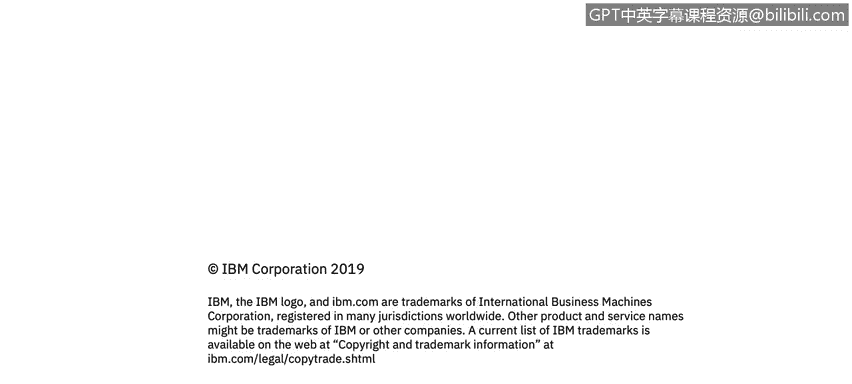

# 课程2：《网络安全角色、流程与操作系统安全》：17：访问控制方法

在本节课中，我们将学习主要的访问控制方法，包括强制访问控制、自主访问控制、基于角色的访问控制以及其他方法，如集中式和分散式控制。我们还将探讨访问控制的最佳实践，例如最小权限原则、职责分离和职责轮换。

## 什么是访问控制

访问控制的核心是追踪谁有权访问特定资源，以及如何管理这些访问权限。有多种方法可以实现访问控制，接下来我们将介绍三种主要方法。

## 主要访问控制方法

以下是三种主要的访问控制方法。

*   **强制访问控制**：这种方法通常用于军事领域，对数据进行分级。一个很好的例子是“交通信号灯协议”。数据根据其敏感度被标记为不同颜色，例如“TLP:AMBER”或“TLP:RED”。常见的分类级别包括“绝密”、“机密”和“秘密”。MAC使用标签来严格管控访问权限。
*   **自主访问控制**：在这种方法中，每个对象（如文件、文档、资源）都有一个所有者，由该所有者定义谁拥有读写权限。由于管理大量对象的权限较为困难，DAC通常用于小型企业。
*   **基于角色的访问控制**：这是目前应用最广泛的访问控制方法。它将权限与角色而非个人用户关联。例如，收银员拥有“收银员”角色的权限，而经理则拥有“经理”角色的更多权限。RBAC有助于防止权限过度分配。

## 其他访问控制方法

除了上述三种主要方法，还存在其他访问控制方案。

*   **集中式解决方案**：例如单点登录，它提供了我们之前提到的“3A”（认证、授权、审计）功能。
*   **分散式解决方案**：例如独立访问控制。这类控制通常内置于本地设备中，常用于军事领域，如在战场环境下管理访问。

## 访问控制最佳实践

在实施访问控制时，遵循一些最佳实践至关重要。以下是三个核心原则。

*   **最小权限原则**：确保人员或资源仅拥有完成其工作所必需的最低限度访问权限。
*   **职责分离**：避免让单个人员或资源拥有过多权限。试想，如果一名对公司不满的员工能够访问所有资源，会造成多大损害？职责分离可以最大限度地减少这种风险。
*   **职责轮换**：这不仅有助于员工了解其他部门的工作，也有利于组织对职责进行跟踪和控制，是良好的管理实践。

## 总结

本节课中，我们一起学习了访问控制的核心概念。我们探讨了三种主要方法：强制访问控制、自主访问控制和基于角色的访问控制，并简要介绍了集中式与分散式等其他方法。最后，我们强调了实施访问控制时应遵循的三个最佳实践：**最小权限原则**、**职责分离**和**职责轮换**。理解并应用这些方法和原则，是构建有效网络安全防线的基础。