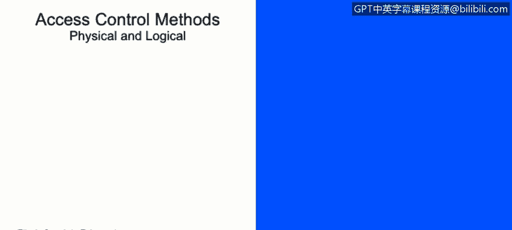

# 课程2：《网络安全角色、流程与操作系统安全》：18：物理与逻辑访问控制 🔐

在本节课中，我们将要学习物理和逻辑访问控制的各种常见方法，并探讨监控与访问控制流程，例如入侵检测系统、入侵防御系统、主机入侵检测与防御系统、蜜罐以及嗅探器。

---

## 物理访问控制方法 🏢

上一节我们介绍了访问控制的基本概念，本节中我们来看看物理访问控制方法。物理访问控制旨在保护物理空间和资产，防止未经授权的进入。

以下是几种常见的物理访问控制措施：

*   **周界控制**：例如围墙，用于保护建筑、工作区域等的外围。
*   **建筑控制**：控制谁能进入特定建筑物，通常通过门禁系统实现。
*   **工作区域控制**：确保只有授权人员才能进入特定的工作区域。
*   **服务与网络控制**：在企业场景中，通常将访客网络与企业内部网络进行物理或逻辑隔离。

为了实施这些控制，我们会采用一些技术手段：

*   **摄像头**：用于监控进出关键区域的人员。
*   **陷阱门/通道门**：一种安全门禁系统，通常一次只允许一人通过，并需刷卡验证。
*   **令牌与门禁日志**：使用门禁卡等令牌，并记录人员进出日志，以便追踪。

---

## 逻辑访问控制方法 💻

了解了物理控制后，现在我们来探讨逻辑访问控制方法。逻辑访问控制关注的是对系统、网络和数据的电子化访问权限管理。

以下是实现逻辑访问控制的关键手段：

*   **访问控制列表**：在路由器或防火墙上设置规则，控制网络流量的进出。
*   **组策略与合规解决方案**：通过策略强制执行密码策略、设备策略以及时间限制。例如，可以限制在非工作时间（如凌晨2点）访问特定资源。
*   **账户管理**：实施集中式或分散式的账户管理，并强制执行账户过期策略，确保离职人员权限被及时收回。

所有这些措施都呼应了我们在课程早期学到的最佳安全实践。

---

## 自带设备带来的挑战 📱

“自带设备”是一个流行的概念，但为其实施有效的访问控制需要付出大量努力。

以下是成功推行BYOD政策所需的关键要素：

*   **严格的策略**：需要制定明确且严格的安全策略。
*   **技术控制**：例如移动设备管理解决方案，用于管理员工个人设备。
*   **员工培训**：确保员工了解如何安全地使用个人设备。
*   **强大的外围控制**：加强网络边界的安全防护。

统计数据表明，约40%的数据泄露与BYOD相关，这凸显了在推行便捷性的同时，必须同步加强安全策略的重要性。

---

## 监控与访问控制流程 👁️

在回顾了可能对组织造成损害的威胁和漏洞之后，现在让我们来谈谈可以保护我们主机的设备和技术。

首先，我们要提到的是**入侵检测系统**。IDS是一个扫描、评估和监控计算机基础设施以发现攻击迹象的系统。它需要硬件传感器和软件才能正确部署。重要的是，每种实现都是独特的，取决于组织的安全需求。请记住，IDS通常只负责**通知**你发生了攻击。

接下来是**入侵防御系统**。IPS具备我们刚才提到的IDS的监控能力，但它还能**主动阻断**检测到的威胁，同时继续对其他事件使用被动响应。

然后是**主机入侵检测与防御系统**。这些是基于主机的系统，可以监控主机是否存在意外行为或与基线的剧烈变化。例如，它可以进行文件完整性检查，或寻找可能可疑的出站请求。

我们还将提到**蜜罐**。蜜罐是一种安全工具，用于引诱攻击者远离实际网络，使其在一个可以被安全监控的环境中活动。当攻击者在蜜罐上操作时，其所有流量和技术都会被记录以供分析。蜜罐可以是软件模拟程序、硬件诱饵或整个域名网络。

最后，我们有**嗅探器**，也称为数据包分析器。它是一种可以监控有线或无线网络通信的设备或程序，并捕获数据。它们通常用于网络故障排除。

在结束本节之前，我想明确区分IPS和IDS：请始终记住，IPS可以**终止连接或采取行动**，而IDS通常只负责**告警和通知**。

---

本节课中，我们一起学习了物理和逻辑访问控制的核心方法，了解了BYOD模式带来的安全挑战，并深入探讨了IDS、IPS、HIDS/HIPS、蜜罐和嗅探器等关键的监控与防御技术。理解这些控制措施和流程，是构建纵深防御安全体系的基础。