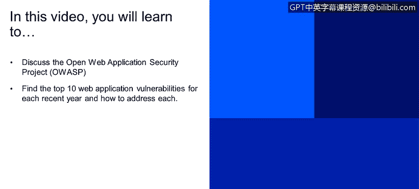
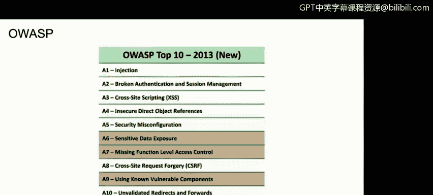
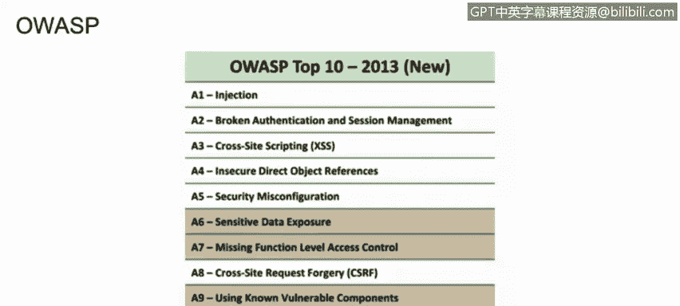
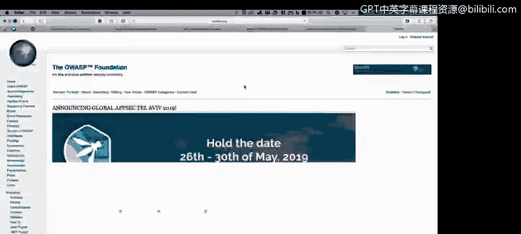
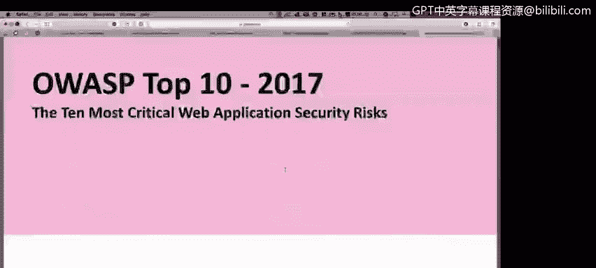
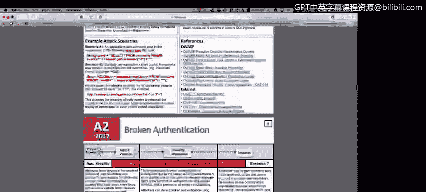
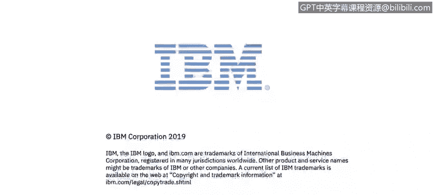

# 课程2：《网络安全角色、流程与操作系统安全》：19：开放式Web应用程序安全项目(OWASP) 🔐

在本节课程中，我们将学习开放式Web应用程序安全项目（OWASP），了解其每年发布的十大Web应用安全风险，并探讨如何应对这些风险。OWASP为网络安全专业人员提供了一套重要的方法论和最佳实践。

上一节我们介绍了其他安全框架，本节中我们来看看OWASP。对于大多数Web应用程序而言，遵循OWASP的指导原则是一项关键的最佳实践。

以下是OWASP十大安全风险项目。如果你正在处理网页或Web应用程序，甚至任何类型的应用程序，你都可以参考OWASP十大清单，并开始对组织网站或应用中的各个部分进行安全测试。

## 访问OWASP资源

OWASP官方网站提供了大量信息。如果你在搜索引擎中查找“OWASP”，访问其官方网站（owasp.org），你将获得关于该组织的丰富资料。这些资源在你尝试对自己的Web应用程序，甚至移动应用程序进行安全测试时，会提供极大的帮助。

例如，在官网的“下载”区域，你可以找到多种分类的资源。

## OWASP十大安全风险

让我们重点关注“十大项目”。这里可以看到2017年发布的OWASP十大Web应用安全风险报告。

该报告详细列出了近两三年内Web应用程序最关键的十大漏洞。例如，排名第一的风险是**注入**。

在报告的第7页，你可以找到关于注入攻击的示例，例如利用SQL注入从系统获取信息的过程。报告还解释了攻击向量、受影响的区域，以及你需要执行哪些查询来测试系统是否存在注入漏洞。

除了注入，报告还涵盖了其他关键风险，例如：
*   **失效的身份认证**
*   **敏感数据泄露**

报告中包含大量可供测试和验证的内容。

## 安全控制清单

在OWASP官网上，你还可以找到另一个重要资源：**检查清单**。

这是一份文档，其中列出了大量你需要实施的控制措施和检查项。遵循这份清单有助于确保你的Web应用程序达到充分的安全水平。

## 总结

本节课中，我们一起学习了开放式Web应用程序安全项目（OWASP）。我们了解了如何访问其官方资源，重点研究了每年发布的“十大Web应用安全风险”报告，并认识了用于确保应用安全的安全控制检查清单。掌握这些资源是进行有效Web应用安全测试的基础。