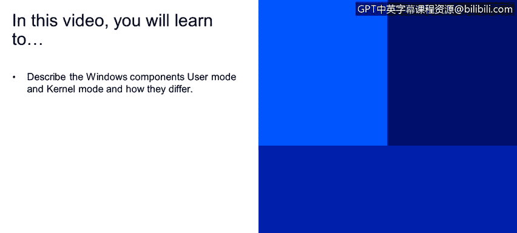
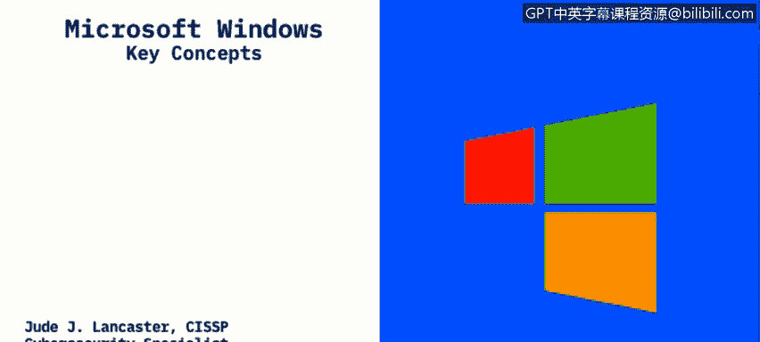
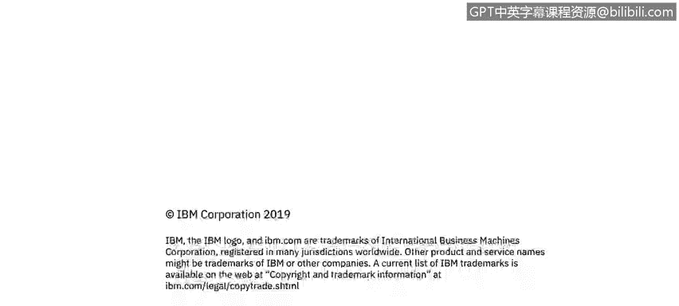

# 课程2：《网络安全角色、流程与操作系统安全》：21：用户与内核模式 👨‍💻

在本节课中，我们将学习描述Windows操作系统的两个核心组件：用户模式和内核模式，并了解它们之间的区别。

---

由微软公司开发的Microsoft Windows操作系统已经存在很长时间了。过去20年里，几乎所有使用过个人电脑的人都可能接触过Windows。Windows最大的优点之一是它创造了我们如今习惯使用的第一个图形用户界面。用户可以使用鼠标进行点击操作，而无需输入命令。Windows专为IBM兼容的个人电脑设计。众所周知，苹果设备运行其自身的操作系统，而Windows则运行在我们所谓的IBM兼容PC上。IBM在80年代初制造了第一台个人电脑。全球约90%的个人电脑和服务器都运行着某个版本的Windows。因此，这是一个我们很多人都非常熟悉的系统。

Windows包含几个关键组件，主要分为**用户模式**和**内核模式**。

上一节我们提到了Windows的普及性，本节中我们来看看其核心架构。

## 用户模式

用户模式是您在使用应用程序时直接交互的部分。例如，当您打开Microsoft Word处理文档，或使用Chrome、Firefox等浏览器上网时，您就在访问用户模式。应用程序会调用驱动程序来创建您所使用的输入/输出功能。

当您启动一个用户模式应用程序时，Windows会为该应用创建一个**进程**。如果您打开任务管理器，就能看到正在运行的应用程序及其对应的进程。任务管理器会显示该进程占用了多少内存和处理器资源。

用户模式应用程序的一个重要特点是它们彼此隔离。以下是其关键特性：

*   **私有虚拟地址空间**：每个应用程序都拥有自己独立的虚拟地址空间。
*   **数据隔离**：一个应用程序无法修改属于另一个应用程序的数据。
*   **独立运行**：每个应用程序都在隔离的环境中运行。
*   **故障隔离**：如果一个应用程序崩溃，它通常不会导致整个操作系统崩溃，只会影响自身。

## 内核模式

内核模式是Windows底层技术的核心。它包含了实际控制用户模式中应用程序的各种**进程**和**线程**。

与用户模式不同，内核模式中的所有组件共享同一个虚拟地址空间。这意味着：

*   **共享地址空间**：内核模式驱动程序并不与其他驱动程序或操作系统本身隔离。
*   **高风险操作**：如果一个内核模式驱动程序意外地向错误的虚拟地址或操作系统其他部分写入数据，可能会破坏操作系统内的数据。
*   **系统级故障**：如果一个内核模式驱动程序崩溃，将导致整个操作系统崩溃。这就是我们常说的“蓝屏死机”现象。当操作系统停止运行并需要重启时，这通常就是由内核模式故障或驱动程序写入错误虚拟地址引起的。

---

本节课中，我们一起学习了Windows操作系统的两个核心运行模式。**用户模式**负责运行应用程序，其特点是进程隔离，一个程序的故障通常不会影响系统整体。而**内核模式**是操作系统的核心，负责管理硬件和系统资源，其组件共享地址空间，一旦发生故障则可能导致整个系统崩溃。理解这两种模式的区别对于进行系统维护和故障排查至关重要。