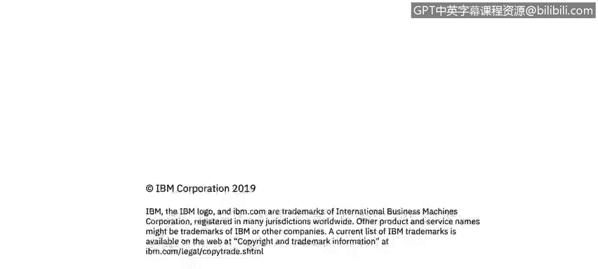

# 课程2：《网络安全角色、流程与操作系统安全》：22：文件系统 📁

在本节课中，我们将学习Windows操作系统中使用的两种主要文件系统：NTFS和FAT。文件系统是应用程序在存储设备上存储和接收文件的基石。我们将了解它们的基本概念、特点以及应用场景。

---

## 什么是文件系统？

文件系统使得应用程序能够在存储设备上存储和接收文件。在Windows环境中，存储设备主要指计算机内置的硬盘驱动器。硬盘驱动器可以是机械式的旋转盘片，也可以是非机械式的固态硬盘。

文件被放置在一种称为**分层结构**的体系中。这意味着你可以在文件夹中创建子文件夹，形成树状结构。文件系统规定了文件的命名规则，以及在该分层结构中指定文件路径的格式。

为了明确概念，我们定义以下核心术语：
*   **文件**：文件系统中用户可访问和管理的**数据单元**。例如，一张图片（JPG或PNG格式）就是一个文件。
*   **目录（文件夹）**：文件和目录的**分层集合**。在Windows中，目录通常被称为“文件夹”。

每个文件在其所在的目录内必须拥有**唯一的名称**。如果你尝试在同一个目录内复制并粘贴一个文件，系统会自动在文件名后添加数字以示区分。

---

## Windows中的主要文件系统类型

上一节我们介绍了文件系统的基本概念，本节中我们来看看Windows中两种主要的文件系统类型。

Windows主要使用两种文件系统：

1.  **NTFS**
2.  **FAT**

### NTFS（新技术文件系统）

**NTFS** 是当今Windows操作系统中最主流的文件系统。自1993年问世以来，它已成为Windows个人电脑和服务器的标准文件系统。

以下是NTFS的一些关键特点：
*   **广泛应用**：用于Windows 10、Windows Server 2012/2016等现代操作系统。
*   **支持大容量**：设计用于支持超过32GB的大容量存储设备。
*   **功能丰富**：提供了高级功能，如文件权限、加密、压缩和日志记录，增强了安全性和可靠性。

### FAT（文件分配表）

**FAT** 是一种更简单的文件系统，其历史可追溯到20世纪80年代，早于NTFS出现。它常见于容量较小的可移动存储设备上。

FAT系统名称中的数字（如FAT16、FAT32）指的是用于枚举文件系统块的**位数**。

以下是FAT文件系统的主要应用场景：
*   **可移动驱动器**：常用于USB闪存盘、可擦写CD/DVD等。
*   **小容量设备**：FAT32通常用于容量**小于32GB**的设备。
*   **兼容性**：由于其简单性，FAT在各种设备和操作系统（如相机、游戏机、旧版Windows）上具有广泛的兼容性。

---

## 总结

本节课中，我们一起学习了Windows操作系统的核心组成部分——文件系统。我们首先了解了文件系统的基本定义和作用，以及文件和目录的概念。接着，我们重点探讨了两种主要的文件系统：**NTFS**和**FAT**。NTFS是现代Windows系统和大容量硬盘的首选，功能强大且安全；而FAT则因其简单和兼容性，广泛应用于小容量的可移动存储设备。理解这两种文件系统的区别，对于管理存储设备和进行基本的系统操作至关重要。