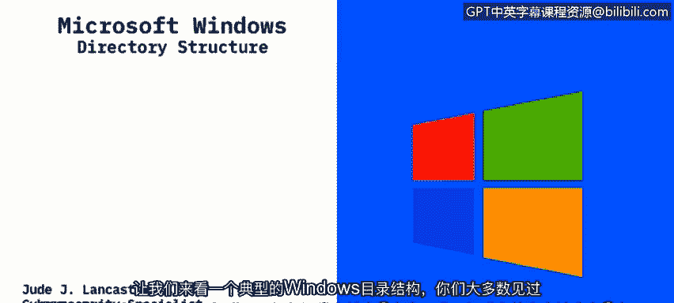

# 课程2：《网络安全角色、流程与操作系统安全》：23：Windows目录结构

在本节课程中，我们将学习Windows操作系统的目录结构，并了解Windows如何处理32位与64位应用程序的分离。理解这些基础知识对于进行系统安全分析和文件管理至关重要。

## 概述：Windows目录结构核心

Windows操作系统将几乎所有文件都存储在通常被称为 **C盘** 的主硬盘驱动器上。一个典型的Windows 10设备具有一套标准的文件夹结构，其中部分文件夹对普通用户是隐藏的。

## 标准文件夹解析

以下是您将在Windows C盘根目录下看到的主要文件夹及其功能。

### 隐藏文件夹：erfLogs

首先，系统包含一些隐藏文件夹。隐藏意味着终端用户默认无法直接访问，除非通过控制面板取消隐藏。微软隐藏这些文件夹是因为普通用户通常不需要访问它们。

其中一个主要的隐藏文件夹是 **PerfLogs**，它用于存放性能日志。不过，这个文件夹通常是空的。

### 应用程序文件夹：rogram Files 与 Program Files (x86)

C盘的核心内容是应用程序文件夹。在能够寻址更多内存的新操作系统（即64位系统）上，您会看到两个关键文件夹：

*   **Program Files**：此文件夹用于存储 **64位应用程序**。
*   **Program Files (x86)**：此文件夹用于存储 **32位应用程序**。

为了理解这种分离的原因，我们需要回顾一下操作系统的发展历程。Windows操作系统经历了从16位（如Windows 3.1）到32位（如Windows 95），再到64位的演变。**32位操作系统** 与 **64位操作系统** 的一个根本区别在于它们能够寻址（即管理和使用）的内存总量。

一个关键的限制是：**32位操作系统最多只能寻址4GB内存**。对于现代应用程序来说，这通常不够用。因此，从Windows 2000开始，64位操作系统逐渐成为主流，Windows 10现在主要是64位系统。

在64位Windows系统上，32位应用程序可以运行，但为了保持系统稳定性和组织性，它们被安装在与64位应用不同的目录中。如果您使用的是32位操作系统，则不会出现“Program Files (x86)”文件夹，因为所有应用程序都将安装在唯一的“Program Files”目录中。

### 程序数据文件夹：rogramData

接下来是 **ProgramData** 文件夹。此文件夹包含由计算机程序访问的文件，**无论当前哪个用户登录到系统**。这些是应用程序运行所必需的文件，其功能独立于任何特定用户。

### 用户配置文件文件夹：Users

**Users** 目录是存储用户配置文件的地方。每个子文件夹对应一个不同的用户名。

*   **Public（公共）文件夹**：所有Windows系统都会有一个Public文件夹。这是一个共享空间，允许多个登录到同一系统的用户在此放置文件，以便所有用户都能访问。
*   **用户个人文件夹**：在Users文件夹下，您会看到每个授权用户的用户名文件夹。用户的个人文件通常存储在这里，例如“文档”、“图片”、“音乐”等，这是现代Windows系统的常见布局。
*   **AppData文件夹**：位于用户个人文件夹内，它类似于“ProgramData”，但存储的是**特定于终端用户的应用程序数据**。例如，您在Microsoft Word中创建的自定义模板就会存储在此处，从而与其他登录用户的设置分开。

### Windows系统文件夹

最后是 **Windows** 系统目录，这是Windows操作系统实际安装的位置。其下主要有三个核心文件夹，它们包含了Windows的核心功能和API（应用程序编程接口）文件：

1.  **System**：存储16位DLL（动态链接库）文件。在64位Windows版本上，此文件夹通常是空的，但为了兼容性依然存在。
2.  **System32**：根据您使用的是32位还是64位系统，此文件夹存储相应位数的DLL文件。在64位系统上，它存储的是64位DLL。
3.  **SysWOW64**：此文件夹**仅出现在64位Windows版本**上。它的作用是存储**32位DLL**文件。当32位应用程序在64位系统上运行时，系统会在此文件夹中查找所需的库文件。

当程序请求加载一个DLL文件而未指定具体路径时，Windows会自动在上述文件夹中进行搜索。这些文件夹是运行Windows并为用户提供图形界面所必需的系统文件库。

## 总结

本节课我们一起学习了Windows操作系统的目录结构。我们了解到，文件主要存储在C盘，并区分了用于64位应用的 **`Program Files`** 和用于32位应用的 **`Program Files (x86)`** 文件夹。我们还探讨了存储公共程序数据的 **`ProgramData`**、存放用户个人配置和文件的 **`Users`** 目录，以及包含系统核心文件的 **`Windows`** 目录及其子文件夹（`System`， `System32`， `SysWOW64`）。理解这些结构是有效进行系统管理和安全分析的基础。