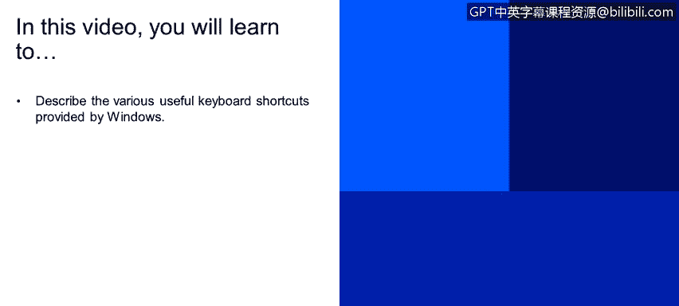
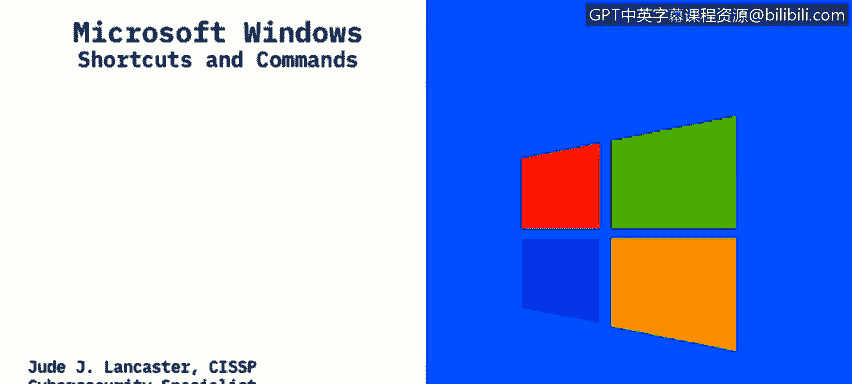
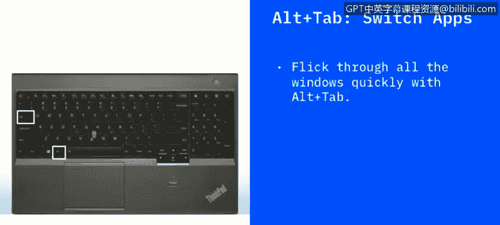
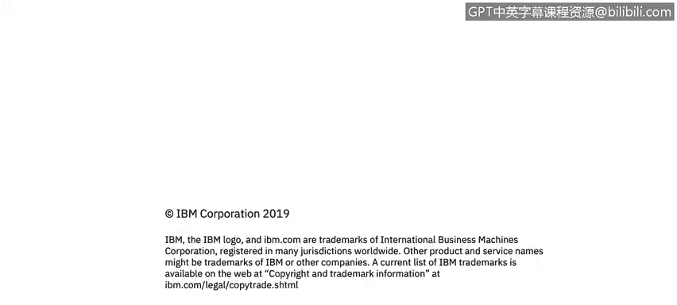

# 课程2：《网络安全角色、流程与操作系统安全》：24：快捷方式和命令 🖥️⌨️

在本节课中，我们将学习Windows操作系统提供的各种实用键盘快捷键。掌握这些快捷键能显著提升操作效率，让你在图形用户界面中更快速地完成任务。

## 概述

Windows操作系统以其图形用户界面著称，用户可以通过鼠标、键盘等输入设备与系统交互。除了图形界面，Windows也支持命令行操作，但图形界面因其直观性而广受欢迎。为了进一步提升效率，Windows内置了许多键盘快捷键，这些快捷键通常通过组合**Windows键**或**Ctrl键**与其他按键来实现，能帮助我们快速执行常用操作，节省时间。

## 常用键盘快捷键详解

上一节我们概述了快捷键的重要性，本节中我们来看看一些具体且实用的快捷键组合及其功能。

以下是几个核心的Windows键盘快捷键：

*   **Ctrl + Z**：撤销上一个操作。这个快捷键是通用的，无论你是在Microsoft Word中误删了一段文字，还是不小心删除了一个文件，都可以使用它来撤销。公式表示为：`动作 = 撤销(上一个操作)`。
*   **Ctrl + W**：关闭当前窗口。如果你打开了多个窗口或应用程序，使用此快捷键可以快速关闭位于最前端的活动窗口。如果窗口中有未保存的内容，系统通常会提示保存。
*   **Ctrl + A**：全选当前页面或文档中的所有内容。这在复制网页文字或整理长文档时非常方便，无需再用鼠标费力地拖动选择。
*   **Alt + Tab**：在打开的应用程序之间切换。按下此组合键会显示所有已打开窗口的缩略图，持续按住`Alt`键并多次按`Tab`键可以在它们之间循环选择。
*   **Alt + F4**：关闭当前活动窗口。如果所有窗口都已关闭，此快捷键将打开关机对话框。这是一个历史悠久的快捷方式，能高效地关闭应用程序。
*   **Win + D**：显示或隐藏桌面。这是一个切换功能，可以一键最小化所有窗口以查看桌面文件，再次按下则恢复所有窗口。
*   **Win + 左/右方向键**：将当前窗口贴靠到屏幕左侧或右侧。这有助于并排查看两个窗口，提升多任务处理效率。
*   **Win + Tab**：打开“任务视图”。与`Alt + Tab`类似，但会以更大的缩略图平铺展示所有打开的窗口和虚拟桌面，视觉效果更直观。
*   **Tab / Shift + Tab**：在对话框的选项之间向前或向后移动焦点。当面对一个包含多个按钮、输入框的对话框时，使用`Tab`键可以快速导航，无需使用鼠标点击。

## 总结

本节课中，我们一起学习了Windows操作系统中一系列提高效率的键盘快捷键。从撤销操作(`Ctrl + Z`)、窗口管理(`Alt + Tab`, `Win + D`)，到文本处理(`Ctrl + A`)和对话框导航(`Tab`)，这些组合键是每位Windows用户，尤其是追求效率的IT专业人士应该掌握的基础技能。熟练运用它们，能让你的日常工作流程更加流畅快捷。