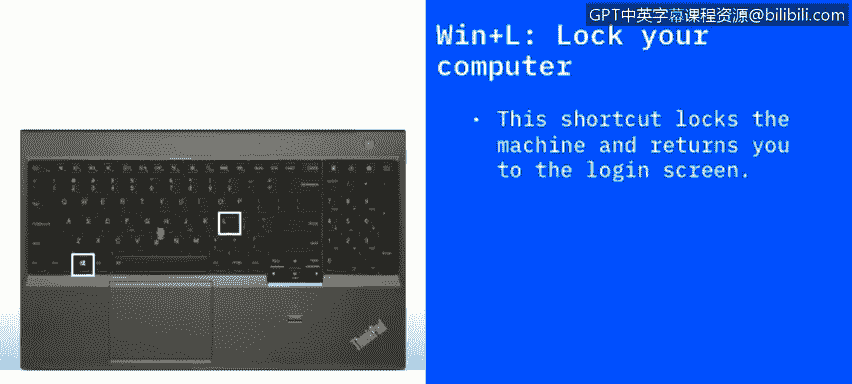

# 课程2：《网络安全角色、流程与操作系统安全》：25：其他快捷方式 🖥️

在本节课程中，我们将学习一系列实用的Windows键盘快捷键。掌握这些快捷键能显著提升工作效率，并有助于遵循良好的安全实践。

上一节我们介绍了基础的Windows操作，本节中我们来看看更多能简化日常任务的高级快捷键。

## 文件与窗口操作快捷键

以下是几个用于快速管理文件和刷新内容的快捷键：

*   **F2**：重命名文件。选中一个文件后按下 **F2**，可以直接为其重命名，无需右键点击选择“重命名”选项。此功能在文件资源管理器、Excel、Word等应用程序中均适用。
*   **F5**：刷新。当你在编辑网页或查看文件资源管理器，并希望获取最新内容时，按下 **F5** 可以立即刷新当前视图，无需使用鼠标点击刷新按钮。

## 系统安全与设置快捷键

良好的安全习惯至关重要。以下是两个与系统安全和设置相关的快捷键：

*   **Windows键 + L**：锁定计算机。无论你是暂时离开工位去休息，还是在家中起身，按下 **Windows键 + L** 可以立即锁定计算机屏幕。这是一个重要的安全实践，能防止他人未经授权访问你的电脑。返回后，你可以使用密码、指纹或面部识别等方式解锁。
*   **Windows键 + I**：打开Windows设置。在任何界面下，按下 **Windows键 + I** 可以快速打开Windows系统设置对话框。
*   **Windows键 + A**：打开操作中心。按下此组合键会打开操作中心，你可以在这里查看通知，并快速访问网络、音量等常用设置。

## 搜索与截图快捷键

快速查找信息和捕捉屏幕画面是常见需求。以下是相关快捷键：

*   **Windows键 + S**：打开搜索。按下 **Windows键 + S** 会弹出搜索对话框，你可以快速搜索文件、文件夹或应用程序，比通过开始菜单导航更高效。
*   **Windows键 + Print Screen**：截取全屏。按下此组合键会将当前整个屏幕的图像保存为文件，并复制到剪贴板。
*   **Alt + Windows键 + Print Screen**：截取活动窗口。如果你只想截取当前正在使用的窗口（而非整个桌面），可以按下 **Alt + Windows键 + Print Screen**。这对于故障诊断或向他人展示特定错误信息非常有用。

## 系统管理与高级功能快捷键

对于系统管理和使用一些高级功能，以下快捷键能提供便利：

*   **Ctrl + Shift + Esc**：打开任务管理器。直接按下 **Ctrl + Shift + Esc** 可以快速打开任务管理器，查看正在运行的应用程序、服务及其占用的内存和CPU资源。如果某个程序无响应，你可以在这里将其结束。
*   **Windows键 + C**：打开Cortana（微软小娜）。在较新的Windows系统（如Windows 10及以上）中，按下 **Windows键 + C** 可以启动Cortana数字助理，你可以通过语音或打字向其提问。
*   **Windows键 + Ctrl + D**：创建新的虚拟桌面。这个功能可以帮你整理工作空间。按下 **Windows键 + Ctrl + D** 会创建一个新的虚拟桌面，你可以在不同的桌面间切换，将不同类型的任务（如工作、娱乐）分开，避免所有窗口堆叠在一个桌面上。
*   **Windows键 + X**：打开高级用户菜单。这是一个独立于开始菜单的隐藏菜单，按下 **Windows键 + X** 可以快速访问控制面板、命令提示符、电源选项等高级系统工具和设置。

本节课中我们一起学习了多种实用的Windows键盘快捷键，涵盖了文件操作、系统安全、快速搜索、屏幕截图和高级管理功能。熟练运用这些快捷键不仅能提升你的操作效率，也是培养良好计算机使用习惯和安全意识的一部分。