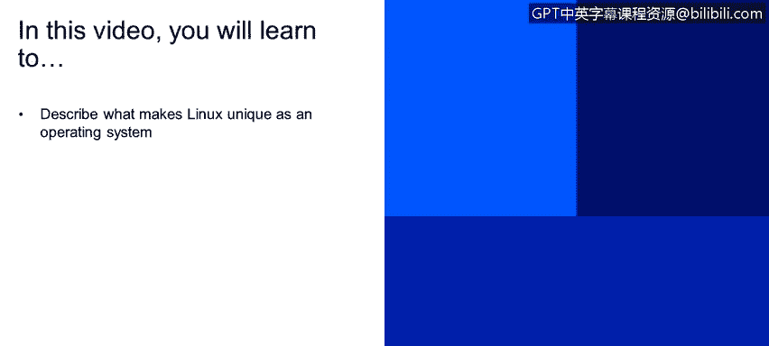
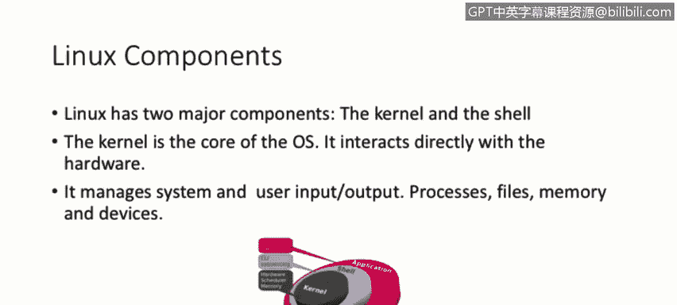
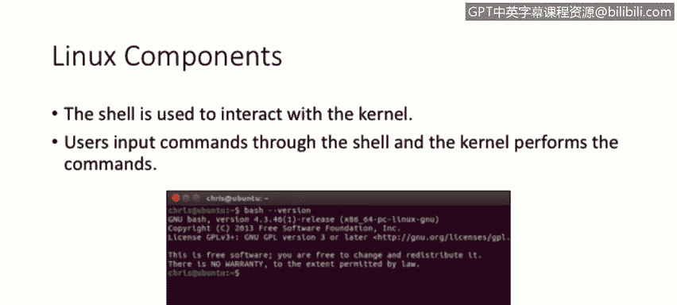
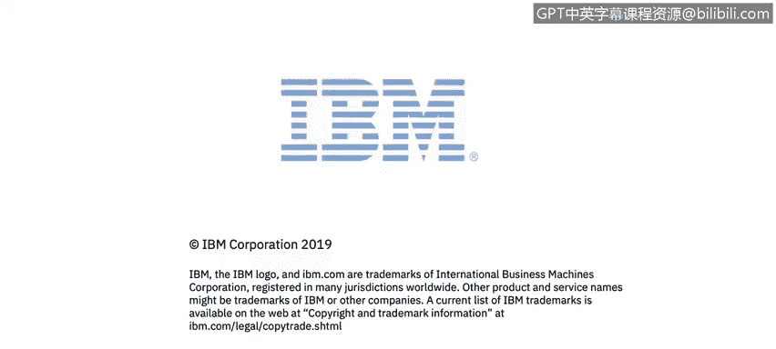

# 课程2：《网络安全角色、流程与操作系统安全》：26：关键组件

在本节课中，我们将学习Linux操作系统的独特之处。我们将讨论Linux及其操作系统的几个关键概念。

## 什么是Linux？

Linux是一个操作系统。它是开源的，并在通用公共许可证（也称为GPL）下授权。此许可证保证最终用户（即我们自己）拥有运行、研究、分享和修改软件的自由。但有一个条件：你可以研究、修改和分享它，但前提是你的修改也必须同样在通用公共许可证（GPL）下授权。

## Linux的核心组件

Linux包含许多组件，但我们现在将讨论两个主要组件：**内核**和**Shell**。

### 内核

内核是操作系统的核心。它被设计为直接与硬件本身交互。它管理系统和用户的输入/输出、进程、文件、内存和设备。

### Shell

在内核之上，我们有Shell，它是一个为用户设计的、用于直接与内核交互的接口。在幻灯片中间的截图中，你会看到所谓的CLI或命令行界面。这就是系统的Shell，用户在此界面中输入命令，然后内核将执行这些命令。

## 总结

本节课中，我们一起学习了Linux操作系统的定义及其两个核心组件：内核和Shell。内核是直接管理硬件的核心，而Shell则是用户与内核交互的命令行界面。