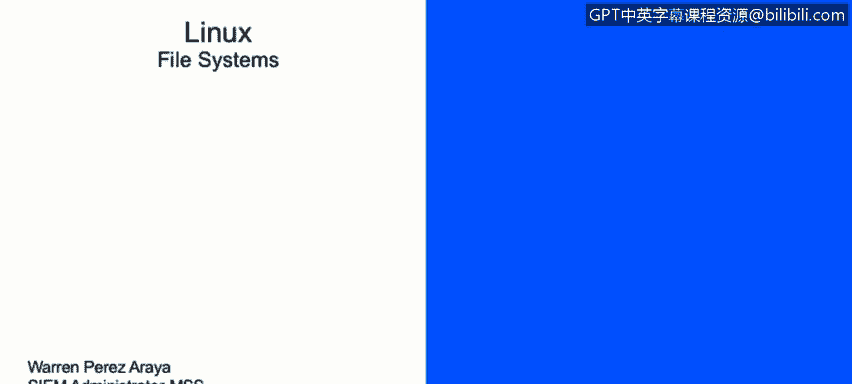
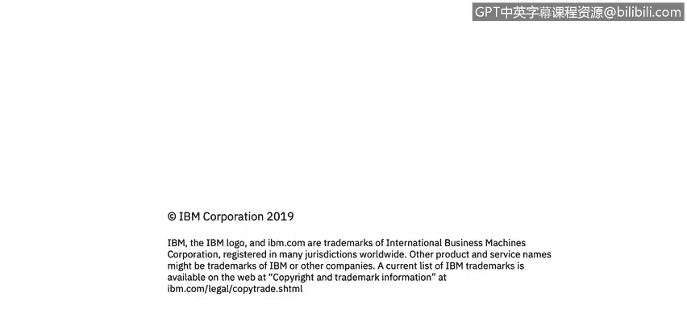

# 课程2：《网络安全角色、流程与操作系统安全》：27：Linux文件系统

在本节课中，我们将学习如何描述Linux文件系统。接下来，我们将讨论Linux及其文件系统的设计方式。

首先，我们来谈谈文件和目录。

**文件**是存储数据的基本单元。这个单元本质上是物理介质（如硬盘、U盘或任何设计用于存储信息的设备）上的一个存储位置。在命令行中，文件通常用一个短横线 `-` 表示，我们稍后会详细讨论。

**目录**则是一种特殊类型的文件。目录包含有关其他文件的信息，因此它是文件的容器，相当于Windows系统中的文件夹。在Linux命令行中，目录用字母 `d` 表示。

在下面的截图或图像中，您会看到高亮显示的目录。在左侧，您可以看到它以字母 `d` 开头，这表明该项是一个目录。而在其上方，您可以看到一个以短横线 `-` 开头的项，这表明它是一个文件。

Linux的目录结构与Windows有很大不同。一切从斜杠 `/` 开始，这个斜杠也称为**根目录**。其他所有内容都“附加”到这个根分区上。根分区是每个文件和目录的起点。通常，只有根用户组才对这个目录拥有权限，这是出于安全原因。

请注意，`/`（根目录）与 `/root` 不同。`/root` 是根用户（root）的主目录。我们稍后会讨论主目录。

以下是Linux文件系统中一些重要的标准目录及其作用：

*   **`/bin` 目录**：包含二进制可执行文件。常见的Linux命令如 `ps`、`ls`、`grep`、`cp`、`mv` 等都存放在这里。我们将在后续课程中更详细地讨论基本命令。
*   **`/sbin` 目录**：同样包含可执行二进制文件，但这些文件更多与系统维护任务相关，例如 `iptables`、`reboot`、`fdisk` 或 `ifconfig` 命令。
*   **`/etc` 目录**：大多数情况下，系统上安装的所有程序的配置文件都存放在这里。例如，如果我们在Linux服务器上安装了Apache服务，该服务的所有配置文件通常位于 `/etc/apache2/` 目录下。
*   **`/var` 目录**：这是一个专门设计用于存放不断增长或变化的文件的特定分区。它被称为可变文件目录。一个典型的例子是日志文件，它们通常位于 `/var/log/` 目录下。大多数应用程序都会在这里创建其日志。
*   **`/tmp` 目录**：包含临时文件。任何存储在 `/tmp` 下的文件在系统重启时都会被删除。这个目录不用于长期保存文件。
*   **`/home` 目录**：这是所有用户的**主目录**。每当创建一个用户时，系统会为其在 `/home` 下创建一个同名目录。这个分区设计用于存储每个用户的个人文件，并且通常只有该用户自己拥有读写权限。例如，创建一个名为“Warren”的用户后，其主目录将是 `/home/warren`，只有Warren可以编辑或读取该目录中的文件。
*   **`/boot` 目录**：包含引导加载程序文件。这个分区专门在系统启动时使用。

既然谈到了启动，我们也需要了解Linux使用的不同**运行级别**，它们对应系统特定的状态或模式。

*   **运行级别 0**：系统关机。它停止所有服务，系统不会在运行级别0执行后重新启动。
*   **运行级别 1**：单用户模式。只有一个用户可以使用系统，且没有网络功能。这通常用于直接在操作系统上进行维护。
*   **运行级别 2**：多用户模式，但**没有网络支持**。也用于维护和系统测试。
*   **运行级别 3**：**多用户模式，并带有网络支持**。例如，一个只有命令行界面（CLI）而没有图形界面的服务器通常运行在此级别。它是纯文本模式，但支持服务器运行所需的所有必要服务。
*   **运行级别 4**：自定义模式。由系统管理员使用，可以根据特定需求进行定制。
*   **运行级别 5**：**图形界面模式**，也称为X11。它与运行级别3类似，但增加了图形登录和图形用户界面。
*   **运行级别 6**：系统重启。它指示系统重新启动并重新加载所有正在运行的服务。

**总结**

本节课我们一起学习了Linux文件系统的核心概念。我们了解了文件（用 `-` 表示）和目录（用 `d` 表示）的区别，并探索了从根目录 `/` 开始的层级结构。我们介绍了几个关键的系统目录，如存放命令的 `/bin` 和 `/sbin`，存放配置的 `/etc`，存放可变数据的 `/var`，存放临时文件的 `/tmp`，以及存放用户个人文件的 `/home`。最后，我们还了解了Linux的不同运行级别，它们定义了系统启动后的操作状态，从单用户维护模式（级别1）到带网络的多用户文本模式（级别3），再到完整的图形界面模式（级别5）。理解这些基础知识对于有效管理和维护Linux系统至关重要。