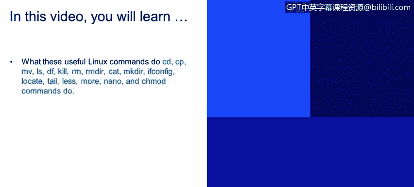

# 课程2：《网络安全角色、流程与操作系统安全》：28：基本命令

在本视频中，你将学习这些有用的Linux命令的功能。现在我们将讨论Linux操作系统上的一些基本命令。

我们有一个基本命令列表，我们将逐一介绍。

首先，我们有 `cd` 或更改目录命令。

这个命令基本上用于更改用户的目录。

这些命令都基于文本模式界面，例如命令行界面。

因此，如果你想从 `/home` 移动到 `/bin`，你可以使用命令 `cd /bin`。

`cp` 命令用于复制文件或目录。对于目录，你必须使用特殊的标志，例如 `-r` 或递归标志。

由于目录内部包含多个文件或子目录，你必须将 `cp` 命令与标志结合使用，以指示复制命令递归地复制内部目录。

`mv` 命令类似于复制命令 `cp`。但在这种情况下，`mv` 命令会将目录从一个位置移动到另一个位置。

`ls` 命令用于列出与文件和目录相关的信息，例如所有者和权限，我们稍后会看到这一点。

`df` 命令用于显示文件系统的磁盘空间。因此，如果你想了解分区的磁盘空间使用情况，可以使用 `df` 命令，它将显示与磁盘使用情况相关的信息。

`kill` 命令用于终止或停止一个执行中的进程。例如，如果你有一个正在后台运行的进程（如Apache），并且你想停止它，你可以使用 `kill` 命令来终止该特定进程或服务。

`rm` 命令用于删除文件或目录。如果你想删除目录，需要在该特定命令上指定递归标志 `-r`。`rm` 可以删除文件和目录，但我们也有 `rmdir` 命令，它基本上用于删除目录，但该目录必须是空的才能被删除。

我们还有 `cat` 命令，它是“concatenate”的缩写。你可以将多个文件合并为一个，但如果你想查看文件的内容，它也非常有用。例如，`cat textfile.txt` 将在命令行界面上显示该文件内的所有信息。

`mkdir` 命令用于创建新目录。它会创建一个空目录。基本上，你输入 `mkdir` 和你想要创建的目录名称。

`ifconfig` 命令用于查看或配置网络接口。因此，每当需要检查Linux系统的网络配置时，你可以使用 `ifconfig` 命令，它将在命令行界面上打印与特定网卡或系统上安装的所有网卡相关的信息。

`locate` 命令非常有用，如果你想搜索文件的位置。该命令使用一个需要更新的内部数据库。要更新数据库，你需要使用 `updatedb` 命令。

`tail` 命令也用于查看文本文件的最后10行。你还可以将 `tail` 命令与 `-n` 标志结合使用，例如 `tail -n 20`，然后指定你想在该特定文件中看到的行数。你还可以使用 `tail -f`，这将为你提供文件的实时视图，这在查看日志文件时非常有用，因为它们会不断变化。因此，你可以使用 `tail -f`，这基本上会为你提供该特定文件的实时视图。

`less` 命令用于查看巨大的日志文件。它在打开时不会加载整个文件，基本上只在你向下移动文件时加载文件内容。

`more` 命令也用于显示文本，它一次显示一屏。例如，如果你想滚动浏览一个大文件，它将一次滚动一屏。因此，如果你在文件上向下滚动，它将一次滚动命令行界面大小的内容。

`nano` 命令是一个文本编辑器。它用于编辑文件，你可以输入命令，可以从文件中删除信息。它基本上就像命令行界面的文字处理程序。

我们还有 `chmod` 或更改模式命令。这是一个非常有用的命令，用于更改文件和目录的权限。我们将稍后进一步讨论这一点。

