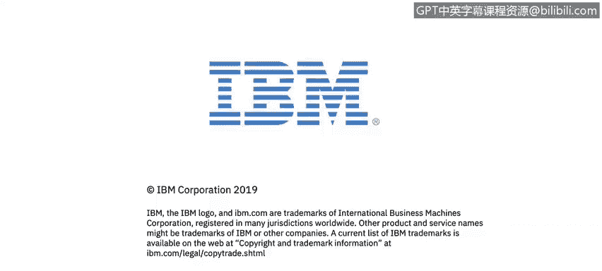

# 课程2：《网络安全角色、流程与操作系统安全》：29：权限和所有者 🔐


在本节课中，我们将学习描述Linux文件和目录的基本权限结构。理解权限是管理操作系统安全的基础，它决定了谁可以访问、修改或执行系统中的资源。


## 权限与所有者


上一节我们介绍了Linux系统的基本概念，本节中我们来看看文件和目录的权限设置。权限主要涉及三个可以“拥有”文件的实体，它们分别是：
*   **用户**：文件的所有者。
*   **组**：拥有该文件的用户组。
*   **其他用户**：指既不是文件所有者，也不在所属组内的其他所有用户。

请注意幻灯片中的最后一张图片，您会看到：
*   `wal` 是该文件的**用户**。
*   `support` 是拥有该文件的**组**。
*   用户和组共同构成了该文件的**所有者**。


## 权限类型

对于上述每个实体，都可以分配三种基本类型的权限。在本课程中，我们将讨论这三种基本权限：
*   **读取**：查看文件内容或列出目录内容。
*   **写入**：修改文件内容或在目录中创建/删除文件。
*   **执行**：运行文件（如果是程序）或进入目录。

这些权限可以用数字表示，分别为4、2、1。它们也可以用二进制数表示：
*   **读取**的值为 `4`，二进制表示为 `100`。
*   **写入**的值为 `2`，二进制表示为 `010`。
*   **执行**的值为 `1`，二进制表示为 `001`。


再次将注意力集中到幻灯片最后一张图片的左侧，您会看到：
*   **文件类型**：由一个短横线 `-` 表示，这代表一个普通文件。
*   **权限**：有三组权限，每组包含三个具体的权限标志。
    *   第一组三个字母代表**用户**权限。从图中可知，用户拥有读、写和执行权限 (`rwx`)。
    *   第二组三个字母代表**组**权限。组只有读和执行权限 (`r-x`)，没有写权限（由短横线 `-` 表示）。
    *   第三组三个字母代表**其他用户**权限。其他用户没有任何权限 (`---`)。

## 权限的数字表示法

以下是刚才讨论内容的另一种表示方法。权限的数字值含义如下：
*   `0` 表示无权限。
*   `1` 表示可执行。
*   `2` 表示可写入。
*   `3` (即 2+1) 表示可写和可执行。
*   `4` 表示可读取。
*   `5` (即 4+1) 表示可读和可执行。
*   `6` (即 4+2) 表示可读和可写。
*   `7` (即 4+2+1) 表示可读、可写和可执行。

在屏幕右侧，您可以看到这些数字是如何相加的另一个示例：
*   对于**所有者**权限，数字是 `7`。这由读(4)、写(2)、执行(1)相加得到，二进制为 `111`。
*   对于**组**权限，数字是 `5`。这由读(4)和执行(1)相加得到，二进制为 `101`。注意，组权限中写权限的位置是短横线 `-`，所以没有加2。
*   对于**其他用户**权限，数字是 `4`。这仅由读(4)构成，写和执行位置都是短横线 `-`。

## 修改权限：`chmod` 命令

文件的权限并非一成不变，可以被更改和修改。这时我们就需要使用 `chmod`（change mode，更改模式）命令。

该命令的基本用法如下：
```bash
chmod [权限] [文件名或目录名]
```
权限可以用数字设置，例如 `755` 表示用户权限为7，组权限为5，其他用户权限为5。

我们也可以更具体地设置权限。以下是使用字母表示法的示例：
```bash
chmod u=rw,g=r,o=r filename
```
*   `u=` 代表用户，此处赋予读(`r`)和写(`w`)权限。
*   `g=` 代表组，此处仅赋予读(`r`)权限。
*   `o=` 代表其他用户，此处也仅赋予读(`r`)权限。
命令最后跟上要编辑的文件名或目录名。

## 修改所有者：`chown` 命令

在Linux中，我们也可以更改文件或目录的所有者（用户）或所属组。为此，我们将使用 `chown`（change owner，更改所有者）命令。

该命令的格式如下：
```bash
chown [新用户]:[新组] [文件名或目录名]
```
例如，在给出的图片案例中，文件 `main.txt` 的所有者是用户 `wal` 和组 `support`。如果我们想将其修改为 `root` 用户和 `root` 组，可以运行：
```bash
chown root:root test
```
执行此命令后，文件 `test` 的所有者将变为用户 `root`，所属组也将变为 `root`。



本节课中我们一起学习了Linux文件和目录的权限与所有者概念。我们了解了权限的三个实体（用户、组、其他用户）和三种类型（读、写、执行），掌握了用字母和数字表示权限的方法，并学会了使用 `chmod` 命令修改权限以及使用 `chown` 命令修改所有者和所属组。这些是管理Linux系统安全性的核心操作。