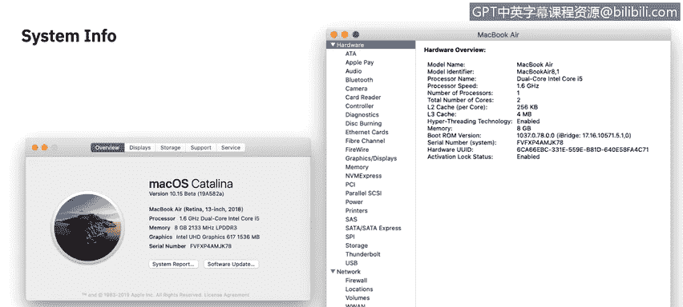

# 课程2：《网络安全角色、流程与操作系统安全》：30：macOS审计 🍎

在本节课中，我们将学习如何在macOS操作系统中查找硬件和软件的规格信息，查看所有当前的活动进程，以及定位各类日志文件。掌握这些技能是进行系统审计和故障排查的基础。

## 系统概览：关于本机

获取Mac电脑信息最基础的起点是查看“关于本机”菜单设置。该选项位于屏幕左上角苹果菜单的第一项。在“概览”界面中，你可以看到硬件规格的总体概览，包括电脑的型号、处理器、内存、显卡以及设备的序列号。

“关于本机”窗口内还有另外四个标签页：显示器、储存空间、支持和保修。

以下是各标签页的详细说明：
*   **显示器**：功能如其名，显示当前连接的所有显示器的类型和分辨率信息。
*   **储存空间**：展示内置存储设备的总容量，并以直观的图形方式显示各类文件（如视频、文档、照片）所占用的空间大小，例如：视频30GB，文档15GB，照片100GB。
*   **支持**：提供指向Apple官方网站上自助帮助页面的有用链接。
*   **保修**：允许你检查设备的保修状态，并在需要时联系AppleCare。

回到“概览”标签页，这里有一个“系统报告”按钮，点击它会启动“系统信息”应用程序。这个应用提供了比“关于本机”详细得多的信息，涵盖了Mac OS识别出的每一块硬件、每一个网络接口以及已安装的每一款软件。

在系统信息中，你可以找到以下有用信息：
*   已连接或安装在Mac上的设备详情。
*   已安装的软件及其版本号。
*   计算机上存在的所有驱动程序。
*   一个专门用于存放诊断报告的部分，特定应用程序会向此处报告日志。

系统信息提供了极佳的高层次概览。然而，如果你想获取当前系统活动的实时快照，就需要查看“活动监视器”。

## 实时监控：活动监视器

活动监视器是获取所有正在发生的活动实时信息的最佳途径。默认情况下，活动监视器会打开“CPU”窗口或标签页。这里会显示每一个正在运行的活跃进程和已打开的应用程序，其功能与Windows系统中的任务管理器非常相似。

活动监视器还有另外四个标签页：内存、能耗、磁盘和网络。与CPU标签页类似，这些标签页分别显示每个活跃进程的相关信息：
*   **内存**：显示每个消耗内存的进程及其占用的内存百分比。
*   **能耗**：显示每个进程对能源（电池）的影响。
*   **磁盘**：显示每个进程的磁盘读写活动。
*   **网络**：显示每个进程的网络数据收发情况。

如果你需要捕获那些在系统重启后可能消失的易失性数据，活动监视器尤其有用。当你需要精确记录计算机在某一时刻的运行状态时，活动监视器是必查的工具之一。

## 日志分析：控制台

最后一个实用工具是“控制台”，它位于“应用程序”>“实用工具”文件夹中，是macOS用于记录所有信息的应用程序。如你所见，在左侧边栏，它方便地将报告分类到不同区域，例如：应用程序崩溃或卡顿报告、日志报告、诊断报告、Mac分析数据以及系统日志。

控制台的便利之处在于，你可以搜索几乎任何内容。如果你需要精确定位或监控某个事件，可以清除所有日志，或者直接点击“现在”按钮，这将带你跳转到日志的最新时间点，从此处开始监控你需要的任何特定日志。

## 总结

本节课我们一起学习了macOS系统审计的三个核心工具。通过“系统信息”，我们可以全面了解硬件和软件的静态配置。借助“活动监视器”，我们能够实时监控CPU、内存、磁盘和网络的活动进程。最后，利用“控制台”，我们可以深入分析和搜索系统及应用程序生成的各种日志文件。综合运用这三个工具，你就能有效地审计计算机上当前存在和正在发生的一切活动。