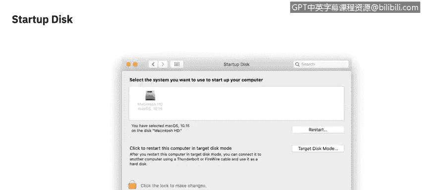
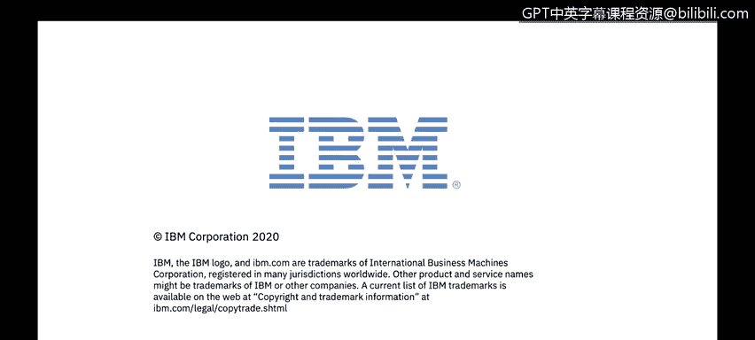

# 课程2：《网络安全角色、流程与操作系统安全》：31：macOS安全设置 🔒

在本节课程中，我们将学习macOS操作系统中的各项安全设置。我们将逐一探索系统偏好设置中与安全和隐私相关的核心功能，了解如何通过这些设置来增强计算机的安全性。

所有将在本视频中讨论的设置都位于macOS的系统偏好设置中。

系统偏好设置可以在苹果菜单下找到，或者通常位于程序坞上。它是一个带有齿轮图标的银色盒子。

可以看到，系统偏好设置中有许多不同的选项。为了聚焦于本视频的范围，我们将只关注与安全和隐私相关的部分。因此，我们将从这里开始。

## 安全性与隐私设置

在“安全性与隐私”设置窗口中，有四个主要标签页。首次打开时，通常会停留在第一个标签页，即“通用”。

这里我们可以看到两类不同的设置。

第一类是关于管理员密码的设置。你可以在此处更改密码。

下方，由中间的分隔线隔开的部分，是Gatekeeper的功能区域。它虽然没有明确标注，但这是macOS中用于防止安装未经授权的第三方应用程序的功能。

需要澄清的是，这里的“第三方应用程序”指的是任何不是从苹果应用商店安装的应用。例如，如果你通过网页浏览器下载Google Chrome，系统会弹出一个提示，说明这是一个第三方应用程序，并询问你是否确定要安装。此时，你必须手动覆盖Gatekeeper的限制才能继续。

在某些情况下，Gatekeeper可能会直接阻止你打开`.dmg`文件（这是macOS中默认的磁盘映像安装文件）。要绕过此限制，你可以右键点击该文件并选择“打开”。

## 文件保险箱

第二个标签页是“文件保险箱”设置。文件保险箱是macOS的全盘加密功能，用于加密整个硬盘驱动器。此设置专门用于为此功能设置密码。

这一点非常重要，因为如果你丢失了这个密码，将无法恢复你的数据。

## 防火墙

第三个标签页是“防火墙”设置。这里主要是一个开启或关闭的选项。除非你点击“防火墙选项”进入高级设置，在那里你可以看到更多配置，例如阻止所有传入连接，或者将特定应用程序加入白名单。

## 隐私

“隐私”标签页包含的设置选项最多。自macOS Catalina版本以来，此部分进行了大规模的重组。

这些设置的存在是为了确保当任何程序试图访问你计算机上的服务或应用程序时，都必须先获得你的许可。这包括位置服务、访问你的摄像头、麦克风、输入监控（例如记录键盘输入）、共享你的屏幕、共享分析数据或访问你的文件等。

这里的每一项权限都需要你单独批准。这不是一个“允许所有应用程序”的全局设置。每次首次启动某个应用程序时，它都会请求相关权限。虽然很多人觉得这有些繁琐，但总体上它极大地增强了计算机的安全性。

## 启动磁盘

最后要介绍的内容并不在“安全性与隐私”中，而是在“启动磁盘”设置里。在这里，你可以看到内部驱动器上的任何分区，以及任何已连接或网络驱动器。你可以选择一个驱动器并重启以从该驱动器启动。此外，你还可以启动到“目标磁盘模式”，此模式会将当前活动的计算机变成一个外部硬盘，显示在另一台网络设备上。

关于其他安全设置，我们将在下一个视频中继续探讨。

---

本节课中，我们一起学习了macOS的核心安全设置。我们了解了如何通过“安全性与隐私”中的通用设置管理管理员密码和Gatekeeper，如何使用文件保险箱进行全盘加密，如何配置防火墙以控制网络连接，以及如何在隐私设置中精细化管理应用程序的权限。最后，我们还简要介绍了启动磁盘的功能。掌握这些设置是保护macOS系统安全的重要基础。