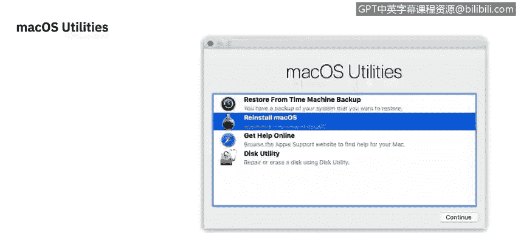
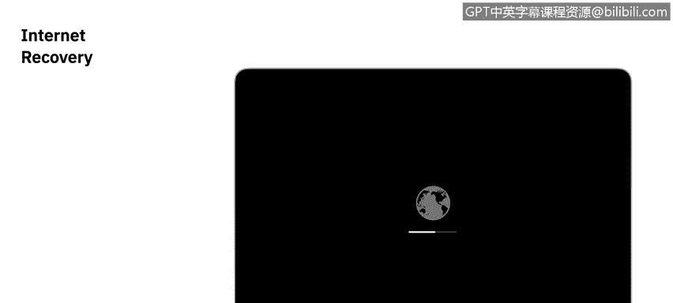
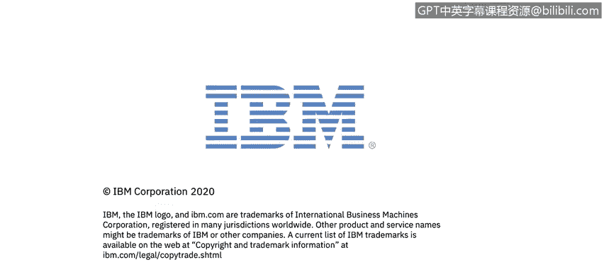

# 课程2：《网络安全角色、流程与操作系统安全》：32：macOS恢复模式详解 🍎

在本节课中，我们将要学习macOS的恢复分区及其提供的各项服务。恢复分区是macOS系统内置的一个隐藏分区，它替代了传统计算机附带的安装光盘，提供了操作系统重装和一些实用工具。

## 概述

macOS自带一个名为“macOS恢复”的隐藏分区。它本质上取代了新计算机附带的安装光盘。该分区提供了一个可供安装的操作系统版本以及一些额外的实用程序。

## 访问macOS恢复模式

你可以通过重启Mac并按住 **R** 键来访问恢复分区。系统可能会要求你输入管理员密码。启动后，你会看到一个小窗口，标题为“macOS实用工具”。

## macOS实用工具选项

以下是“macOS实用工具”提供的四个主要选项：

*   **从“时间机器”备份恢复**：如果你使用“时间机器”备份了Mac，可以通过此选项恢复。
*   **重新安装macOS**：此选项会重新安装操作系统。
*   **获取在线帮助**：这是一个功能有限的Safari浏览器窗口，允许你访问苹果的支持文档。
*   **磁盘工具**：此工具帮助我们管理设备上的磁盘。

“重新安装macOS”选项的优点在于，它并非“抹掉并安装”，而只是替换系统文件，不会触及用户目录。因此，如果操作系统出现问题，你可以相对放心地重装，个人数据通常不会受损。当然，始终建议进行备份，但最坏情况下，这个选项是存在的。

需要注意的是，此选项会重新安装该电脑出厂时搭载的操作系统，而非最新的操作系统版本。

## 深入解析磁盘工具

上一节我们介绍了macOS实用工具的整体功能，本节中我们来看看其中最重要的“磁盘工具”。磁盘工具在管理Mac存储方面提供了许多功能。

其功能主要可分为三个领域：

1.  你可以尝试运行“急救”来解决任何磁盘问题。
2.  你可以对存储空间进行分区或创建更多宗卷。
3.  你可以完全抹掉驱动器。

为了修改存储空间上的任何宗卷，你需要管理员权限。此外，如果磁盘使用**FileVault**加密，你将需要FileVault密钥来解锁驱动器才能进行修改。

如果你希望抹掉硬盘，抹掉后你将有三个选项来选择安全擦除的级别：

*   **标准抹掉**：本质上就像将存储的全部内容倒入垃圾桶并清空。此时数据恢复仍然非常可行。
*   **安全性选项（中）**：此选项会覆盖数据三次，符合美国能源部安全擦除磁性介质的标准。
*   **最安全选项**：此选项会覆盖数据七次，符合美国国防部 **5220.22-M** 标准。

如果你需要关于驱动器本身的更多详细信息，可以使用右上角的“信息”按钮，获取关于该驱动器的尽可能多的信息列表。

虽然磁盘工具有很多功能，但最常用的场景是重新分区任何类型的驱动器，特别是外置硬盘。由于驱动程序问题，新购买的外置硬盘通常无法与macOS配合使用。你可以打开磁盘工具，选择驱动器，重新格式化它。这将清除磁盘上任何专有软件或备份软件，之后你就可以正常使用它了。

## 互联网恢复模式

现在，所有这些实用工具都非常有帮助。当然，除非硬盘或固态硬盘已被重新格式化。在这种情况下，存放macOS实用工具的隐藏分区将不复存在。

此时，你可以进行所谓的“互联网恢复”。你可以通过启动时按住 **Option + R** 键来访问互联网恢复。你会看到一个带有进度条的小地球图标，表示它正在下载macOS实用工具。

这里需要注意两点：第一，它仍然需要互联网连接，系统会提示你连接网络。第二，与常规的macOS实用工具（安装Mac出厂时的操作系统）不同，互联网恢复将安装与你的Mac兼容的最新版本。

## 总结

本节课中我们一起学习了macOS恢复模式。我们了解了如何通过恢复分区访问“macOS实用工具”，包括重新安装系统、从备份恢复、使用磁盘工具管理存储以及进行安全擦除。我们还探讨了当恢复分区不可用时，如何使用互联网恢复功能来下载并安装最新的兼容操作系统。这些工具对于系统维护、故障排除和安全数据清理至关重要。