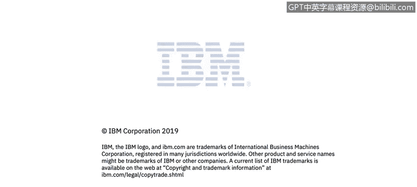

# 课程2：《网络安全角色、流程与操作系统安全》：33：虚拟化模块简介 🖥️

在本节课中，我们将学习虚拟化的基本概念及其与网络安全的关系。沃伦将在模块7中引导我们探索这一主题，并介绍来自SANS研究所的宝贵资源。

上一节我们介绍了课程的整体结构，本节中我们来看看虚拟化模块的具体内容。

在模块7中，沃伦将讨论虚拟化的概念及其与网络安全的关系。

你将访问多个SANS研究所的资源。SANS是全球最受信任且规模最大的信息安全培训和安全认证信息来源。

SANS开发、维护并免费提供涵盖信息安全各个方面的最大规模研究文档库。

不仅如此，SANS还运营着互联网风暴中心。

该中心被认为是互联网的早期预警系统。

让我们进一步了解。

本节课中我们一起学习了虚拟化模块的引入，并了解了SANS研究所作为关键信息安全资源提供者的角色。在接下来的课程中，我们将深入探讨虚拟化技术的具体细节。