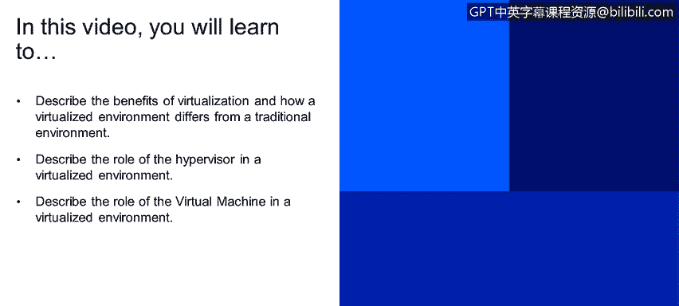
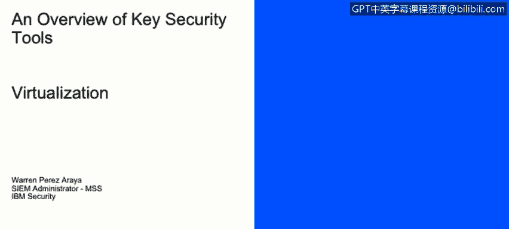
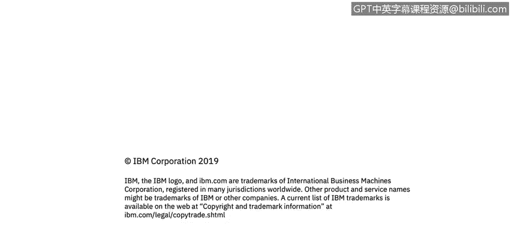

# 课程2：《网络安全角色、流程与操作系统安全》：34：虚拟化概述 🖥️

在本节课中，我们将要学习虚拟化的核心概念，包括其优势、虚拟化环境与传统环境的区别，以及管理程序（Hypervisor）和虚拟机（VM）在虚拟化环境中的角色。

## 虚拟化与传统环境对比

虚拟化技术允许你从单一的物理硬件系统中创建多个模拟环境，并为每个环境分配专用资源。

在屏幕右侧的图片中，你可以看到两种基础设施架构。左侧是传统的基础设施架构，其结构自下而上依次是：**硬件**、**操作系统**和**应用程序**。右侧则是虚拟化架构，其结构自下而上依次是：**硬件**、**虚拟化层**（通常是一个软件），以及运行在每个虚拟机上的**操作系统和应用程序**。在这个例子中，每一个包含操作系统和应用程序的方块都代表一个虚拟机。

## 虚拟化层与虚拟机

上一节我们对比了两种架构，本节中我们来看看虚拟化环境的核心组件。虚拟化层包含**管理程序**，也称为**主机**。主机是安装了管理程序的物理机器。管理程序是运行在实际硬件上的软件或应用程序，它使你能够虚拟化操作系统。

在管理程序之上运行的是**虚拟机**，也称为**来宾机**。它本质上是在管理程序或虚拟化层之上虚拟化的任何东西。

管理程序将物理资源与虚拟环境隔离开来，这意味着虚拟机本身无法直接访问硬件。

## 管理程序的部署模式

管理程序可以安装在操作系统之上，作为一个应用程序运行。例如，你可以安装像 VirtualBox 或 VMware Workstation 这样的应用程序。管理程序也可以直接安装在硬件上，这种模式也称为**企业模式**。VMware ESXi 就是这种模式的一个典型例子。

在屏幕右侧的图片中，你可以看到一个示例：底层是**硬件**，中间是**管理程序**，顶层则是多个**虚拟机**。

## 虚拟机的本质

最后，我们来了解一下虚拟机本身。虚拟机本质上是一个**单一的数据文件**，就像任何数字文件一样，可以从一台计算机移动到另一台计算机。你可以在一个计算机上创建虚拟机，复制该文件，并将其放到另一台相同类型的管理程序上，它应该能够完全一样地运行。

管理程序负责转发来自虚拟机的所有请求到硬件本身。因此，虚拟机不直接与硬件交互，它们之间有一个中间层，即我们讨论过的管理程序。

物理硬件资源被直接分配给虚拟机，但这是通过管理程序完成的。例如，你拥有总共 8GB 的 RAM，你可以将其中 1GB 分配给计划运行的每一个虚拟机。

在屏幕右侧的同一张图片中，我们现在关注的是顶层，即位于管理程序之上的**虚拟机**。

---

本节课中我们一起学习了虚拟化的基本概念。我们了解了虚拟化如何通过管理程序在单一硬件上创建多个独立的虚拟环境，比较了虚拟化架构与传统架构的区别，并明确了管理程序和虚拟机各自的角色与工作原理。