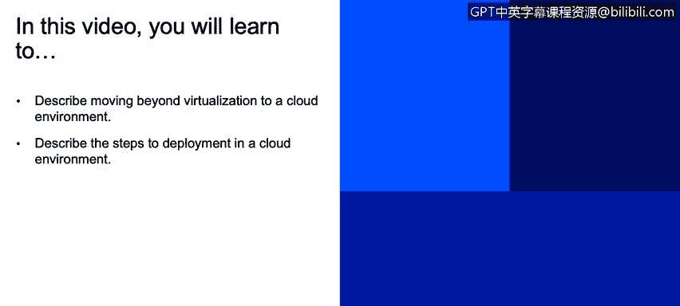
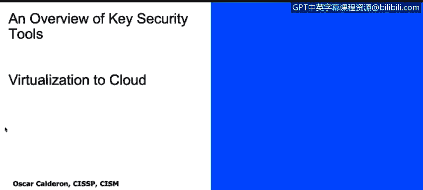
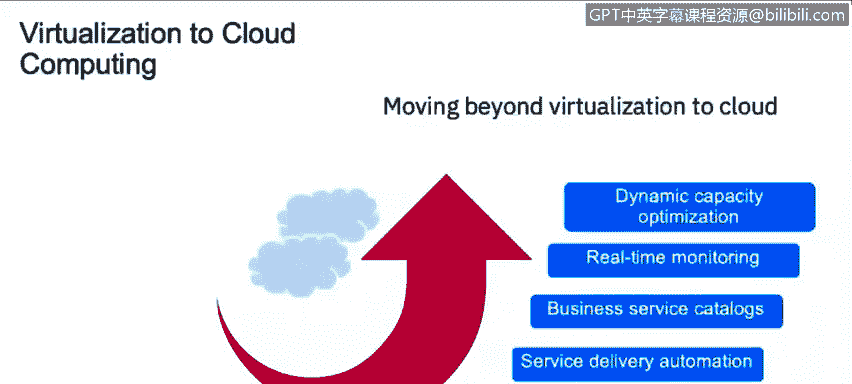
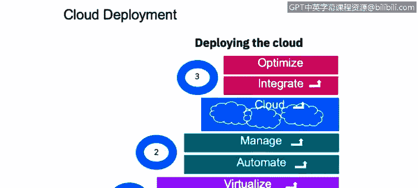
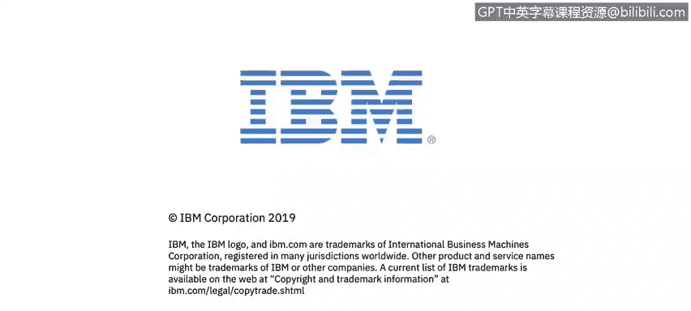

# 课程2：《网络安全角色、流程与操作系统安全》：35：从虚拟化到云 ☁️

在本节课中，我们将学习如何描述从虚拟化环境向云环境的演进，并了解在云环境中进行部署的关键步骤。

---

## 从虚拟化到云环境的演进

上一节我们介绍了虚拟化的基本概念。本节中，我们来看看如何从单一的虚拟化环境，发展到提供完整服务的云系统。

首先，我们需要理解什么是虚拟化。**虚拟化**允许你使用更少的物理资源来运行软件资源。例如，你可以在一个物理服务器上运行多个虚拟机，从而在一个物理资源上创建多个独立的环境。

那么，如果我们把多个虚拟化资源组合在一起会怎样呢？这正是几年前云计算兴起时人们提出的问题。于是，我们实现了从虚拟化管理到整个服务交付自动化的跨越。这个过程需要与业务服务目录对齐，因为你不能在不明确用途的情况下构建虚拟化环境。

一旦你确定了想要实现的业务目标，就可以将这个模型应用到你的业务需求中。接下来，我们需要端到端的实时监控与优化、基于消费的计量以及动态容量优化。

简而言之，我们从拥有单一虚拟资源的阶段，发展到了由大量交互设备共同满足服务需求的完整云环境。

---

## 云部署的步骤

在上一部分，我们讨论了从虚拟化到云服务的演进。现在，为了理解云部署的具体样貌，你可以参考本幻灯片中的图表。云部署主要遵循三个核心步骤，每个步骤内又包含若干子步骤。

以下是部署到云环境的关键步骤：

1.  **整合与虚拟化**
    首先，你需要整合现有的操作。所谓“整合”，是指明确你计划迁移到云中的内容、你想要提供的服务以及所需的服务类型。然后，你需要将第一步中列出的项目进行虚拟化，并准备相应的资源来完成整个虚拟化过程。

2.  **自动化**
    第二步是实现自动化。这里的“自动化”指的是对你第一步整合的各项服务与资源进行自动化管理。一旦你建立了所有架构并明确了管理方式，就可以开始向云端迁移。

3.  **集成与优化**
    进入云环境后，你需要进行集成和优化。你必须衡量系统的运行状况和性能，确保云服务与业务需求相集成，并且所提供的服务确实能满足业务目标。同时，优化至关重要，你需要确保现有资源被有效利用。例如，如果你只需要一个云邮件解决方案，就不必在多个地点部署上百项服务。此时，你需要进行容量规划（Sizing Exercise），以优化资源配置。

通过了解你的业务及其希望通过云计算实现的目标，你才能判断当前构建的系统是否足够，或者未来是否需要更多资源来支持增长。

---

## 总结

本节课中，我们一起学习了从虚拟化到云计算的演进过程。我们了解到，虚拟化是云计算的基础，它通过抽象物理资源提高了效率。而完整的云部署则是一个包含**整合、虚拟化、自动化、集成与优化**的系统性过程。理解这些步骤有助于我们更好地规划和实施安全的云环境。