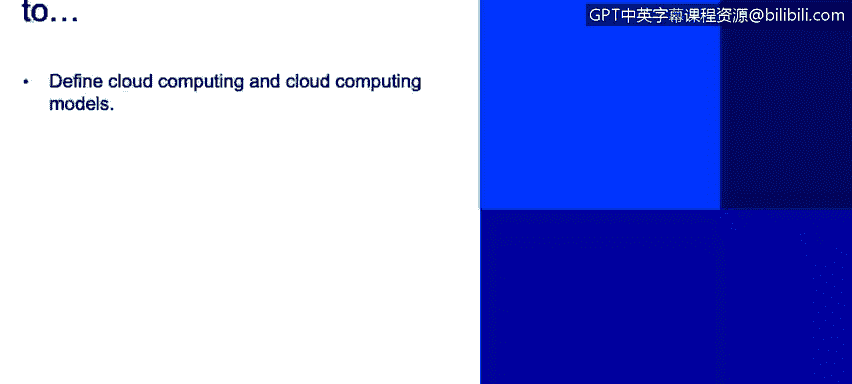
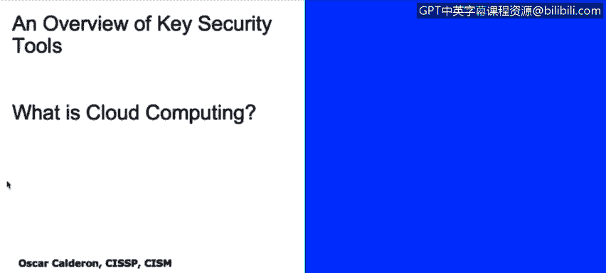
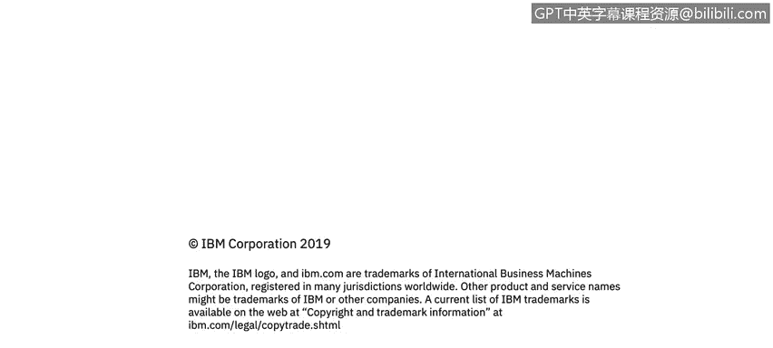

# 课程2：《网络安全角色、流程与操作系统安全》：36：什么是云计算 ☁️

在本节课程中，我们将学习云计算的定义及其主要服务模型。我们将探讨云计算的优势与挑战，并了解不同的部署模式。

---

### **云计算的定义**

云计算是指按需提供的系统资源可用性。这意味着存在一个由虚拟化设备构成的环境，服务于业务目的，范围涵盖从存储到计算能力的各种资源。

### **云计算的优势与挑战**

以下是云计算的一些主要优点和挑战。

**优势：**
*   **选择与敏捷性**：由于拥有多种虚拟化资源，业务具有灵活性，可以在全球任何地方扩展。
*   **集成、规模与成本**：虚拟化资源通常比购置和维护独立的物理服务器更便宜，并且允许业务按需扩展，无需增加硬件。
*   **集中化的变更管理**：无论系统规模大小，都可以通过单一平台管理整个环境，无需亲临不同地点的数据中心。
*   **下一代架构**：云服务商会将新技术应用到服务中，使云环境日益高效。

**挑战：**
*   **安全顾虑**：存在一种观念，认为由于与他人共享资源，安全性会受到影响。虽然大型提供商通常有完善的对策，但这仍是一种常见的担忧。
*   **供应商锁定**：如果业务深度依赖某个云提供商，当该提供商调整价格时，迁移到其他服务商可能需要大量工作和成本。
*   **控制权缺失**：用户可能认为，由于设备不在本地，他们无法真正控制这些资源。根据所选服务模型的不同，用户可能确实不负责某些维护任务（如系统补丁更新）。
*   **可靠性担忧**：与控制权缺失相关，用户可能会质疑他们无法直接控制的设备的可靠性。

### **云计算部署类型**

接下来，我们看看三种主要的云计算部署类型。

**1. 公有云**
*   最常见的云计算类型，由第三方拥有和运营。
*   用户与其他组织共享硬件和处理资源（称为“多租户”）。
*   优点：无需购买硬件，成本较低，无需维护，可弹性扩展，通常非常可靠。

**2. 私有云**
*   为单一组织提供专用的云计算资源。
*   不与其他公司共享资源，脱离了“多租户”模式。
*   优点：能更好地满足特定的业务需求，提供更高的安全性和控制级别。

**3. 混合云**
*   结合了公有云和私有云，旨在获得两者的优势。
*   可以将敏感资产放在私有基础设施上以加强控制，同时将非核心或弹性需求部分放在成本更低的公有云上扩展，从而实现成本效益。

### **云计算参考模型**

云计算参考模型是一个抽象图表，用于描述云计算环境的功能组件，帮助我们理解其运作方式。

*   **云消费者**：租用或使用云服务的个人或组织。
*   **云审计者**：负责确保安全性、隐私性，并进行控制审计，以验证信息的可靠性和合规性。
*   **云提供商**：提供各种云服务的实体，主要包括以下三种服务模型。
*   **云经纪人**：以某种方式向云消费者转售云服务的中间商。
*   **云运营商**：实际管理和维护云基础设施（如系统打补丁）的组织，确保服务有效运行。

### **云计算服务模型**

最后，我们来详细了解三种核心的云计算服务模型。

**1. 软件即服务**
*   由第三方托管应用程序并通过互联网提供使用。
*   示例：Salesforce、Google Apps、Facebook、Outlook.com、Gmail。
*   核心：用户直接使用云端应用，无需在本地计算机安装或维护。

**2. 平台即服务**
*   提供一个完整的平台，允许用户开发、运行或管理应用程序，而无需构建和维护底层基础设施的复杂性。
*   示例：提供中间件、数据库环境、Java沙箱等开发平台的云服务。
*   核心：用户购买的是一个可进行应用开发和部署的环境，而非单个应用或底层硬件。

**3. 基础设施即服务**
*   提供完整的计算基础设施作为服务，包括存储、服务器、网络设备等。
*   示例：将整个数据中心作为服务提供。
*   核心：用户租用的是基础的计算资源（如虚拟机、网络），可以在此之上安装操作系统和应用程序，但无需管理物理硬件。

---

**总结**
本节课我们一起学习了云计算。我们定义了云计算是按需提供虚拟化系统资源的概念，分析了其优势（如敏捷性、成本效益）与挑战（如安全顾虑、供应商锁定）。我们探讨了三种部署类型：公有云、私有云和混合云。最后，我们通过参考模型理解了云生态中的角色，并详细介绍了三种核心服务模型：**软件即服务**、**平台即服务**和**基础设施即服务**。理解这些基础概念对于规划和管理云环境至关重要。