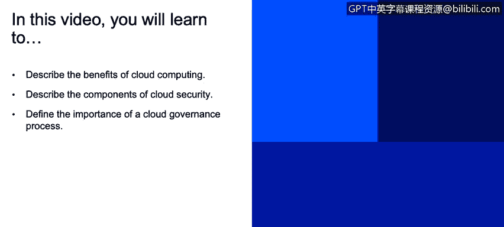
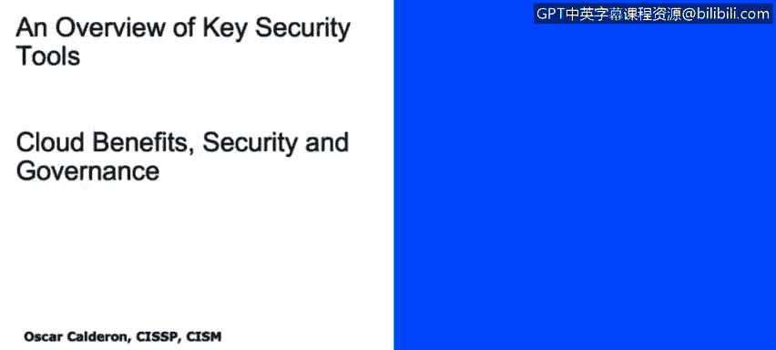
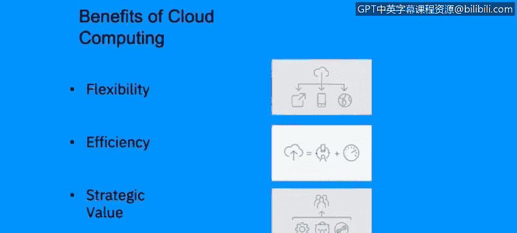
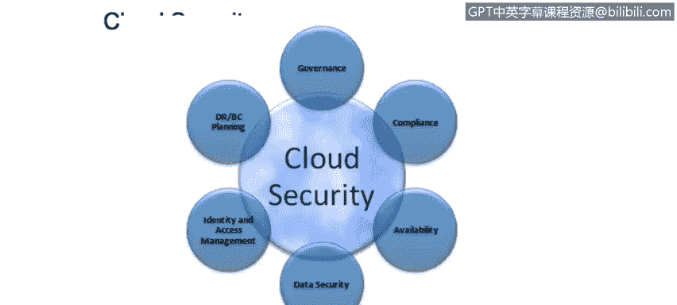
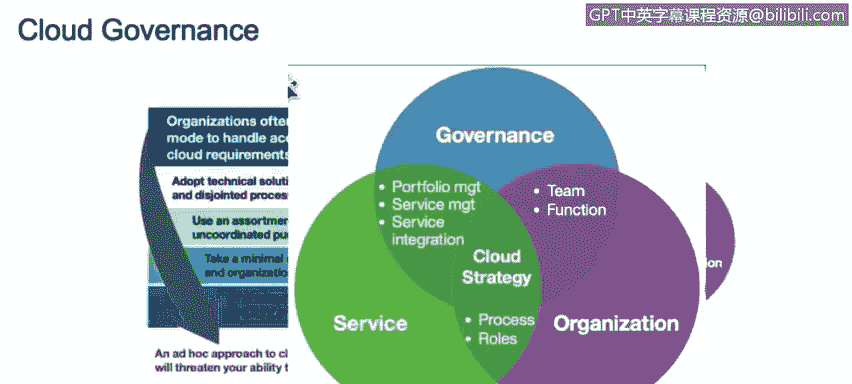
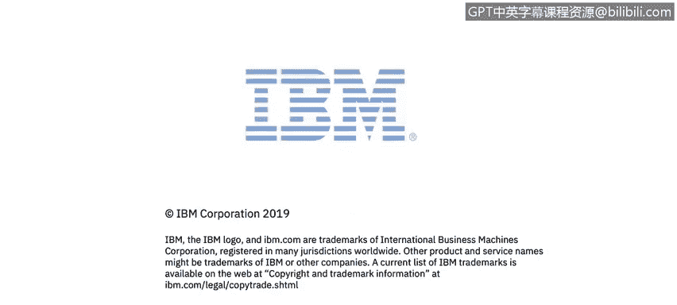

# 课程2：《网络安全角色、流程与操作系统安全》：37：云的好处、安全性与治理 ☁️

在本节课程中，我们将学习云计算的优势、构成云安全的关键组件，以及建立有效云治理流程的重要性。

---

上一节我们探讨了云计算的基础概念，本节中我们来看看云计算带来的具体好处。

云计算的优势主要基于其灵活性、效率和战略价值。

以下是云计算的核心优势：
*   **灵活性**：您可以根据业务需求灵活扩展环境，不受地理位置限制，可以从世界任何地方访问资源。
*   **效率**：您可以随时加入会议或使用服务，并能通过添加更多资源来提升效率。
*   **战略价值**：上述灵活性使我们能够将云计算的战略方向与组织的战略目标对齐，从而为企业创造巨大的战略价值。

---

了解了云计算的优势后，我们接下来需要关注如何确保其安全性。一个常见的误解是云计算缺乏安全性，但事实并非如此。

云安全涉及多个关键控制领域，需要全面考虑。

以下是构建云安全策略时必须考虑的核心组件：
*   **灾难恢复与业务连续性计划**：需要规划当云服务商遭受攻击或服务中断时的应对方案，例如是否需要备用提供商或备份数据。
*   **治理**：需要建立明确的云治理框架，定义责任方、沟通计划、工作流程以及对云环境的期望。
*   **合规性**：确保云计算环境符合组织内部政策及所在国家/地区的法规要求，例如欧洲的GDPR。
*   **可用性**：规划当云服务商不可用时，如何维持服务，例如是否有备用网站或本地服务器。
*   **数据安全**：确保数据被加密，并了解数据在传输过程中的安全措施，应定期对云服务商进行安全审计。
*   **身份与访问管理**：必须严格记录和管理谁在何时、何地、以何种方式、为何访问了哪些资源，即使由第三方管理云环境，也需要保留对这些日志的可见性。

---

最后，我们来探讨云治理的重要性，这是确保云安全策略有效的关键环节。

为了拥有有效的云战略，必须建立良好的云治理。而实现良好治理的唯一途径，是确保治理、服务与组织目标三者对齐。

如下图所示，治理、服务与组织三者必须相互重叠、紧密结合：
*   治理必须与您在云上提供的**服务**对齐。
*   云服务必须与**组织**的战略目标对齐。
*   组织的目标也必须融入**治理**框架之中。

这三者构成了一个稳固的三角关系，任何一点都不可偏废。只有三者协同一致，才能构建出有效的云安全策略。

---

**总结**
本节课中，我们一起学习了云计算在灵活性、效率和战略价值方面的优势。我们深入探讨了构成云安全的六大关键组件：灾难恢复、治理、合规性、可用性、数据安全以及身份与访问管理。最后，我们明确了建立有效云安全策略的核心在于实现**治理、服务与组织目标**三者的紧密对齐。理解这些概念是规划和实施安全云计算环境的基础。