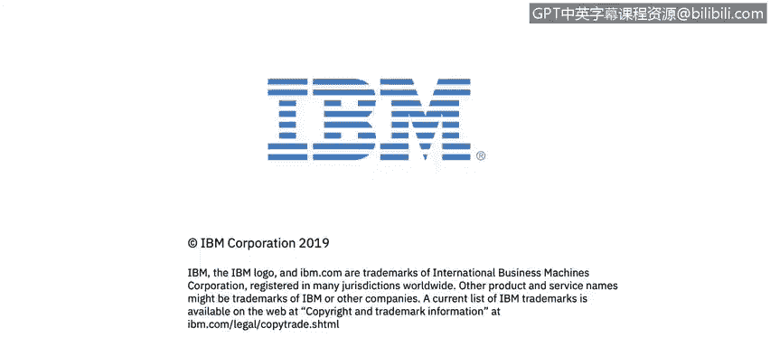

# 课程2：《网络安全角色、流程与操作系统安全》：38：总结

在本节课中，我们将对《网络安全角色、流程与操作系统安全》的核心内容进行回顾与总结。

感谢您参与本课程的学习。

如果您有兴趣在网络安全领域获取更多技能，我们期待与您再次相见。

---

本节课中，我们一起回顾了整个课程的结构与核心目标。本课程主要围绕网络安全中的关键角色、标准流程以及操作系统层面的安全实践展开，为初学者构建了基础的知识框架。希望这些内容能为您后续的深入学习与实践打下坚实的基础。