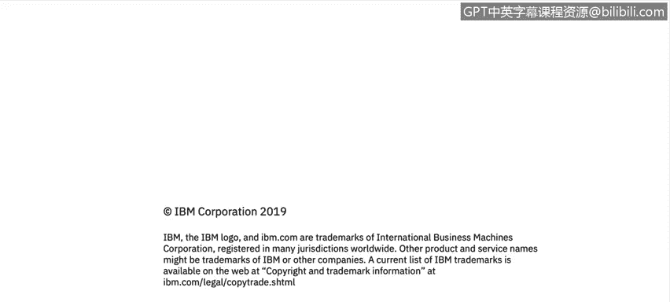

# 课程2：《网络安全角色、流程与操作系统安全》：39：0_01_欢迎来到人员、流程与操作系统基础

在本节课中，我们将学习网络安全领域的基础知识，包括核心角色、关键流程以及操作系统安全的重要性。课程将介绍网络安全分析师所需的技能，并概述后续内容。

我叫Alex，是哥斯达黎加IBM安全运营中心的经理。

我的团队负责为IBM及其客户监控网络安全威胁，并采取行动应对这些威胁，以最小化客户数据丢失或泄露的风险。

当我招聘新的网络安全分析师和管理员时，我会考察他们的技术技能。

我关注操作系统知识，例如对**Linux**、**MacOS**和**Windows**的掌握。

数据库知识也是考察重点。

此外，还需要了解跨站脚本攻击、恶意软件、分布式拒绝服务攻击等网络安全知识。

特别是关于**防火墙**和**防病毒软件**的知识。

同样重要的还有有效沟通的技能。

因为需要与正确的人员进行协作。

批判性思维也必不可少，因为每天遇到的安全事件都各不相同。

还需要有强烈的动机，因为分析师必须具备解决问题的驱动力。

在本课程中，您将听到来自IBM全球各地的多位专家的讲解。

他们将帮助您建立关于重要网络安全流程的技能。

您将学习相关的资源和术语。

感谢。

---

本节课中，我们一起学习了网络安全基础知识的概览，包括从业者所需的**技术技能**（如操作系统、数据库、防火墙知识）和**软技能**（如沟通、批判性思维和动机）。课程也介绍了后续将由IBM专家引导的学习路径。