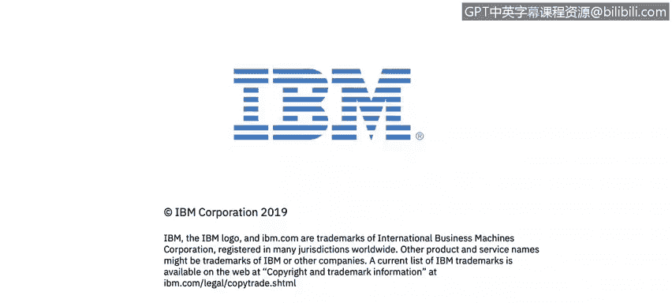

# 课程2：《网络安全角色、流程与操作系统安全》：40：1_04_人员、流程与技术概述

在本节课中，我们将概述网络安全中人员、流程与技术这三个核心要素，并了解它们如何共同构成一个组织的安全态势。这是理解后续更深入内容的基础。

正如你在Alex的课程欢迎辞中所学到的，理解安全基础对于网络安全分析师的日常工作至关重要。

我是Lou Fua，IBM数据安全产品组合的课程开发人员。在整个课程中，我将陪伴你，帮助你梳理并掌握成为一名初级网络安全分析师所需的核心知识。

接下来，你将跟随IBM的网络安全专家学习。他们将引导你完成关于系统基础知识的各个模块。

专家们将展示**人员**、**流程**与**技术**如何影响一家公司的整体网络安全态势。

你将学习**服务管理框架**如何影响企业应对网络安全威胁的能力。

你准备好了吗？

---

本节课中，我们一起学习了网络安全的基础框架，明确了人员、流程与技术是构成安全防御体系的三大支柱。理解这三者之间的关系，是评估和提升组织安全态势的第一步。