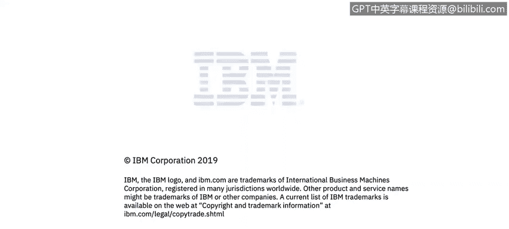

# 课程2：《网络安全角色、流程与操作系统安全》：41：2_05：什么是IT安全？🔐

在本节课中，我们将学习IT安全的基本定义，了解其核心概念和涵盖范围。

## 什么是IT安全？

上一节我们介绍了课程的整体框架，本节中我们来看看IT安全的具体含义。

幻灯片中展示了一个术语，我们将对其进行更清晰的解释。我们可以将IT安全定义为：保护计算机、服务器、移动设备、电子系统、网络及其数据免受恶意攻击的实践。

在行业中，这个术语也可以被称为**信息安全**或**网络安全**。

## 核心概念解析

为了更好地理解IT安全，以下是其涵盖的几个关键方面：

*   **保护对象**：包括计算机、服务器、移动设备、电子系统、网络以及其中存储和处理的数据。
*   **防御目标**：抵御各种形式的恶意攻击。
*   **行业同义词**：信息安全、网络安全。

## 总结

本节课中我们一起学习了IT安全的基本定义。我们了解到，IT安全的核心在于采取各种实践措施，以保护数字资产和信息系统免受侵害。这一概念是后续深入学习网络安全角色、流程和操作系统安全的基础。